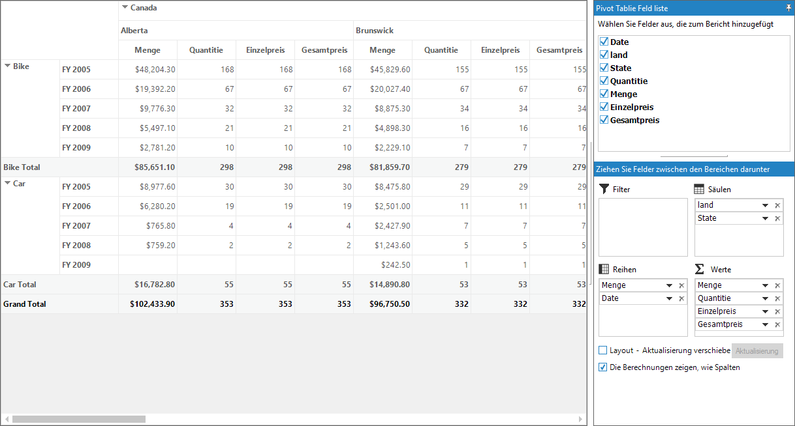
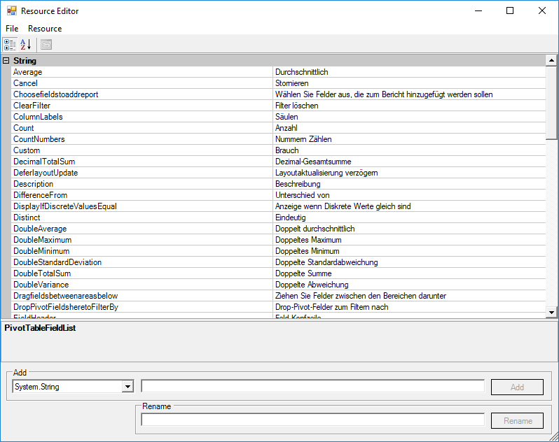

# Localization in Windows Forms Pivot Grid

Localization is the process of making application multilingual by formatting the content according to the cultures. This involves configuring the application for a specific language. Culture is the combination of language and location. For example, "en-US" is the culture for English language spoken in United States; en-GB is the culture for English language spoken in Great Britain.

Syncfusion components have their own neutral resources and these resources can be localized as per the customer requirement. Pivot grid control can be localized in any of the following ways.

* Using ILocalizationProvider interface
* Using satellite assemblies

## Using ILocalizationProvider interface

To localize the pivot grid control, create a class by inheriting [ILocalizationProvider](http://help.syncfusion.com/cr/windowsforms/Syncfusion.Windows.Forms.ILocalizationProvider.html) interface. The [GetLocalizedString](https://help.syncfusion.com/cr/windowsforms/Syncfusion.Windows.Forms.ILocalizationProvider.html#Syncfusion_Windows_Forms_ILocalizationProvider_GetLocalizedString_System_Globalization_CultureInfo_System_String_System_Object_) method of this interface need to be implemented to get the equivalent localized strings. The [PivotResourceIdentifiers](https://help.syncfusion.com/cr/windowsforms/Syncfusion.Windows.Forms.PivotAnalysis.PivotResourceIdentifiers.html) class contains the resource identifiers specific to the pivot grid control.

Refer to the below code sample to localize the pivot grid control using ILocalizationProvider interface.





public Form1()
{
    InitializeComponent();
    LocalizationProvider.Provider = new Localizer();
    pivotGridControl1.ItemSource = ProductSalesData.GetSalesData();

    pivotGridControl1.PivotRows.Add(new PivotItem { FieldMappingName = "Product", FieldHeader = "Menge", TotalHeader = "Total" });
    pivotGridControl1.PivotRows.Add(new PivotItem { FieldMappingName = "Date", TotalHeader = "Total" });

    pivotGridControl1.PivotColumns.Add(new PivotItem { FieldMappingName = "Country", FieldHeader = "land", TotalHeader = "Total" });
    pivotGridControl1.PivotColumns.Add(new PivotItem { FieldMappingName = "State", TotalHeader = "Total" });

    pivotGridControl1.PivotCalculations.Add(new PivotComputationInfo { FieldName = "Amount", FieldHeader = "Menge", Format = "C", SummaryType = SummaryType.DoubleTotalSum });
    pivotGridControl1.PivotCalculations.Add(new PivotComputationInfo { FieldName = "Quantity", FieldHeader = "Quantitie", Format = "#,##0" });
    pivotGridControl1.PivotCalculations.Add(new PivotComputationInfo { FieldName = "UnitPrice", FieldHeader = "Einzelpreis" });
    pivotGridControl1.PivotCalculations.Add(new PivotComputationInfo { FieldName = "TotalPrice", FieldHeader = "Gesamtpreis" });

    pivotGridControl1.GridVisualStyles = GridVisualStyles.Metro;
    pivotGridControl1.ShowPivotTableFieldList = true;
}

class Localizer : ILocalizationProvider
{
    string ILocalizationProvider.GetLocalizedString(CultureInfo culture, string name, object ctrl)
    {
        switch (name)
        {
            case PivotResourceIdentifiers.PivotTableFieldList:
                return "Pivot Tablie Feld liste";
            case PivotResourceIdentifiers.Choosefieldstoaddreport:
                return "Wählen Sie Felder aus, die zum Bericht hinzugefügt werden sollen";
            case PivotResourceIdentifiers.ColumnLabels:
                return "Säulen";
            case PivotResourceIdentifiers.DeferlayoutUpdate:
                return "Layout - Aktualisierung verschieben";
            case PivotResourceIdentifiers.Dragfieldsbetweenareasbelow:
                return "Ziehen Sie Felder zwischen den Bereichen darunter";
            case PivotResourceIdentifiers.DropPivotFieldsheretoFilterBy:
                return "Schau hier, um Pivot Felder durch Filter";
            case PivotResourceIdentifiers.MoveDown:
                return "Nach unten";
            case PivotResourceIdentifiers.MoveToBeginning:
                return "An den Anfang";
            case PivotResourceIdentifiers.MoveToColumnLabels:
                return "Spaltenbeschriftungen";
            case PivotResourceIdentifiers.MoveToEnd:
                return "Zum Ende";
            case PivotResourceIdentifiers.MoveToReportFilter:
                return "Verschieben nach Filter melden";
            case PivotResourceIdentifiers.MoveToRowLabels:
                return "Verschieben nach Etikettenzeile";
            case PivotResourceIdentifiers.MoveToValues:
                return "Bewegen Sie die Werte";
            case PivotResourceIdentifiers.MoveUp:
                return "Nach oben";
            case PivotResourceIdentifiers.OK:
                return "OK";
            case PivotResourceIdentifiers.PivotSchemaDesigner:
                return "Pivot Svhemae Konstrukteur";
            case PivotResourceIdentifiers.RemoveField:
                return "Feld entfernen";
            case PivotResourceIdentifiers.ReportFilter:
                return "Filter";
            case PivotResourceIdentifiers.RowLabel:
                return "Reihen";
            case PivotResourceIdentifiers.ShowCalculationsasColumns:
                return "Die Berechnungen zeigen, wie Spalten";
            case PivotResourceIdentifiers.Update:
                return "Aktualisierung";
            case PivotResourceIdentifiers.Values:
                return "Werte";
            case PivotResourceIdentifiers.FieldName:
                return "Feldname";
            case PivotResourceIdentifiers.FieldHeader:
                return "Feld Kopfzeile";
            case PivotResourceIdentifiers.Description:
                return "Beschreibung";
            case PivotResourceIdentifiers.Format:
                return "Format";
            case PivotResourceIdentifiers.SummarizeValueBy:
                return "Wert zusammenfassen nach";
            case PivotResourceIdentifiers.ShowValueAs:
                return "Wert anzeigen als";
            case PivotResourceIdentifiers.PivotComputationInformation:
                return "Pivot-Berechnungsinformationen";
            case PivotResourceIdentifiers.DoubleTotalSum:
                return "Doppelte Gesamtsumme";
            case PivotResourceIdentifiers.DoubleAverage:
                return "doppelter Durchschnitt";
            case PivotResourceIdentifiers.DoubleMaximum:
                return "Doppeltes Maximum";
            case PivotResourceIdentifiers.DoubleMinimum:
                return "Doppeltes Minimum";
            case PivotResourceIdentifiers.DoubleStandardDeviation:
                return "Doppelte Standardabweichung";
            case PivotResourceIdentifiers.Count:
                return "Anzahl";
            case PivotResourceIdentifiers.DecimalTotalSum:
                return "Dezimal-Gesamtsumme";
            case PivotResourceIdentifiers.IntTotalSum:
                return "Int Gesamtsumme";
            case PivotResourceIdentifiers.Custom:
                return "Brauch";
            case PivotResourceIdentifiers.DisplayIfDiscreteValuesEqual:
                return "Anzeige wenn Diskrete Werte gleich sind";
            case PivotResourceIdentifiers.Sum:
                return "Summe";
            case PivotResourceIdentifiers.Average:
                return "Durchschnittlich";
            case PivotResourceIdentifiers.Max:
                return "Max";
            case PivotResourceIdentifiers.Min:
                return "Mindest";
            case PivotResourceIdentifiers.CountNumbers:
                return "Nummern Zählen";
            case PivotResourceIdentifiers.StdDev:
                return "Std. Dev";
            case PivotResourceIdentifiers.StdDevP:
                return "Std. Entwickler P";
            case PivotResourceIdentifiers.Var:
                return "Var";
            case PivotResourceIdentifiers.VarP:
                return "VarP";
            case PivotResourceIdentifiers.DoubleVariance:
                return "Doppelte Abweichung";
            case PivotResourceIdentifiers.NoCalculation:
                return "Keine Berechnung";
            case PivotResourceIdentifiers.PercentageOfGrandTotal:
                return "% der Gesamtsumme";
            case PivotResourceIdentifiers.PercentageOfColumnTotal:
                return "% der Spaltensumme";
            case PivotResourceIdentifiers.PercentageOfRowTotal:
                return "% der Zeilensumme";
            case PivotResourceIdentifiers.PercentageOfParentColumnTotal:
                return "% der übergeordneten Spalte insgesamt";
            case PivotResourceIdentifiers.PercentageOfParentRowTotal:
                return "% der übergeordneten Zeilensumme";
            case PivotResourceIdentifiers.PercentageOfParentTotal:
                return "% der Elternsumme";
            case PivotResourceIdentifiers.Index:
                return "Index";
            case PivotResourceIdentifiers.Formula:
                return "Formel";
            case PivotResourceIdentifiers.PercentageOf:
                return "% von";
            case PivotResourceIdentifiers.DifferenceFrom:
                return "Unterschied von";
            case PivotResourceIdentifiers.PercentageOfDifferenceFrom:
                return "% Unterschied von";
            case PivotResourceIdentifiers.RunningTotalIn:
                return "Laufende Summe";
            case PivotResourceIdentifiers.PercentageOfRunningTotalIn:
                return "% der laufenden Summe in";
            case PivotResourceIdentifiers.RankSmallestToLargest:
                return "Rang Kleinster bis Größter";
            case PivotResourceIdentifiers.RankLargestToSmallest:
                return "Rang am größten zum kleinsten";
            case PivotResourceIdentifiers.Distinct:
                return "Eindeutig";
            default:
                return string.Empty;
        }
    }
}





Public Sub New()
    InitializeComponent()
    LocalizationProvider.Provider = New Localizer()
    pivotGridControl1.ItemSource = ProductSalesData.GetSalesData()

    pivotGridControl1.PivotRows.Add(New PivotItem With {.FieldMappingName = "Product", .FieldHeader = "Menge", .TotalHeader = "Total"})
    pivotGridControl1.PivotRows.Add(New PivotItem With {.FieldMappingName = "Date", .TotalHeader = "Total"})

    pivotGridControl1.PivotColumns.Add(New PivotItem With {.FieldMappingName = "Country", .FieldHeader = "land", .TotalHeader = "Total"})
    pivotGridControl1.PivotColumns.Add(New PivotItem With {.FieldMappingName = "State", .TotalHeader = "Total"})

    pivotGridControl1.PivotCalculations.Add(New PivotComputationInfo With {.FieldName = "Amount", .FieldHeader = "Menge", .Format = "C", .SummaryType = SummaryType.DoubleTotalSum})
    pivotGridControl1.PivotCalculations.Add(New PivotComputationInfo With {.FieldName = "Quantity", .FieldHeader = "Quantitie", .Format = "#,##0"})
    pivotGridControl1.PivotCalculations.Add(New PivotComputationInfo With {.FieldName = "UnitPrice", .FieldHeader = "Einzelpreis"})
    pivotGridControl1.PivotCalculations.Add(New PivotComputationInfo With {.FieldName = "TotalPrice", .FieldHeader = "Gesamtpreis"})

    pivotGridControl1.GridVisualStyles = GridVisualStyles.Metro
    pivotGridControl1.ShowPivotTableFieldList = True
End Sub

Friend Class Localizer
    Implements ILocalizationProvider
    Private Function GetLocalizedString(ByVal culture As CultureInfo, ByVal name As String, ByVal ctrl As Object) As String Implements ILocalizationProvider.GetLocalizedString
        Select Case name
            Case PivotResourceIdentifiers.PivotTableFieldList
                Return "Pivot Tablie Feld liste"
            Case PivotResourceIdentifiers.Choosefieldstoaddreport
                Return "Wählen Sie Felder aus, die zum Bericht hinzugefügt werden sollen"
            Case PivotResourceIdentifiers.ColumnLabels
                Return "Säulen"
            Case PivotResourceIdentifiers.DeferlayoutUpdate
                Return "Layout - Aktualisierung verschieben"
            Case PivotResourceIdentifiers.Dragfieldsbetweenareasbelow
                Return "Ziehen Sie Felder zwischen den Bereichen darunter"
            Case PivotResourceIdentifiers.DropPivotFieldsheretoFilterBy
                Return "Schau hier, um Pivot Felder durch Filter"
            Case PivotResourceIdentifiers.MoveDown
                Return "Nach unten"
            Case PivotResourceIdentifiers.MoveToBeginning
                Return "An den Anfang"
            Case PivotResourceIdentifiers.MoveToColumnLabels
                Return "Spaltenbeschriftungen"
            Case PivotResourceIdentifiers.MoveToEnd
                Return "Zum Ende"
            Case PivotResourceIdentifiers.MoveToReportFilter
                Return "Verschieben nach Filter melden"
            Case PivotResourceIdentifiers.MoveToRowLabels
                Return "Verschieben nach Etikettenzeile"
            Case PivotResourceIdentifiers.MoveToValues
                Return "Bewegen Sie die Werte"
            Case PivotResourceIdentifiers.MoveUp
                Return "Nach oben"
            Case PivotResourceIdentifiers.OK
                Return "OK"
            Case PivotResourceIdentifiers.PivotSchemaDesigner
                Return "Pivot Svhemae Konstrukteur"
            Case PivotResourceIdentifiers.RemoveField
                Return "Feld entfernen"
            Case PivotResourceIdentifiers.ReportFilter
                Return "Filter"
            Case PivotResourceIdentifiers.RowLabel
                Return "Reihen"
            Case PivotResourceIdentifiers.ShowCalculationsasColumns
                Return "Die Berechnungen zeigen, wie Spalten"
            Case PivotResourceIdentifiers.Update
                Return "Aktualisierung"
            Case PivotResourceIdentifiers.Values
                Return "Werte"
            Case PivotResourceIdentifiers.FieldName
                Return "Feldname"
            Case PivotResourceIdentifiers.FieldHeader
                Return "Feld Kopfzeile"
            Case PivotResourceIdentifiers.Description
                Return "Beschreibung"
            Case PivotResourceIdentifiers.Format
                Return "Format"
            Case PivotResourceIdentifiers.SummarizeValueBy
                Return "Wert zusammenfassen nach"
            Case PivotResourceIdentifiers.ShowValueAs
                Return "Wert anzeigen als"
            Case PivotResourceIdentifiers.PivotComputationInformation
                Return "Pivot-Berechnungsinformationen"
            Case PivotResourceIdentifiers.DoubleTotalSum
                Return "Doppelte Gesamtsumme"
            Case PivotResourceIdentifiers.DoubleAverage
                Return "doppelter Durchschnitt"
            Case PivotResourceIdentifiers.DoubleMaximum
                Return "Doppeltes Maximum"
            Case PivotResourceIdentifiers.DoubleMinimum
                Return "Doppeltes Minimum"
            Case PivotResourceIdentifiers.DoubleStandardDeviation
                Return "Doppelte Standardabweichung"
            Case PivotResourceIdentifiers.Count
                Return "Anzahl"
            Case PivotResourceIdentifiers.DecimalTotalSum
                Return "Dezimal-Gesamtsumme"
            Case PivotResourceIdentifiers.IntTotalSum
                Return "Int Gesamtsumme"
            Case PivotResourceIdentifiers.Custom
                Return "Brauch"
            Case PivotResourceIdentifiers.DisplayIfDiscreteValuesEqual
                Return "Anzeige wenn Diskrete Werte gleich sind"
            Case PivotResourceIdentifiers.Sum
                Return "Summe"
            Case PivotResourceIdentifiers.Average
                Return "Durchschnittlich"
            Case PivotResourceIdentifiers.Max
                Return "Max"
            Case PivotResourceIdentifiers.Min
                Return "Mindest"
            Case PivotResourceIdentifiers.CountNumbers
                Return "Nummern Zählen"
            Case PivotResourceIdentifiers.StdDev
                Return "Std. Dev"
            Case PivotResourceIdentifiers.StdDevP
                Return "Std. Entwickler P"
            Case PivotResourceIdentifiers.Var
                Return "Var"
            Case PivotResourceIdentifiers.VarP
                Return "VarP"
            Case PivotResourceIdentifiers.DoubleVariance
                Return "Doppelte Abweichung"
            Case PivotResourceIdentifiers.NoCalculation
                Return "Keine Berechnung"
            Case PivotResourceIdentifiers.PercentageOfGrandTotal
                Return "% der Gesamtsumme"
            Case PivotResourceIdentifiers.PercentageOfColumnTotal
                Return "% der Spaltensumme"
            Case PivotResourceIdentifiers.PercentageOfRowTotal
                Return "% der Zeilensumme"
            Case PivotResourceIdentifiers.PercentageOfParentColumnTotal
                Return "% der übergeordneten Spalte insgesamt"
            Case PivotResourceIdentifiers.PercentageOfParentRowTotal
                Return "% der übergeordneten Zeilensumme"
            Case PivotResourceIdentifiers.PercentageOfParentTotal
                Return "% der Elternsumme"
            Case PivotResourceIdentifiers.Index
                Return "Index"
            Case PivotResourceIdentifiers.Formula
                Return "Formel"
            Case PivotResourceIdentifiers.PercentageOf
                Return "% von"
            Case PivotResourceIdentifiers.DifferenceFrom
                Return "Unterschied von"
            Case PivotResourceIdentifiers.PercentageOfDifferenceFrom
                Return "% Unterschied von"
            Case PivotResourceIdentifiers.RunningTotalIn
                Return "Laufende Summe"
            Case PivotResourceIdentifiers.PercentageOfRunningTotalIn
                Return "% der laufenden Summe in"
            Case PivotResourceIdentifiers.RankSmallestToLargest
                Return "Rang Kleinster bis Größter"
            Case PivotResourceIdentifiers.RankLargestToSmallest
                Return "Rang am größten zum kleinsten"
            Case PivotResourceIdentifiers.Distinct
                Return "Eindeutig"
            Case Else
                Return String.Empty
        End Select
    End Function
End Class





## Using satellite assemblies

A satellite assembly is a compiled library that contains resources which can be localized. Make use of the satellite assemblies to create a multilingual application.
Rather than using hard coding strings in main application, it is easier to design and deploy solutions to multiple cultures by using satellite assemblies. These assemblies are auto generated, and do not contain any code. Hence, they cannot be executed as the main assembly. Localization processes can be performed by using satellite assemblies without recompiling the main assembly.

### Requirements

A resource file is required to create a satellite assembly. It can be created by using the tool provided by Microsoft Visual Studio.NET namely [resource editor](https://learn.microsoft.com/en-us/cpp/windows/resource-editors?view=msvc-160), which provides a graphic interface to construct resource files containing bitmaps, icons, and strings.

The resource file can also be created by using an empty text file (SR.txt). Then, enter the following command in the Visual Studio command prompt for creating resource file from the text file.



Resgen SR.txt SR.resources



### Creating satellite assembly

Refer to the following steps to create a satellite assembly.

1.Open the created resource file (SR.resources) using the resource editor and add the equivalent strings of pivot grid control's string resources for the required culture.

2.Select File > Save As to save the edited resource file as **Syncfusion.PivotAnalysis.Windows.Localization.SR.de-DE** in the desired location.

3.Open the Visual Studio command prompt and enter the following command. Make sure to keep the sf.publicsnk file in the same location containing the "Syncfusion.PivotAnalysis.Windows.Localization.SR.de-DE.resources" file



al /t:lib /culture:de-DE /out:Syncfusion.PivotAnalysis.Windows.resources.dll /v:1.1.0.0 /delay+ /keyf:sf.publicsnk /embed:Syncfusion.PivotAnalysis.Windows.Localization.SR.de-DE.resources



4.The version specified for these assemblies in the `al` command should be based on the `SatelliteContractVersionAttribute` setting in the product AssemblyInfo. This also means that when a new version of the product is released (with a newer assembly version), then it is necessary to recreate (adding new resources, when available or necessary), and recompile the resource assemblies with a new version (in case the SatelliteContractVersionAttribute has changed).

7.On successful execution, an assembly file named **Syncfusion.PivotAnalysis.Windows.resources.dll** is generated in the same location.

8.Finally, mark this satellite assembly for verification skipping (since it is not signed with the same strong-name as the product assembly). To do this, enter the following code in the Visual Studio command prompt



Sn –Vr Syncfusion.PivotAnalysis.Windows.resources.dll



9.Drop this assembly into an appropriate sub-directory under the required .EXE’s directory like, &lt;Sample Location&gt;\bin\Debug\de-DE directory, based on the culture. de-DE sub-directory contains resources for the German (Germany) culture.

10.Finally, add the below code to change the UI culture of the current thread. Make sure that this code should be added before calling the InitializeComponent() method.





public Form1()
{
    Thread.CurrentThread.CurrentUICulture = new System.Globalization.CultureInfo("de-DE");
    InitializeComponent();
}





Public Sub New()
    Thread.CurrentThread.CurrentUICulture = New System.Globalization.CultureInfo("de-DE")
    InitializeComponent()
End Sub





N> The name of the sub-directory in Debug folder gets differ based on the culture of the application. For example, `fr-FR` need to be used for the French culture, and so on.

A demo sample is available in the following location.

&lt;Installed Drive&gt;\Users\Public\Documents\Syncfusion\Windows\\&lt;Version Number&gt;\PivotGrid.Windows\Samples\Localization\Localization using Satellite Assemblies
