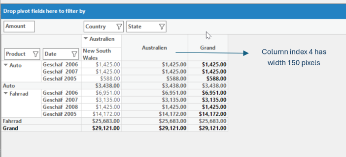

# Pivot Columns in Windows Forms Pivot Grid

Pivot columns are defined by using the [PivotItem](https://help.syncfusion.com/cr/windowsforms/Syncfusion.PivotAnalysis.Base.PivotItem.html) object which holds the information needed for columns that appear in the pivot grid control.

## Defining pivot columns using pivot items

To define a pivot column item, the following properties of `PivotItem` object are used.

<table>
<tr>
<th>
Property Name</th><th>
Description</th><th>
Type</th></tr>
<tr>
<td>
{{'[Comparer](https://help.syncfusion.com/cr/windowsforms/Syncfusion.PivotAnalysis.Base.PivotItem.html#Syncfusion_PivotAnalysis_Base_PivotItem_Comparer)'| markdownify }}</td><td>
Gets or sets the IComparer object used for sorting. If this value is null, then sorting will be performed under the assumption that this field is IComparable.</td><td>
IComparer</td></tr>
<tr>
<td>
{{'[FieldHeader](https://help.syncfusion.com/cr/windowsforms/Syncfusion.PivotAnalysis.Base.PivotItem.html#Syncfusion_PivotAnalysis_Base_PivotItem_FieldHeader)'| markdownify }}</td><td>
Gets or sets the title you want to see in the header for this pivot item.</td><td>
string</td></tr>
<tr>
<td>
{{'[FieldMappingName](https://help.syncfusion.com/cr/windowsforms/Syncfusion.PivotAnalysis.Base.PivotItem.html#Syncfusion_PivotAnalysis_Base_PivotItem_FieldMappingName)'| markdownify }}</td><td>
Gets or sets the property's mapping name.</td><td>
string</td></tr>
<tr>
<td>
{{'[Format](https://help.syncfusion.com/cr/windowsforms/Syncfusion.PivotAnalysis.Base.PivotItem.html#Syncfusion_PivotAnalysis_Base_PivotItem_Format)'| markdownify }}</td><td>
Gets or sets the format item for the specified field.</td><td>
string</td></tr>
<tr>
<td>
{{'[TotalHeader](https://help.syncfusion.com/cr/windowsforms/Syncfusion.PivotAnalysis.Base.PivotItem.html#Syncfusion_PivotAnalysis_Base_PivotItem_TotalHeader)'| markdownify }}</td><td>
Gets or sets the string you want to append to the pivot item's summary cells.</td><td>
string</td></tr>
</table>

Refer to the below code sample for adding pivot column item in the pivot grid control.





// Defining pivot item
PivotItem pivotItem = new PivotItem() { FieldHeader = "Country", FieldMappingName = "Country", TotalHeader = "Total" };

// Adding pivot column item to pivot grid
this.pivotGridControl1.PivotColumns.Add(pivotItem);





' Defining pivot item
Dim pivotItem As New PivotItem() With {.FieldHeader = "Country", .FieldMappingName = "Country", .TotalHeader = "Total"}

' Adding pivot column item to pivot grid
Me.pivotGridControl1.PivotColumns.Add(pivotItem)





## Synchronizing pivot columns

To synchronize the newly added or modified pivot column items with the pivot grid control, the [SynchronizePivotItems](https://help.syncfusion.com/cr/windowsforms/Syncfusion.Windows.Forms.PivotAnalysis.PivotGridControlBase.html#Syncfusion_Windows_Forms_PivotAnalysis_PivotGridControlBase_SynchronizePivotItems_System_Collections_Specialized_NotifyCollectionChangedEventArgs_System_Boolean_) method will be used. This method will be invoked whenever the collection of pivot column items gets changed.

## Sorting pivot columns

By default, the pivot grid control sorts the column data in ascending order. The sorting order can be changed by defining custom comparer and it needs to be assigned using the [Comparer](https://help.syncfusion.com/cr/windowsforms/Syncfusion.PivotAnalysis.Base.PivotItem.html#Syncfusion_PivotAnalysis_Base_PivotItem_Comparer) property of corresponding pivot item.

Refer to the below code sample to define comparer for sorting the column data in descending order.





public partial class Form1 : Form
{
    public Form1()
    {
        ......
        this.pivotGridControl1.PivotColumns.Add(new PivotItem { FieldMappingName = "Country", Comparer = new ReverseOrderComparer() });
        ......
    }
}

// Reverse order comparer for sorting the data in descending order
public class ReverseOrderComparer : IComparer
{
   public int Compare(object x, object y)
   {
      if (x == null && y == null)
         return 0;
      else if (y == null)
         return 1;
      else if (x == null)
         return -1;
      else
         return -x.ToString().CompareTo(y.ToString());
   }
}





Partial Public Class Form1
    Inherits Form
    Public Sub New()
        .....
        Me.pivotGridControl1.PivotColumns.Add(New PivotItem With {.FieldMappingName = "Country", .Comparer = New ReverseOrderComparer()})
        .....
    End Sub
End Class

' Reverse order comparer for sorting the data in descending order
Public Class ReverseOrderComparer
    Inherits IComparer

    Public Function Compare(ByVal x As Object, ByVal y As Object) As Integer
        If x Is Nothing AndAlso y Is Nothing Then
            Return 0
        ElseIf y Is Nothing Then
            Return 1
        ElseIf x Is Nothing Then
            Return -1
        Else
            Return -x.ToString().CompareTo(y.ToString())
        End If
    End Function
End Class





## Set the width for the pivot columns

The width of the pivot columns can be changed using the `QueryColWidth` event.

Refer the below code snippet to change the width of the pivot columns by using the column index.





pivotGridControl1.TableModel.QueryColWidth += TableModel_QueryColWidth;

 private void TableModel_QueryColWidth(object sender, Syncfusion.Windows.Forms.Grid.GridRowColSizeEventArgs e)
 {
     if (e.Index == 4) 
     {
         e.Size = 150;
         e.Handled = true;
     }
 }    





AddHandler pivotGridControl1.TableModel.QueryColWidth, AddressOf TableModel_QueryColWidth

Private Sub TableModel_QueryColWidth(ByVal sender As Object,ByVal e As Syncfusion.Windows.Forms.Grid.GridRowColSizeEventArgs)
    If e.Index == 4 Then
        e.Size = 150
        e.Handled = True
    End If
End Sub





