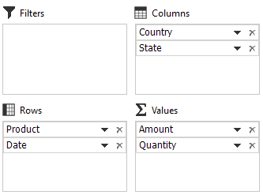
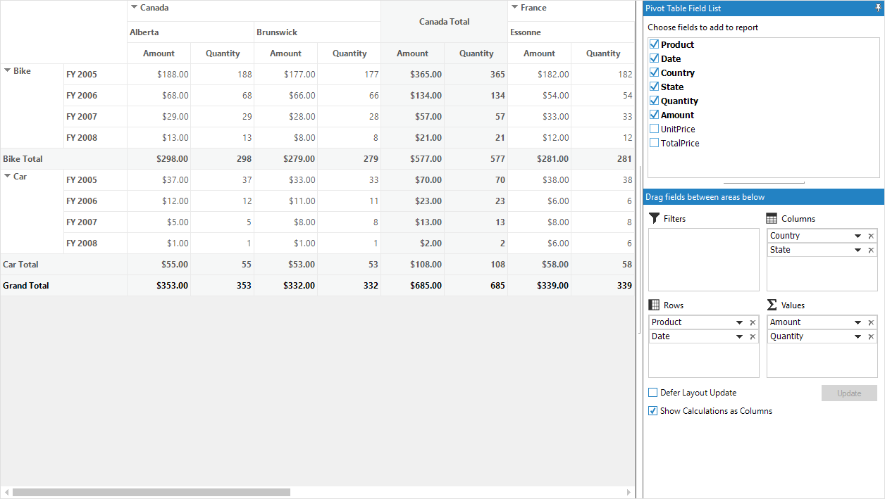
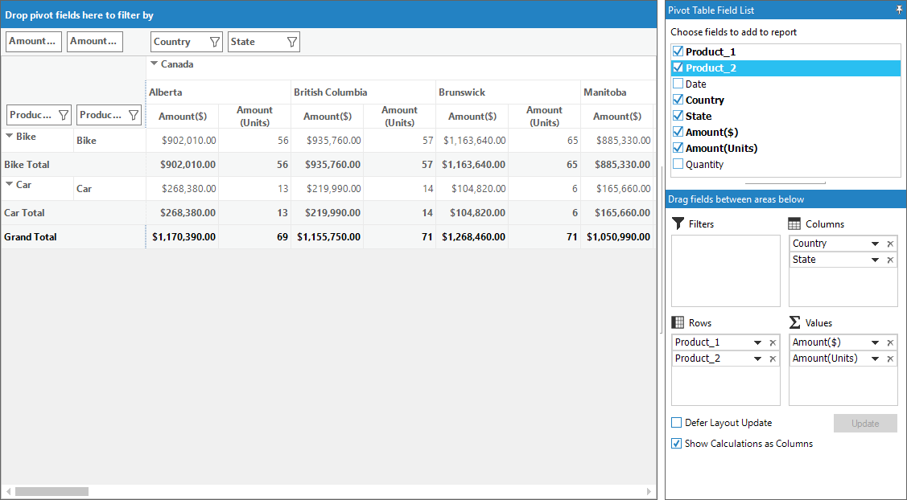
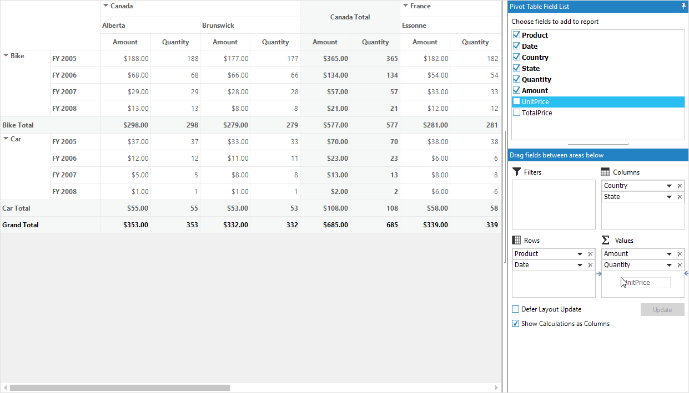
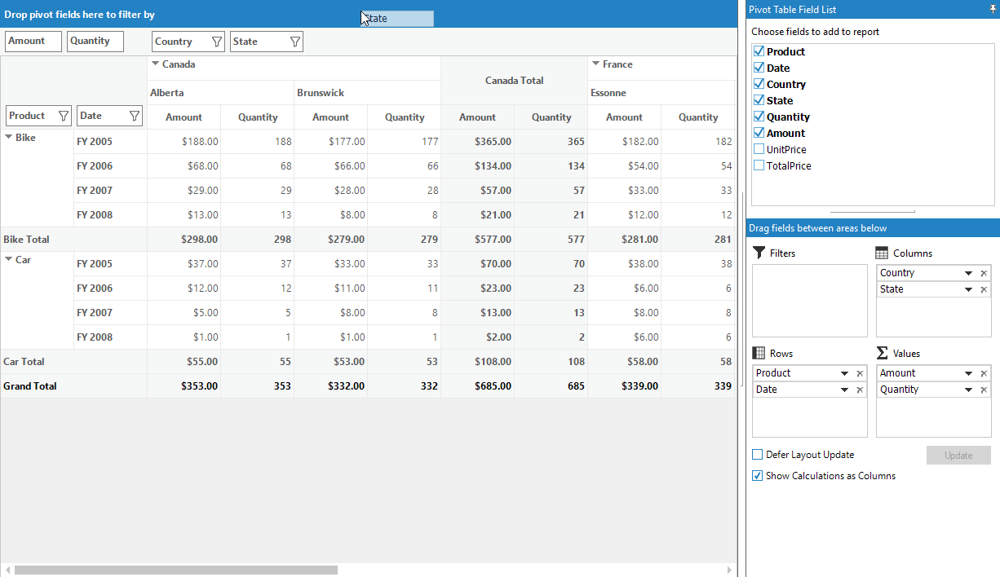
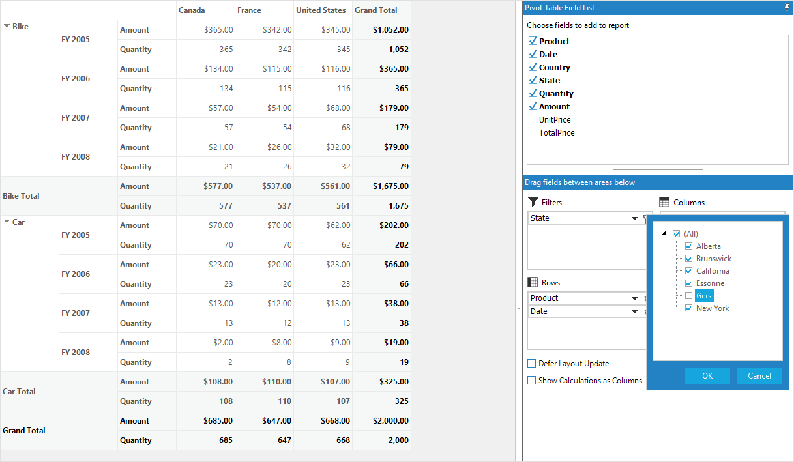
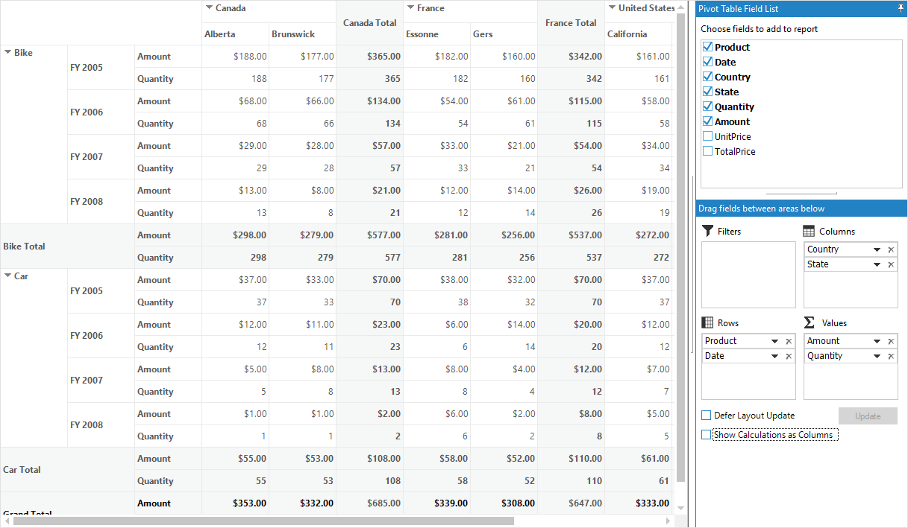

# Pivot Schema Designer in Windows Forms Pivot Grid

The [Pivot schema designer](https://help.syncfusion.com/cr/windowsforms/Syncfusion.Windows.Forms.PivotAnalysis.PivotGridControl.html#Syncfusion_Windows_Forms_PivotAnalysis_PivotGridControl_PivotSchemaDesigner) also known as pivot table field list allows you to add, rearrange, filter, and remove the pivot fields to show the data in the pivot grid exactly the way you desired.

Based on the data source bound to the pivot grid control, the pivot table field list will be automatically populated with field names. The pivot table field list provides an Excel like appearance and behavior.

The pivot schema designer consists of two sections such as follows:

* **Fields section**: Presents at the top portion to add and remove the pivot fields in the pivot grid.
* **Layout section**: Presents at the bottom portion to rearrange and reposition the pivot fields in the pivot grid.

## Fields section

The fields section contains the list of pivot items that are present in the data source of pivot grid. The [PivotFields](https://help.syncfusion.com/cr/windowsforms/Syncfusion.Windows.Forms.PivotAnalysis.PivotGridControl.html#Syncfusion_Windows_Forms_PivotAnalysis_PivotGridControl_PivotFields) property holds the collection of pivot items available in the fields section.

Using this fields section, the pivot fields can be dynamically added or removed in the pivot grid. If the pivot field is checked in the fields section, then it will be added to the pivot grid. Simultaneously, if the pivot field is unchecked in the fields section, then it will be removed from the pivot grid.

By default, the pivot field gets added to the row section. To add the pivot fields in any other layout section, drag it from the fields section to the required layout section.

## Layout section

The layout section is segregated into four sections as follows:

* Filters section (Grid filter list).
* Columns section  (Grid column list).
* Rows section  (Grid row list).
* Values section  (Grid value list).

### Filters section

The filters section is used to filter the items in pivot grid based on items selected in the report filter pop-up and it can be accessed using the [GridFilterList](https://help.syncfusion.com/cr/windowsforms/Syncfusion.Windows.Forms.PivotAnalysis.PivotGridControlBase.html#Syncfusion_Windows_Forms_PivotAnalysis_PivotGridControlBase_GridFilterList) property available in the pivot grid control's `TableControl` property.

The report filter pop-up can be launched by clicking the filter icon available in the right corner of each item in the filters section.

### Columns section

The columns section is used to display the pivot column fields added to the pivot grid control and it can be accessed using the [GridColumnList](https://help.syncfusion.com/cr/windowsforms/Syncfusion.Windows.Forms.PivotAnalysis.PivotGridControlBase.html#Syncfusion_Windows_Forms_PivotAnalysis_PivotGridControlBase_GridColumnList) property.

### Rows section

The rows section is used to display the pivot row fields added to the pivot grid control and it can be accessed using the [GridRowList](https://help.syncfusion.com/cr/windowsforms/Syncfusion.Windows.Forms.PivotAnalysis.PivotGridControlBase.html#Syncfusion_Windows_Forms_PivotAnalysis_PivotGridControlBase_GridRowList) property.

### Values section

The values section is used to display the summary value fields added to the pivot grid control and it can be accessed using the [GridValueList](https://help.syncfusion.com/cr/windowsforms/Syncfusion.Windows.Forms.PivotAnalysis.PivotGridControlBase.html#Syncfusion_Windows_Forms_PivotAnalysis_PivotGridControlBase_GridValueList) property.

## Enabling pivot table field list

To show the pivot table field list integrated with the pivot grid control, the [ShowPivotTableFieldList](https://help.syncfusion.com/cr/windowsforms/Syncfusion.Windows.Forms.PivotAnalysis.PivotGridControl.html#Syncfusion_Windows_Forms_PivotAnalysis_PivotGridControl_ShowPivotTableFieldList) property of the pivot grid should be enabled. By default, it is set to false.

Refer to the following code sample to show the pivot table field with pivot grid control.





this.pivotGridControl1.ShowPivotTableFieldList = true;





Me.pivotGridControl1.ShowPivotTableFieldList = True





## Setting caption in pivot table field list

The pivot grid control in Windows Forms supports duplicating a specific field by specifying different names for it. This support can be achieved by using the `FieldCaption` property of row and column pivot item as well as pivot calculation item. Using this support, the pivot grid control allows you to define the multiple items in same underlying type.

Refer to the following code sample to set the field caption for pivot row items and pivot calculation items.





// Pivot row items
this.pivotGridControl1.PivotRows.Add(new PivotItem { FieldMappingName = "Product", FieldCaption = "Product_1", TotalHeader = "Total" });
this.pivotGridControl1.PivotRows.Add(new PivotItem { FieldMappingName = "Product", FieldCaption = "Product_2", TotalHeader = "Total" });

// Pivot calculation items
this.pivotGridControl1.PivotCalculations.Add(new PivotComputationInfo { FieldName = "Amount", FieldCaption = "Amount($)", Format = "C", SummaryType = SummaryType.DoubleTotalSum });
this.pivotGridControl1.PivotCalculations.Add(new PivotComputationInfo { FieldName = "Amount", FieldCaption = "Amount(Units)", Format = "##", SummaryType = SummaryType.IntTotalSum });




'Pivot row items
Me.pivotGridControl1.PivotRows.Add(New PivotItem With {.FieldMappingName = "Product", .FieldCaption = "Product_1", .TotalHeader = "Total"})
Me.pivotGridControl1.PivotRows.Add(New PivotItem With {.FieldMappingName = "Product", .FieldCaption = "Product_2", .TotalHeader = "Total"})

'Pivot calculation items
Me.pivotGridControl1.PivotCalculations.Add(New PivotComputationInfo With {.FieldName = "Amount", .FieldCaption = "Amount($)", .Format = "C", .SummaryType = SummaryType.DoubleTotalSum})
Me.pivotGridControl1.PivotCalculations.Add(New PivotComputationInfo With {.FieldName = "Amount", .FieldCaption = "Amount(Units)", .Format = "##", .SummaryType = SummaryType.IntTotalSum})





## Interactive features

### Adding fields to pivot grid

The pivot fields can be dynamically added to the pivot grid control by checking the check box besides the pivot fields available in the fields section.

### Reordering fields in pivot grid

The pivot fields can be reordered by doing the drag-and-drop operation as well as using the context menu available in the grid list.

#### Dragging fields between grid list and fields section

Any pivot field is dragged from the fields section to the column or row or value or filter grid list available at the bottom of the pivot schema designer as follows.

#### Dragging fields within grid lists

Any pivot field is dragged from one grid list to another grid list available at the bottom of the pivot schema designer as follows.

#### Dragging fields between pivot schema designer and grouping bar

Any pivot field is dragged from any of the pivot schema designer's grid list or field section to the required grouping bar section as follows.

#### Using context menu of grid list

Any pivot field inside the grid lists is reordered by using the context menu, which is opened by clicking the down arrow icon available in each item of grid lists.

### Removing fields from pivot grid

The pivot field can be dynamically removed from the pivot grid control. This can be achieved by any of the following ways:

* Clear the check box of the required pivot field available in the fields section list.
* Click the "Remove Field" option available in the context menu, which is opened by clicking the down arrow icon available in each item of grid lists.
* Click the remove icon available in each item of grid lists.

### Filtering field items in pivot grid

The items of the pivot field inside the filter section can only be filtered. The report filter pop-up will be opened by clicking the filter icon present in the right corner of each item in the filters section. The items of the pivot field can be filtered by checking or unchecking the check box besides them.

N>
At least, one item should be in the checked state, else the OK button will be disabled in the report filter pop-up to restrict the filtering operation.

## Defer layout update

By default, the pivot grid control is updated for each and every action happened related to the pivot field. For pivot grid control containing large data source, these actions can take some time to complete. To handle this scenario, the pivot grid provides defer layout update support which allows users to control when the pivot grid control is updated.

### Enabling defer layout update

The "[Defer Layout Update](https://help.syncfusion.com/cr/windowsforms/Syncfusion.Windows.Forms.PivotAnalysis.PivotSchemaDesigner.html#Syncfusion_Windows_Forms_PivotAnalysis_PivotSchemaDesigner_DeferLayoutUpdateCheckBox)" check box present at the bottom-left corner of the pivot schema designer should be checked to enable this feature. When this checkbox is checked, the "[Update](https://help.syncfusion.com/cr/windowsforms/Syncfusion.Windows.Forms.PivotAnalysis.PivotSchemaDesigner.html#Syncfusion_Windows_Forms_PivotAnalysis_PivotSchemaDesigner_DeferLayoutUpdateButton)" button next to it will be enabled. Now, any operations can be performed on pivot fields without updating the pivot grid control. The pivot grid control will be updated only if the update button is clicked.

This support can also be be achieved programmatically by setting the [DeferLayoutUpdate](https://help.syncfusion.com/cr/windowsforms/Syncfusion.Windows.Forms.PivotAnalysis.PivotGridControl.html#Syncfusion_Windows_Forms_PivotAnalysis_PivotGridControl_DeferLayoutUpdate) property of the pivot grid control.





this.pivotGridControl1.DeferLayoutUpdate = true;





Me.pivotGridControl1.DeferLayoutUpdate = True





## Displaying calculations

The pivot grid supports showing the calculation values in column or row. The "[Show Calculations as Columns](https://help.syncfusion.com/cr/windowsforms/Syncfusion.Windows.Forms.PivotAnalysis.PivotSchemaDesigner.html#Syncfusion_Windows_Forms_PivotAnalysis_PivotSchemaDesigner_ShowCalculationsAsColumnCheckBox)" check box present at the bottom-left corner of the pivot schema designer should be checked or unchecked based on the requirement.

This support can also be achieved programmatically by using the [ShowCalculationsAsColumns](https://help.syncfusion.com/cr/windowsforms/Syncfusion.Windows.Forms.PivotAnalysis.PivotGridControl.html#Syncfusion_Windows_Forms_PivotAnalysis_PivotGridControl_ShowCalculationsAsColumns) property of the pivot grid control.





this.pivotGridControl1.ShowCalculationsAsColumns = false;





Me.pivotGridControl1.ShowCalculationsAsColumns = False





## Pivot computation information dialog

The pivot computation information dialog is used to view the information about particular pivot calculation item. It is also used to edit the header, description, value format, summary type, and calculation type of the pivot calculation item at runtime. While double-clicking the calculation item under the value section, the pivot computation information dialog will be displayed as follows.

