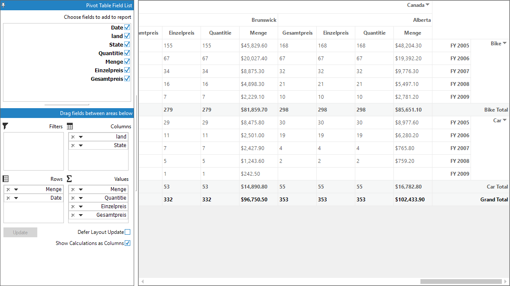

# Right to Left Support in Windows Forms Pivot Grid

The elements of pivot grid control can be aligned in right-to-left (RTL) layout. This support is useful when the pivot grid control is localized in Middle Eastern languages, such as Hebrew and Arabic, which are written predominantly from right to left.

## Enabling RTL mode

Th elements of pivot grid control can be laid out from right to left by setting the [RightToLeft](https://learn.microsoft.com/en-us/dotnet/api/system.windows.forms.control.righttoleft?view=windowsdesktop-7.0&viewFallbackFrom=net-5.0) property to `Yes`. Refer to the below code sample to align the pivot grid control in right to left order.





this.pivotGridControl1.RightToLeft = RightToLeft.Yes;





Me.pivotGridControl1.RightToLeft = RightToLeft.Yes
  




