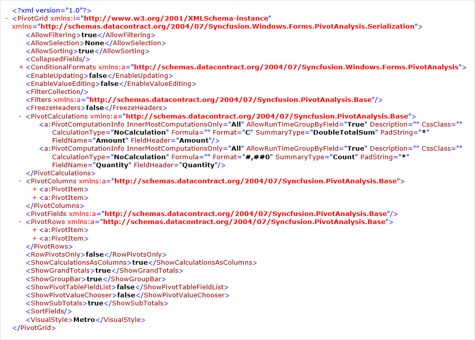

# Serialization and Deserialization in Windows Forms Pivot Grid

Serialization and deserialization support allows to serialize and deserialize the settings of pivot grid control.

## Serializing pivot grid

Serialization is a process that allows to save the settings of pivot grid control by exporting its current settings to an XML file. It can be achieved with the help of any of the following methods.

### Serializing using save file dialog

Pivot grid control allows to save its settings to the desired location in _*.xml_ format by using the [Serialize()](https://help.syncfusion.com/cr/windowsforms/Syncfusion.Windows.Forms.PivotAnalysis.PivotGridControl.html#Syncfusion_Windows_Forms_PivotAnalysis_PivotGridControl_Serialize().html) method.

Refer to the below code sample to serialize the pivot grid control using save file dialog.





this.pivotGridControl1.Serialize();





Me.pivotGridControl1.Serialize()





The below screenshot illustrates the serialized content of pivot grid control.

### Serializing using stream

Pivot grid control allows to save its settings with the help of [Serialize(Stream)](https://help.syncfusion.com/cr/windowsforms/Syncfusion.Windows.Forms.PivotAnalysis.PivotGridControl.html#Syncfusion_Windows_Forms_PivotAnalysis_PivotGridControl_Serialize_System_IO_Stream_) method by passing the stream as parameter.

Refer to the below code sample to serialize the pivot grid control as stream.





using (FileStream fileStream = File.Create("PivotGrid.xml"))
{
    this.pivotGridControl1.Serialize(fileStream);
}





Using fileStream As FileStream = File.Create("PivotGrid.xml")
    Me.pivotGridControl1.Serialize(fileStream)
End Using





### Serializing using specific file

Pivot grid control allows to save its settings with the help of [Serialize(String)](https://help.syncfusion.com/cr/windowsforms/Syncfusion.Windows.Forms.PivotAnalysis.PivotGridControl.html#Syncfusion_Windows_Forms_PivotAnalysis_PivotGridControl_Serialize_System_String_) method by passing the file path as parameter.

Refer to the below code sample to serialize the pivot grid control as xml file.





this.pivotGridControl1.Serialize(@"D:\PivotGrid.xml");





Me.pivotGridControl1.Serialize("D:\PivotGrid.xml")





### Serializing to XML string

Pivot grid control allows to save its settings into a XML string using the [SerializeToXml()](https://help.syncfusion.com/cr/windowsforms/Syncfusion.Windows.Forms.PivotAnalysis.PivotGridControl.html#Syncfusion_Windows_Forms_PivotAnalysis_PivotGridControl_SerializeToXml) method.

Refer to the below code sample to serialize the pivot grid control as xml string.





string xmlString = this.pivotGridControl1.SerializeToXml();





Dim xmlString As String = Me.pivotGridControl1.SerializeToXml()





## Customizing serialization using options

The serialization of pivot grid control can be customized by using the instance of [SerializationOptions](https://help.syncfusion.com/cr/windowsforms/Syncfusion.Windows.Forms.PivotAnalysis.Serialization.SerializationOptions.html). The instance of serialization options needs to be passed as an argument of [Serialize(String,SerializationOptions)](https://help.syncfusion.com/cr/windowsforms/Syncfusion.Windows.Forms.PivotAnalysis.PivotGridControl.html#Syncfusion_Windows_Forms_PivotAnalysis_PivotGridControl_Serialize_System_String_Syncfusion_Windows_Forms_PivotAnalysis_Serialization_SerializationOptions_) or [Serialize(Stream,SerializationOptions)](https://help.syncfusion.com/cr/windowsforms/Syncfusion.Windows.Forms.PivotAnalysis.PivotGridControl.html#Syncfusion_Windows_Forms_PivotAnalysis_PivotGridControl_Serialize_System_IO_Stream_Syncfusion_Windows_Forms_PivotAnalysis_Serialization_SerializationOptions_) method based on the requirement.

### Serializing grouping bar items

By default, the pivot grid control allows to serialize the items of grouping bar. The serialization of grouping bar items can be disabled by setting the [SerializeGrouping](https://help.syncfusion.com/cr/windowsforms/Syncfusion.Windows.Forms.PivotAnalysis.Serialization.SerializationOptions.html#Syncfusion_Windows_Forms_PivotAnalysis_Serialization_SerializationOptions_SerializeGrouping) property to false.





using (var file = File.Create("PivotGrid.xml"))
{
    SerializationOptions options = new SerializationOptions();
    options.SerializeGrouping = false;
    this.pivotGridControl1.Serialize(file, options);
}





Using file = File.Create("PivotGrid.xml")
    Dim options As New SerializationOptions()
    options.SerializeGrouping = False
    Me.pivotGridControl1.Serialize(file, options)
End Using





### Serializing sorted items

By default, the pivot grid control allows to serialize the sorted items. The serialization of sorted items can be disabled by setting the [SerializeSorting](https://help.syncfusion.com/cr/windowsforms/Syncfusion.Windows.Forms.PivotAnalysis.Serialization.SerializationOptions.html#Syncfusion_Windows_Forms_PivotAnalysis_Serialization_SerializationOptions_SerializeSorting) property to false.





using (FileStream fileStream = File.Create("PivotGrid.xml"))
{
    SerializationOptions options = new SerializationOptions();
    options.SerializeSorting = false;
    this.pivotGridControl1.Serialize(fileStream, options);
}





Using fileStream As FileStream = File.Create("PivotGrid.xml")
    Dim options As New SerializationOptions()
    options.SerializeSorting = False
    Me.pivotGridControl1.Serialize(fileStream, options)
End Using





### Serializing filtered items

By default, the pivot grid control allows to serialize the filtered items. The serialization of filtered items can be disabled by setting the [SerializeFiltering](https://help.syncfusion.com/cr/windowsforms/Syncfusion.Windows.Forms.PivotAnalysis.Serialization.SerializationOptions.html#Syncfusion_Windows_Forms_PivotAnalysis_Serialization_SerializationOptions_SerializeFiltering) property to false.





using (var file = File.Create("PivotGrid.xml"))
{
    SerializationOptions options = new SerializationOptions();
    options.SerializeFiltering = false;
    this.pivotGridControl1.Serialize(file, options);
}





Using file = File.Create("PivotGrid.xml")
    Dim options As New SerializationOptions()
    options.SerializeFiltering = False
    Me.pivotGridControl1.Serialize(file, options)
End Using





### Serializing pivot row items

By default, the pivot grid control allows to serialize the collection of pivot row items. The serialization of pivot row items can be disabled by setting the [SerializePivotRows](https://help.syncfusion.com/cr/windowsforms/Syncfusion.Windows.Forms.PivotAnalysis.Serialization.SerializationOptions.html#Syncfusion_Windows_Forms_PivotAnalysis_Serialization_SerializationOptions_SerializePivotRows) property to false.





using (var file = File.Create("PivotGrid.xml"))
{
    SerializationOptions options = new SerializationOptions();
    options.SerializePivotRows = false;
    this.pivotGridControl1.Serialize(file, options);
}





Using file = File.Create("PivotGrid.xml")
    Dim options As New SerializationOptions()
    options.SerializePivotRows = False
    Me.pivotGridControl1.Serialize(file, options)
End Using





### Serializing pivot column items

By default, the pivot grid control allows to serialize the collection of pivot column items. The serialization of pivot column items can be disabled by setting the [SerializePivotColumns](https://help.syncfusion.com/cr/windowsforms/Syncfusion.Windows.Forms.PivotAnalysis.Serialization.SerializationOptions.html#Syncfusion_Windows_Forms_PivotAnalysis_Serialization_SerializationOptions_SerializePivotColumns) property to false.





using (var file = File.Create("PivotGrid.xml"))
{
    SerializationOptions options = new SerializationOptions();
    options.SerializePivotColumns = false;
    this.pivotGridControl1.Serialize(file, options);
}





Using file = File.Create("PivotGrid.xml")
    Dim options As New SerializationOptions()
    options.SerializePivotColumns = False
    Me.pivotGridControl1.Serialize(file, options)
End Using





### Serializing pivot calculation items

By default, the pivot grid control allows to serialize the collection of pivot column items. The serialization of pivot column items can be disabled by setting the [SerializePivotCalculations](https://help.syncfusion.com/cr/windowsforms/Syncfusion.Windows.Forms.PivotAnalysis.Serialization.SerializationOptions.html#Syncfusion_Windows_Forms_PivotAnalysis_Serialization_SerializationOptions_SerializePivotCalculations) property to false.





using (var file = File.Create("PivotGrid.xml"))
{
    SerializationOptions options = new SerializationOptions();
    options.SerializePivotCalculations = false;
    this.pivotGridControl1.Serialize(file, options);
}





Using file = File.Create("PivotGrid.xml")
    Dim options As New SerializationOptions()
    options.SerializePivotCalculations = False
    Me.pivotGridControl1.Serialize(file, options)
End Using





### Serializing conditional formats

By default, the pivot grid control allows to serialize the conditional formats applied to it. The serialization of conditional formats can be disabled by setting the [SerializeConditionalFormats](https://help.syncfusion.com/cr/windowsforms/Syncfusion.Windows.Forms.PivotAnalysis.Serialization.SerializationOptions.html#Syncfusion_Windows_Forms_PivotAnalysis_Serialization_SerializationOptions_SerializeConditionalFormats) property to false.





using (var file = File.Create("PivotGrid.xml"))
{
    SerializationOptions options = new SerializationOptions();
    options.SerializeConditionalFormats = false;
    this.pivotGridControl1.Serialize(file, options);
}





Using file = File.Create("PivotGrid.xml")
    Dim options As New SerializationOptions()
    options.SerializeConditionalFormats = False
    Me.pivotGridControl1.Serialize(file, options)
End Using





### Serializing expand and collapse state

By default, the pivot grid control allows to serialize the expand and collapse state of expanders in row and column headers. The serialization of expand and collapse state of expanders can be disabled by setting the [SerializeExpandCollapseState](https://help.syncfusion.com/cr/windowsforms/Syncfusion.Windows.Forms.PivotAnalysis.Serialization.SerializationOptions.html#Syncfusion_Windows_Forms_PivotAnalysis_Serialization_SerializationOptions_SerializeExpandCollapseState) property to false.





using (var file = File.Create("PivotGrid.xml"))
{
    SerializationOptions options = new SerializationOptions();
    options.SerializeExpandCollapseState = false;
    this.pivotGridControl1.Serialize(file, options);
}





Using file = File.Create("PivotGrid.xml")
    Dim options As New SerializationOptions()
    options.SerializeExpandCollapseState = False
    Me.pivotGridControl1.Serialize(file, options)
End Using





## Deserializing pivot grid

Deserialization is a process that allows to reconstruct the pivot grid control based on the settings stored in the XML file. It can be done with the help of any of the following methods.

### Deserializing using open file dialog

The settings of pivot grid control can be deserialized with the help of [Deserialize()](https://help.syncfusion.com/cr/windowsforms/Syncfusion.Windows.Forms.PivotAnalysis.PivotGridControl.html#Syncfusion_Windows_Forms_PivotAnalysis_PivotGridControl_Deserialize) method.

Refer to the below code sample to deserialize the pivot grid control using open file dialog.





this.pivotGridControl1.Deserialize();





Me.pivotGridControl1.Deserialize()





### Deserializing using stream

The settings of pivot grid control can be deserialized with the help of [Deserialize(Stream)](https://help.syncfusion.com/cr/windowsforms/Syncfusion.Windows.Forms.PivotAnalysis.PivotGridControl.html#Syncfusion_Windows_Forms_PivotAnalysis_PivotGridControl_Deserialize_System_IO_Stream_) method.

Refer to the below code sample to deserialize the pivot grid from stream.





using (FileStream fileStream = File.OpenRead("PivotGrid.xml"))
{
    this.pivotGridControl1.Deserialize(fileStream);
}





Using fileStream As FileStream = File.OpenRead("PivotGrid.xml")
    Me.pivotGridControl1.Deserialize(fileStream)
End Using





### Deserializing using specific file

The settings of pivot grid control can be deserialized with the help of [Deserialize(String)](https://help.syncfusion.com/cr/windowsforms/Syncfusion.Windows.Forms.PivotAnalysis.PivotGridControl.html#Syncfusion_Windows_Forms_PivotAnalysis_PivotGridControl_Deserialize_System_String_) method by passing the path of the file as parameter.

Refer to the below code sample to deserialize the pivot grid from xml file.





this.pivotGridControl1.Deserialize(@"D:\PivotGrid.xml");





Me.pivotGridControl1.Deserialize("D:\PivotGrid.xml")





### Deserializing from XML string

Pivot grid control allows to load its settings from the XML string using the  [DeserializeFromXml()](https://help.syncfusion.com/cr/windowsforms/Syncfusion.Windows.Forms.PivotAnalysis.PivotGridControl.html#Syncfusion_Windows_Forms_PivotAnalysis_PivotGridControl_DeserializeFromXml_System_String_) method.

Refer to the below code sample to deserialize the pivot grid from xml string.





this.pivotGridControl1.DeserializeFromXml(xmlString);





Me.pivotGridControl1.DeserializeFromXml(xmlString)





## Customizing deserialization using options

The deserialization of pivot grid control can be customized by using the instance of [DeserializationOptions](https://help.syncfusion.com/cr/windowsforms/Syncfusion.Windows.Forms.PivotAnalysis.Serialization.DeserializationOptions.html). The instance of deserialization options needs to be passed as an argument of [Deserialize(String,DeserializationOptions)](https://help.syncfusion.com/cr/windowsforms/Syncfusion.Windows.Forms.PivotAnalysis.PivotGridControl.html#Syncfusion_Windows_Forms_PivotAnalysis_PivotGridControl_Deserialize_System_String_Syncfusion_Windows_Forms_PivotAnalysis_Serialization_DeserializationOptions_) or [Deserialize(Stream,DeserializationOptions)](https://help.syncfusion.com/cr/windowsforms/Syncfusion.Windows.Forms.PivotAnalysis.PivotGridControl.html#Syncfusion_Windows_Forms_PivotAnalysis_PivotGridControl_Deserialize_System_IO_Stream_Syncfusion_Windows_Forms_PivotAnalysis_Serialization_DeserializationOptions_) method based on the requirement.

### Deserializing grouping bar items

By default, the pivot grid control allows to deserialize the items of grouping bar. The deserialization of grouping bar items can be disabled by setting the [DeserializeGrouping](https://help.syncfusion.com/cr/windowsforms/Syncfusion.Windows.Forms.PivotAnalysis.Serialization.DeserializationOptions.html#Syncfusion_Windows_Forms_PivotAnalysis_Serialization_DeserializationOptions_DeserializeGrouping) property to false.





using (FileStream fileStream = File.OpenRead("PivotGrid.xml"))
{
    DeserializationOptions options = new DeserializationOptions();
    options.DeserializeGrouping = false;
    this.pivotGridControl1.Deserialize(fileStream, options);
}





Using fileStream As FileStream = File.OpenRead("PivotGrid.xml")
    Dim options As New DeserializationOptions()
    options.DeserializeGrouping = False
    Me.pivotGridControl1.Deserialize(fileStream, options)
End Using





### Deserializing sorted items

By default, the pivot grid control allows to deserialize the sorting operation. The deserialization of sorted items can be disabled by setting the [DeserializeSorting](https://help.syncfusion.com/cr/windowsforms/Syncfusion.Windows.Forms.PivotAnalysis.Serialization.DeserializationOptions.html#Syncfusion_Windows_Forms_PivotAnalysis_Serialization_DeserializationOptions_DeserializeSorting) property to false.





using (FileStream fileStream = File.OpenRead("PivotGrid.xml"))
{
    DeserializationOptions options = new DeserializationOptions();
    options.DeserializeSorting = false;
    this.pivotGridControl1.Deserialize(fileStream, options);
}





Using fileStream As FileStream = File.Create("PivotGrid.xml")
    Dim options As New DeserializationOptions()
    options.DeserializeSorting = False
    Me.pivotGridControl1.Deserialize(fileStream, options)
End Using





### Deserializing filtered items

By default, the pivot grid control allows to deserialize the filtering operation. The deserialization of filtered items can be disabled by setting the [DeserializeFiltering](https://help.syncfusion.com/cr/windowsforms/Syncfusion.Windows.Forms.PivotAnalysis.Serialization.DeserializationOptions.html#Syncfusion_Windows_Forms_PivotAnalysis_Serialization_DeserializationOptions_DeserializeFiltering) property to false.





using (FileStream fileStream = File.OpenRead("PivotGrid.xml"))
{
    DeserializationOptions options = new DeserializationOptions();
    options.DeserializeFiltering = false;
    this.pivotGridControl1.Deserialize(fileStream, options);
}





Using fileStream As FileStream = File.OpenRead("PivotGrid.xml")
    Dim options As New DeserializationOptions()
    options.DeserializeFiltering = False
    Me.pivotGridControl1.Deserialize(fileStream, options)
End Using





### Deserializing pivot row items

By default, the pivot grid control allows to deserialize the collection of pivot row items. The deserialization of pivot row items can be disabled by setting the [DeserializePivotRows](https://help.syncfusion.com/cr/windowsforms/Syncfusion.Windows.Forms.PivotAnalysis.Serialization.DeserializationOptions.html) property to false.





using (FileStream fileStream = File.OpenRead("PivotGrid.xml"))
{
    DeserializationOptions options = new DeserializationOptions();
    options.DeserializePivotRows = false;
    this.pivotGridControl1.Deserialize(fileStream, options);
}





Using fileStream As FileStream = File.OpenRead("PivotGrid.xml")
    Dim options As New DeserializationOptions()
    options.DeserializePivotRows = False
    Me.pivotGridControl1.Deserialize(fileStream, options)
End Using





### Deserializing pivot column items

By default, the pivot grid control allows to deserialize the collection of pivot column items. The deserialization of pivot column items can be disabled by setting the [DeserializePivotColumns](https://help.syncfusion.com/cr/windowsforms/Syncfusion.Windows.Forms.PivotAnalysis.Serialization.DeserializationOptions.html#Syncfusion_Windows_Forms_PivotAnalysis_Serialization_DeserializationOptions_DeserializePivotColumns) property to false.





using (FileStream fileStream = File.OpenRead("PivotGrid.xml"))
{
    DeserializationOptions options = new DeserializationOptions();
    options.DeserializePivotColumns = false;
    this.pivotGridControl1.Deserialize(fileStream, options);
}





Using fileStream As FileStream = File.OpenRead("PivotGrid.xml")
    Dim options As New DeserializationOptions()
    options.DeserializePivotColumns = False
    Me.pivotGridControl1.Deserialize(fileStream, options)
End Using





### Deserializing pivot calculation items

By default, the pivot grid control allows to deserialize the collection of pivot calculation items. The deserialization of pivot calculation items can be disabled by setting the [DeserializePivotCalculations](https://help.syncfusion.com/cr/windowsforms/Syncfusion.Windows.Forms.PivotAnalysis.Serialization.DeserializationOptions.html#Syncfusion_Windows_Forms_PivotAnalysis_Serialization_DeserializationOptions_DeserializePivotCalculations) property to false.





using (FileStream fileStream = File.OpenRead("PivotGrid.xml"))
{
    DeserializationOptions options = new DeserializationOptions();
    options.DeserializePivotCalculations = false;
    this.pivotGridControl1.Deserialize(fileStream, options);
}





Using fileStream As FileStream = File.OpenRead("PivotGrid.xml")
    Dim options As New DeserializationOptions()
    options.DeserializePivotCalculations = False
    Me.pivotGridControl1.Deserialize(fileStream, options)
End Using





### Deserializing conditional formats

By default, the pivot grid control allows to deserialize the conditional formats applied to the it. The deserialization of conditional formats can be disabled by setting the [DeserializeConditionalFormats](https://help.syncfusion.com/cr/windowsforms/Syncfusion.Windows.Forms.PivotAnalysis.Serialization.DeserializationOptions.html#Syncfusion_Windows_Forms_PivotAnalysis_Serialization_DeserializationOptions_DeserializeConditionalFormats) property to false.





using (FileStream fileStream = File.OpenRead("PivotGrid.xml"))
{
    DeserializationOptions options = new DeserializationOptions();
    options.DeserializeConditionalFormats = false;
    this.pivotGridControl1.Deserialize(fileStream, options);
}





Using fileStream As FileStream = File.OpenRead("PivotGrid.xml")
    Dim options As New DeserializationOptions()
    options.DeserializeConditionalFormats = False
    Me.pivotGridControl1.Deserialize(fileStream, options)
End Using





### Deserializing expand and collapse state

By default, the pivot grid control allows to deserialize the expand and collapse state of expanders in column and row headers. The deserialization of expand and collapse state of expanders can be disabled by setting the [DeserializeExpandCollapseState](https://help.syncfusion.com/cr/windowsforms/Syncfusion.Windows.Forms.PivotAnalysis.Serialization.DeserializationOptions.html#Syncfusion_Windows_Forms_PivotAnalysis_Serialization_DeserializationOptions_DeserializeExpandCollapseState) property to false.





using (FileStream fileStream = File.OpenRead("PivotGrid.xml"))
{
    DeserializationOptions options = new DeserializationOptions();
    options.DeserializeExpandCollapseState = false;
    this.pivotGridControl1.Deserialize(fileStream, options);
}





Using fileStream As FileStream = File.OpenRead("PivotGrid.xml")
    Dim options As New DeserializationOptions()
    options.DeserializeExpandCollapseState = False
    Me.pivotGridControl1.Deserialize(fileStream, options)
End Using





A demo sample is available in the following location.

&lt;Installed Drive&gt;\Users\Public\Documents\Syncfusion\Windows\\&lt;Version Number&gt;\PivotGrid.Windows\Samples\Serialization\Serialization Demo
