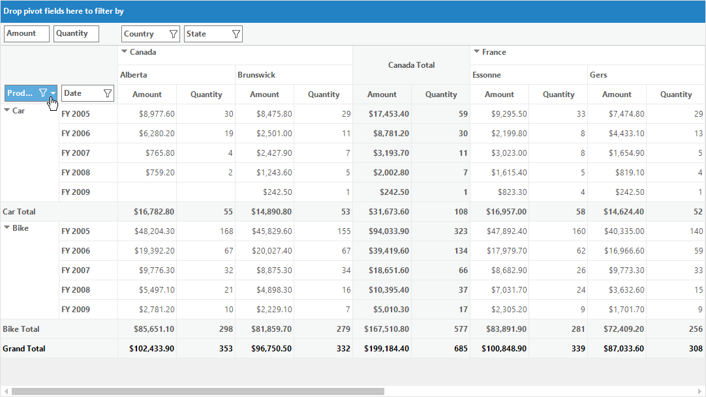

# Sorting in Windows Forms Pivot Grid

Pivot grid provides support for sorting which enables users to quickly visualize, organize and understand the data in a better way. Sorting feature also helps to find the data that you want and make more effective decisions ultimately.

The sorting operation can be performed in the pivot grid control using any of the following ways:

## Using custom comparer programmatically

By default, the pivot grid control populates the data in the ascending order. This sorting order can be changed by using the [Comparer](https://help.syncfusion.com/cr/windowsforms/Syncfusion.PivotAnalysis.Base.PivotItem.html#Syncfusion_PivotAnalysis_Base_PivotItem_Comparer) property of pivot item.





public partial class Form1 : Form
{
    public Form1()
    {
        ......
        this.pivotGridControl1.PivotRows.Add(new PivotItem
        {
            FieldMappingName = "Product",
            TotalHeader = "Total",
            Comparer = new ReverseOrderComparer()
        });
        ......
    }
}

public class ReverseOrderComparer : IComparer
{
   public int Compare(object x, object y)
   {
      if (x == null && y == null)
         return 0;
      else if (y == null)
         return 1;
      else if (x == null)
         return -1;
      else
         return -x.ToString().CompareTo(y.ToString());
   }
}





Partial Public Class Form1
    Inherits Form
    Public Sub New()
        ......
        Me.pivotGridControl1.PivotRows.Add(New PivotItem With
        {
            .FieldMappingName = "Product",
            .TotalHeader = "Total",
            .Comparer = New ReverseOrderComparer()
        })
        ......
    End Sub
End Class

Public Class ReverseOrderComparer
    Implements IComparer
    Public Function Compare(ByVal x As Object, ByVal y As Object) As Integer
        If x Is Nothing AndAlso y Is Nothing Then
            Return 0
        ElseIf y Is Nothing Then
            Return 1
        ElseIf x Is Nothing Then
            Return -1
        Else
            Return -x.ToString().CompareTo(y.ToString())
        End If
    End Function
End Class





## Using grouping bar

The sorting operation can also be performed by clicking on the header item of required pivot field present in row and column header areas of [grouping bar](https://help.syncfusion.com/windowsforms/pivot-grid/grouping-bar).

By default, the pivot field values are sorted in the ascending order. On clicking the same header item once again will reverse the sorting direction. The sort indicator present at the right corner of the header item denotes the type of sorting applied to the pivot field such as ascending order or descending order.

