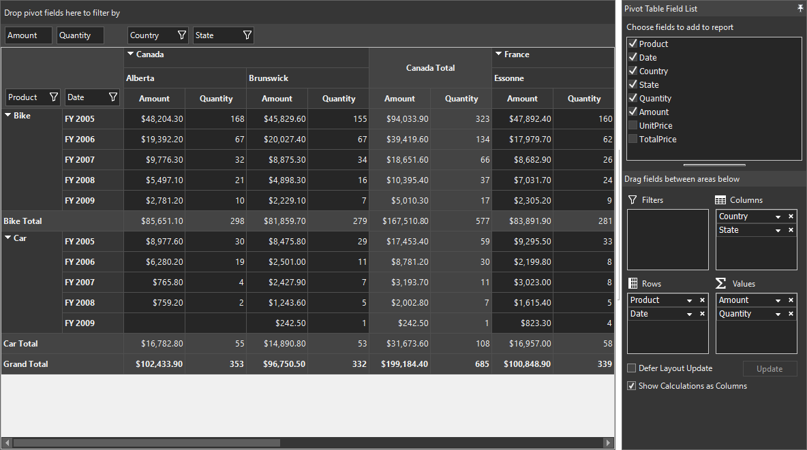
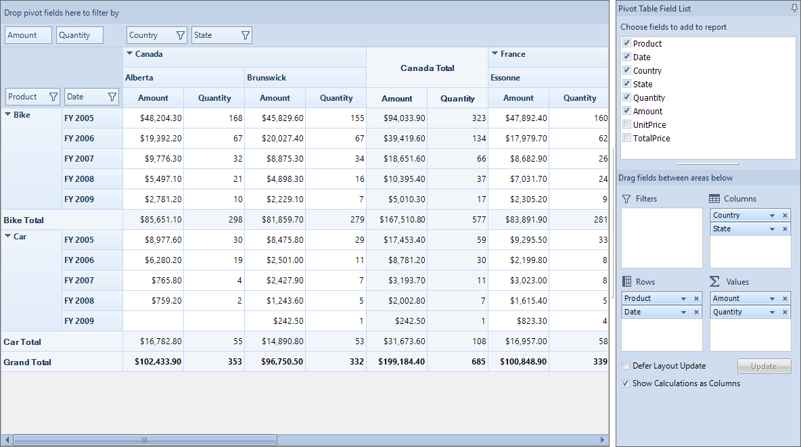
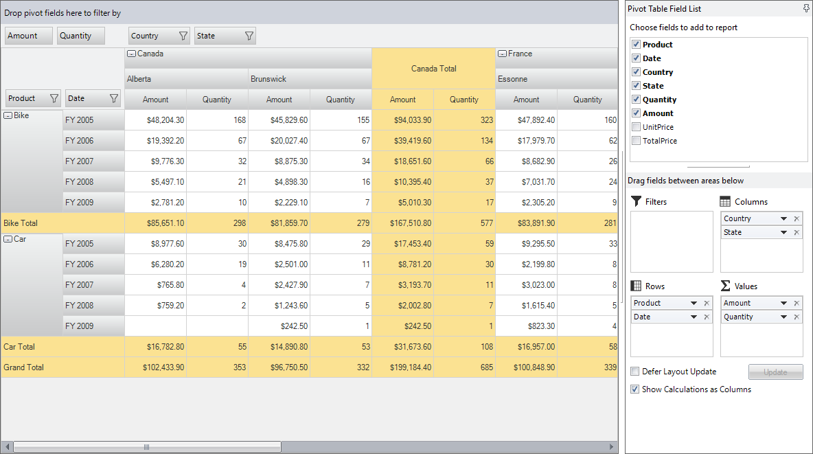

# Theming in Windows Forms Pivot Grid

Pivot grid provides support for various built-in themes, using which the default look of visual elements in the pivot grid control can be customized. This support can be achieved by using the [GridVisualStyles](https://help.syncfusion.com/cr/windowsforms/Syncfusion.Windows.Forms.PivotAnalysis.PivotGridControl.html#Syncfusion_Windows_Forms_PivotAnalysis_PivotGridControl_GridVisualStyles) property of pivot grid control.

## Metro theme

Pivot grid provides support for applying metro theme to its visual elements. Refer to the below code sample to apply metro theme to the pivot grid control.





this.pivotGridControl1.GridVisualStyles = GridVisualStyles.Metro;





Me.pivotGridControl1.GridVisualStyles = GridVisualStyles.Metro





## Office 2016 themes

Pivot grid provides support for applying Office 2016 themes to its visual elements. Following are the Office 2016 themes that are supported in the pivot grid.

* Office 2016 Colorful
* Office 2016 White
* Office 2016 Dark Gray
* Office 2016 Black

Refer to the below code sample to apply Office 2016 black theme to the pivot grid control.





this.pivotGridControl1.GridVisualStyles = GridVisualStyles.Office2016Black;





Me.pivotGridControl1.GridVisualStyles = GridVisualStyles.Office2016Black





## Office 2010 themes

Pivot grid provides support for applying Office 2010 themes to its visual elements. Following are the Office 2010 themes that are supported in the pivot grid.

* Office 2010 Black
* Office 2010 Blue
* Office 2010 Silver

Refer to the below code sample to apply Office 2010 blue theme to the pivot grid control.





this.pivotGridControl1.GridVisualStyles = GridVisualStyles.Office2010Blue;





Me.pivotGridControl1.GridVisualStyles = GridVisualStyles.Office2010Blue





## Office 2007 themes

Pivot grid provides support for applying Office 2007 themes to its visual elements. Following are the Office 2007 themes that are supported in the pivot grid.

* Office 2007 Black
* Office 2007 Blue
* Office 2007 Silver

Refer to the below code sample to apply Office 2007 silver theme to the pivot grid control.





this.pivotGridControl1.GridVisualStyles = GridVisualStyles.Office2007Silver;





Me.pivotGridControl1.GridVisualStyles = GridVisualStyles.Office2007Silver





## Events

The **[ThemeChanged](https://help.syncfusion.com/cr/windowsforms/Syncfusion.Windows.Forms.Grid.GridControlBase.html#Syncfusion_Windows_Forms_Grid_GridControlBase_ThemeChanged)** event occurs when the default theme of pivot grid control gets changed.

A demo sample is available in the following location.

&lt;Installed Drive&gt;\Users\Public\Documents\Syncfusion\Windows\\&lt;Version Number&gt;\PivotGrid.Windows\Samples\Appearance\Visual Styles Demo
