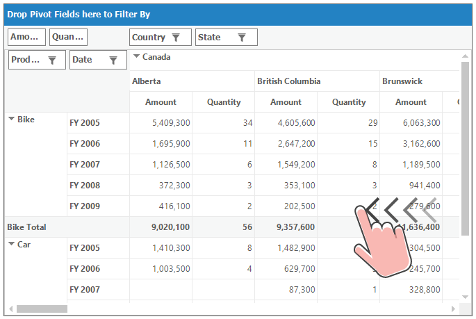
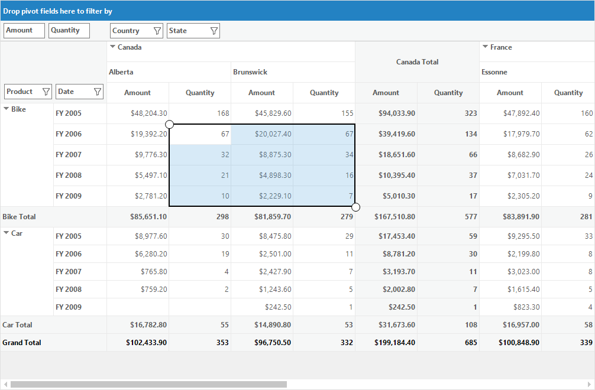
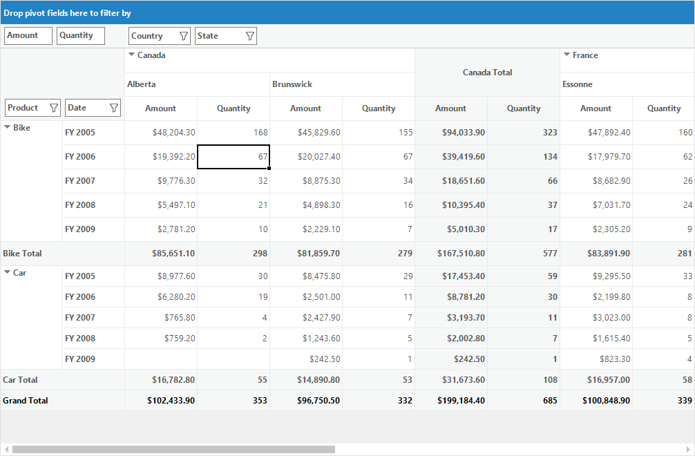

# Touch Support in Windows Forms Pivot Grid

PivotGrid control provides touch support for scrolling, panning and bubble selection while selecting cells.

## Enabling touch mode

The touch support in pivot grid can be enabled using the [EnableTouchMode](https://help.syncfusion.com/cr/windowsforms/Syncfusion.Windows.Forms.PivotAnalysis.PivotGridControl.html#Syncfusion_Windows_Forms_PivotAnalysis_PivotGridControl_EnableTouchMode) property of pivot grid. By default, the `EnableTouchMode` property is set as false.

Refer to the below code sample to enable the touch mode in pivot grid.





this.pivotGridControl1.EnableTouchMode = true;





Me.pivotGridControl1.EnableTouchMode = True





## Touch gestures

Enabling the touch mode in pivot grid control allows to expand or collapse the header cells. It also allows to drag and drop the pivot items between the [pivot table field list](https://help.syncfusion.com/windowsforms/pivotgrid/pivot-schema-designer) and the [grouping bar](https://help.syncfusion.com/windowsforms/pivotgrid/grouping-bar).

## Touch swiping

When the touch mode is enabled, the pivot grid control allows to scroll its tabular values by swiping the control in both horizontal and vertical directions.

## Touch selection

The pivot grid control provides support to select multiple cells with the help of touch indicator.

### Enabling Excel like touch selection

To enable Excel like touch selection, the [AllowSelection](https://help.syncfusion.com/cr/windowsforms/Syncfusion.Windows.Forms.Grid.GridModelOptions.html#Syncfusion_Windows_Forms_Grid_GridModelOptions_AllowSelection), [ExcelLikeSelectionFrame](https://help.syncfusion.com/cr/windowsforms/Syncfusion.Windows.Forms.Grid.GridModelOptions.html#Syncfusion_Windows_Forms_Grid_GridModelOptions_ExcelLikeSelectionFrame) and [ExcelLikeCurrentCell](https://help.syncfusion.com/cr/windowsforms/Syncfusion.Windows.Forms.Grid.GridModelOptions.html#Syncfusion_Windows_Forms_Grid_GridModelOptions_ExcelLikeCurrentCell) properties need to be assigned as illustrated in the below code sample.





this.pivotGridControl1.EnableTouchMode = true;Syncfusion.Windows.Forms.Grid.GridSelectionFlags.Any;
this.pivotGridControl1.TableModel.Options.ExcelLikeSelectionFrame = true;
this.pivotGridControl1.TableModel.Options.ExcelLikeCurrentCell = true;





Me.pivotGridControl1.EnableTouchMode = True
this.pivotGridControl1.TableModel.Options.AllowSelection = Syncfusion.Windows.Forms.Grid.GridSelectionFlags.Any;
Me.pivotGridControl1.TableModel.Options.ExcelLikeSelectionFrame = True
Me.pivotGridControl1.TableModel.Options.ExcelLikeCurrentCell = True





N> When Excel 2003 selection frame is enabled, then the touch selection cannot be performed in the pivot grid control.

### Disabling touch indicator

The touch indicator used for cell selection can be hidden in the pivot grid control by using the [ShowTouchIndicator](https://help.syncfusion.com/cr/windowsforms/Syncfusion.Windows.Forms.Grid.GridControlBase.html#Syncfusion_Windows_Forms_Grid_GridControlBase_ShowTouchIndicator) property. By default, its value is set as `true`.





this.pivotGridControl1.TableControl.ShowTouchIndicator = false;





Me.pivotGridControl1.TableControl.ShowTouchIndicator = False





