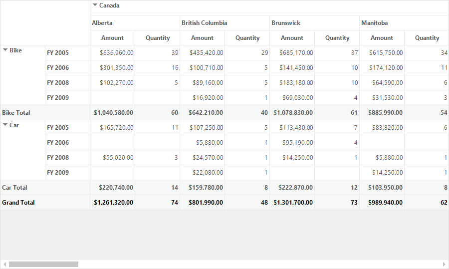

# Updating Values in Windows Forms Pivot Grid

Pivot grid provides support to update the cell values in real time. This support is useful when users want to update the cell values in the underlying data source, thereby the changes will be reflected in the total cells based on the updated data.

## Enabling updating

Cell values can be updated at run time by using the [EnableUpdating](https://help.syncfusion.com/cr/windowsforms/Syncfusion.Windows.Forms.PivotAnalysis.PivotGridControl.html#Syncfusion_Windows_Forms_PivotAnalysis_PivotGridControl_EnableUpdating) property of pivot grid.

Refer to the below code sample to enable the run time updating in pivot grid control.





this.pivotGridControl1.EnableUpdating = true;





Me.pivotGridControl1.EnableUpdating = True





### Throttling update speed

While updating the pivot grid control, users can throttle the updating speed by using the [ThrottleUpdateRate](https://help.syncfusion.com/cr/windowsforms/Syncfusion.Windows.Forms.PivotAnalysis.PivotUpdatingManager.html#Syncfusion_Windows_Forms_PivotAnalysis_PivotUpdatingManager_ThrottleUpdateRate) property of [update manager](https://help.syncfusion.com/cr/windowsforms/Syncfusion.Windows.Forms.PivotAnalysis.PivotGridControl.html#Syncfusion_Windows_Forms_PivotAnalysis_PivotGridControl_UpdateManager). For example, if the throttle update rate is specified as zero milliseconds, then it indicates to refresh the UI without any delay. Throttling the refresh rate can minimize the CPU usage. The update rate values of 300 to 500 milliseconds may give lower CPU usage.

Refer to the below code sample to set the update rate as 300 milliseconds through update manager.





this.pivotGridControl1.UpdateManager.ThrottleUpdateRate = 300;





Me.pivotGridControl1.UpdateManager.ThrottleUpdateRate = 300





A demo sample is available in the following location.

&lt;Installed Drive&gt;\Users\Public\Documents\Syncfusion\Windows\\&lt;Version Number&gt;\PivotGrid.Windows\Samples\Interactive Features\Updating Demo
