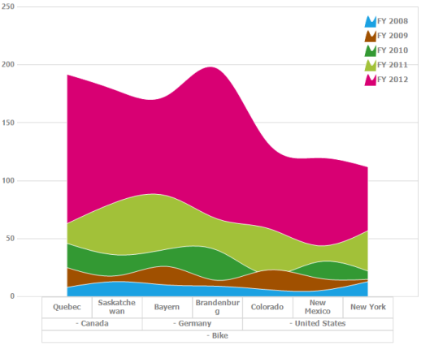
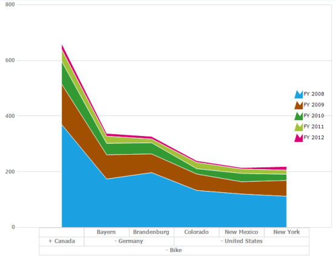

# Chart Types

PivotChart is rendered through different chart types based on the requirement. You can easily switch between different chart types dynamically. Fields bound to the chart is automatically transformed into target chart types.

### Supported chart types are,

* Line
* Spline
* Column
* Area
* Spline Area
* Stacking Area
* Stacking Column
* Stacking Area 100
* Stacking Column 100
* Step Line
* Step Area

The PivotChart types are altered by using the ChartTypes enumeration.



//Changes the Pivot Chart types.
this.pivotChart1.ChartTypes = Syncfusion.Windows.Forms.PivotChart.PivotChartTypes.Line;





' Changes the Pivot Chart types.

Me.pivotChart1.ChartTypes = Syncfusion.Windows.Forms.PivotChart.PivotChartTypes.Line



## Line Chart

The Line Chart joins the data points on a plot by using straight lines that show trends in data at equal intervals.

## Spline Chart

The Spline Chart is similar to line chart except that it connects different data points by using curved lines instead of straight lines.

## Step Line Chart

Step Line Chart uses horizontal and vertical lines to connect the data points resulting in a step like progression.

## Step Area Chart

Step AreaChart is similar to the regular area chart except for a straight line tracing the shortest path between data points. The values are connected by continuous vertical and horizontal lines forming a step like progression.

## Spline Area Chart

Spline AreaChart is similar to Area Chart with the difference of the connected data points of a series. It connects each series of points by a smooth spline curve.

## Stacking Column Chart

Stacking ColumnChart is similar to column charts except for the Y-values. These Y-values stack on top of each other in a specified series order. This helps visualize the relationship of parts to the whole chart.

## Stacking Area100 Chart

Stacking AreaChart is similar to regular area chart except for the Y-values. These Y-values stack on top of each other in the specified series order. This helps visualize the relationship of parts to the whole data. The top range is calculated on the basis of 100.

## Stacking Area Chart

Stacking AreaChart is similar to regular area chart except for the Y-values. These Y-values stack on top of each other in the specified series order. This helps visualize the relationship of parts to the whole data.

