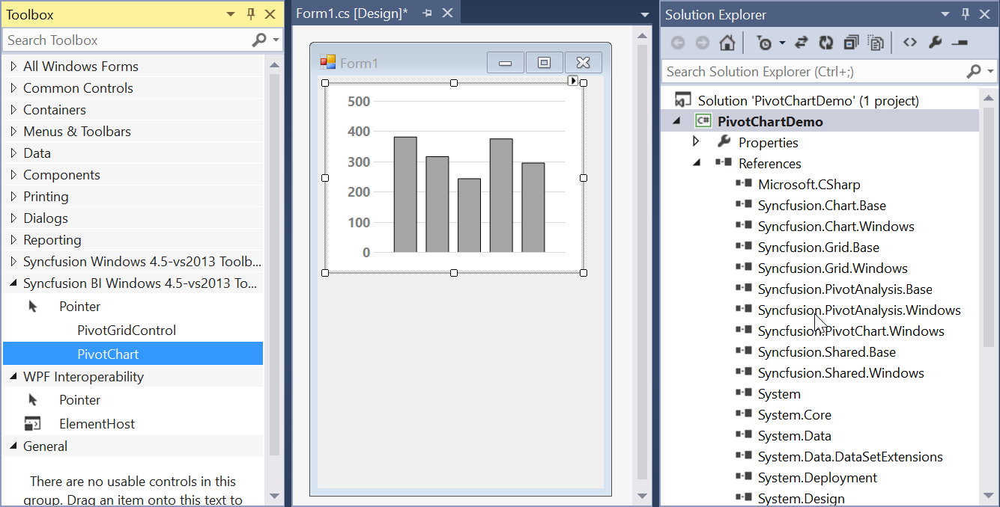
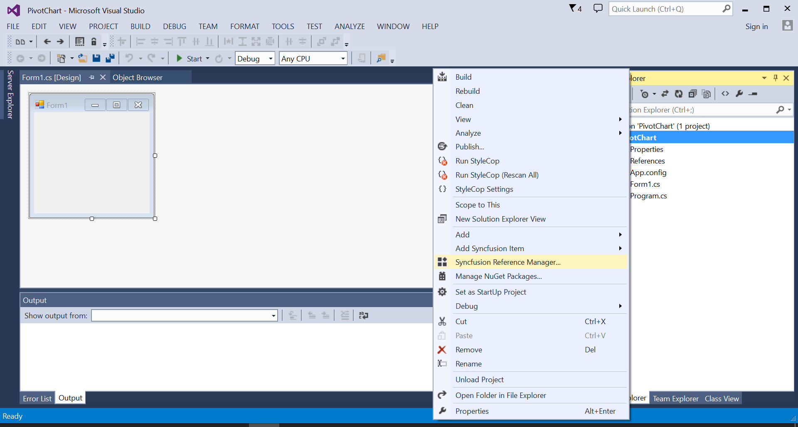
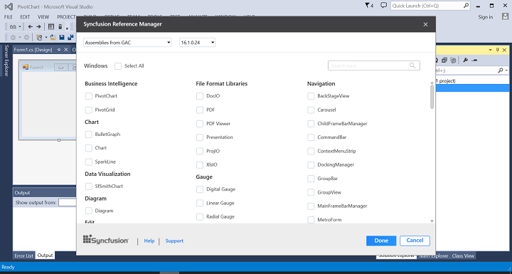
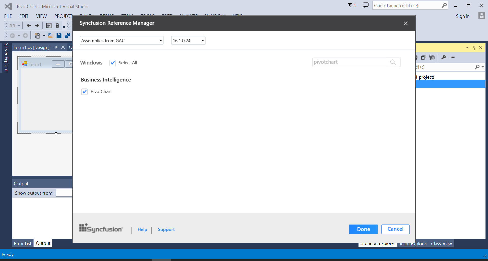
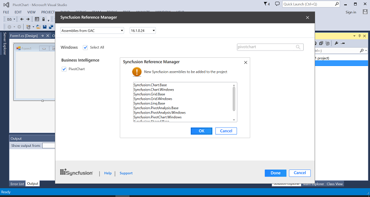

# Getting Started

This section provides a quick overview for working with the pivot chart for WinForms. Walk through the entire process of creating a simple PivotChart.

## Assembly deployment

The following list of assemblies need to be added as reference to use PivotChart control in the application.

    <table>
    <tr>
    <th>
    Required assemblies  </th><th>
    Description  </th></tr>
    <tr>
    <td>
    {{'[Syncfusion.Chart.Windows](http://help.syncfusion.com/cr/cref_files/windowsforms/chart/Syncfusion.Chart.Windows.html)'| markdownify }}  </td><td>
    Syncfusion.Chart.Windows assembly contains classes that handles all UI operations, fundamentals and base classes of ChartControl.  </td></tr>
    <tr>
    <td>
    {{'[Syncfusion.PivotAnalysis.Windows](http://help.syncfusion.com/cr/cref_files/windowsforms/pivot%20analysis/Syncfusion.PivotAnalysis.Windows~Syncfusion.Windows.Forms.PivotAnalysis_namespace.html)'| markdownify }}  </td><td>
    Syncfusion.PivotAnalysis.Windows assembly contains classes that handles UI operations and other fundamentals of PivotGrid control.  </td></tr>
    <tr>
    <td>
    {{'[Syncfusion.PivotChart.Windows](http://help.syncfusion.com/cr/cref_files/windowsforms/pivot%20chart/Syncfusion.PivotChart.Windows~Syncfusion.Windows.Forms.PivotChart_namespace.html)'| markdownify }}  </td><td>
    Syncfusion.PivotChart.Windows assembly contains classes that handles UI operations and other fundamentals of PivotChart control.  </td></tr>
    <tr>
    <td>
    {{'[Syncfusion.Grid.Windows](http://help.syncfusion.com/cr/cref_files/windowsforms/grid/Syncfusion.Grid.Windows.html)'| markdownify }}  </td><td>
    Syncfusion.Grid.Windows assembly contains classes that handles all UI operations, fundamentals and base classes of GridControl.  </td></tr>
    <tr>
    <td>
    {{'[Syncfusion.PivotAnalysis.Base](http://help.syncfusion.com/cr/cref_files/windowsforms/pivot analysis/Syncfusion.PivotAnalysis.Base.html)'| markdownify }}  </td><td>
    Syncfusion.PivotAnalysis.Base allows you to easily access, manipulate, and display your data in a variety of configurations.  </td></tr>
    <tr>
    <td>
    {{'[Syncfusion.Shared.Base](http://help.syncfusion.com/cr/cref_files/windowsforms/grid/Syncfusion.Shared.Base.html)'| markdownify }}  </td><td>
    Syncfusion.Shared.Base contains style related properties and various editor controls which are used in GridControl.  </td></tr>
    </table>

In order to export PivotChart control into Excel, the following assemblies need to be referred.

    <table>
    <tr>
    <th>
    Optional assemblies  </th><th>
    Description  </th></tr>
    <tr>
    <td>
    {{'[Syncfusion.PivotConverter.Windows](http://help.syncfusion.com/cr/cref_files/windowsforms/pivot%20analysis/Syncfusion.PivotConverter.Windows.html)'| markdownify }}   </td><td>
    Syncfusion.PivotConverter.Windows contains classes that provides the functionality of exporting the PivotChart Control to an Excel sheet.   </td></tr>
    <tr>
    <td>
    {{'[Syncfusion.XlsIO.Base](http://help.syncfusion.com/cr/cref_files/windowsforms/xlsio/Syncfusion.XlsIO.Base.html)'| markdownify }}  </td><td>
    Syncfusion.XlsIO.Base. contains fundamental and base classes for creating and manipulating excel files.  </td></tr>
    </table>

## Creating application with PivotChart

This section explains how to add the PivotChart control through designer, code and also through Syncfusion Reference Manager.

### Adding control via designer

The PivotChart control can be added through designer by following the below steps.

1.Create a new **Windows Forms Application** in Visual Studio.

2.Drag and drop the PivotChart control from the toolbox into the designer page.

3.Then, the PivotChart control will be successfully added into the application along with the required libraries.

### Adding control via code

The PivotChart control can be added through code-behind by following the below steps.

1.Create a new **Windows Forms Application** in Visual Studio.

2.Add the following assembly references to the project.

* Syncfusion.Chart.Windows.dll
* Syncfusion.Grid.Windows.dll
* Syncfusion.PivotAnalysis.Base.dll
* Syncfusion.PivotAnalysis.Windows.dll
* Syncfusion.PivotChart.Windows.dll
* Syncfusion.Shared.Base.dll

3.Then initialize the PivotChart control by creating an instance and add it to the Form using the code specified below.





//Initialize a new PivotChart.
private Syncfusion.Windows.Forms.PivotChart.PivotChart pivotChart1 = new Syncfusion.Windows.Forms.PivotChart.PivotChart();
// Add required size for the PivotChart control
this.pivotChart1.Size = new System.Drawing.Size(750, 434);
// Add the PivotChart control to the parent control.
this.Controls.Add(pivotChart1);





'Initialize a new PivotChart.
Private pivotChart1 As Syncfusion.Windows.Forms.PivotChart.PivotChart = New Syncfusion.Windows.Forms.PivotChart.PivotChart()
' Add required size for the PivotChart control
Me.pivotChart1.Size = New System.Drawing.Size(750, 434);
' Add the PivotChart control to the parent control.
Me.Controls.Add(pivotChart1)





### Adding control via Syncfusion reference manager

[Syncfusion reference manager](https://help.syncfusion.com/extension/syncfusion-reference-manager/overview) is a Visual Studio Add-In that helps to add Syncfusion controls. PivotChart control can be added through Syncfusion reference manager by following the below steps.

1.Create a new **Windows Forms Application** in Visual Studio.

2.Then right-click on the project and select Syncfusion Reference Manager.

3.The Syncfusion Reference Manager wizard will be opened as shown below.

4.Select PivotChart control by searching it using search box. Then click on done button to add selected PivotChart control.

5.The required assemblies will be automatically added to the project by clicking ok button.

6.Add the following code snippet in code behind to create a simple PivotChart control.





//Initialize a new PivotChart.
private Syncfusion.Windows.Forms.PivotChart.PivotChart pivotChart1 = new Syncfusion.Windows.Forms.PivotChart.PivotChart();
// Add required size for the PivotChart control
this.pivotChart1.Size = new System.Drawing.Size(750, 434);
// Add the PivotChart control to the parent control.
this.Controls.Add(pivotChart1);





'Initialize a new PivotChart.
Private pivotChart1 As Syncfusion.Windows.Forms.PivotChart.PivotChart = New Syncfusion.Windows.Forms.PivotChart.PivotChart()
' Add required size for the PivotChart control
Me.pivotChart1.Size = New System.Drawing.Size(750, 434);
' Add the PivotChart control to the parent control.
Me.Controls.Add(pivotChart1)





N>
Syncfusion reference manager supports for specific framework which is shipped (assemblies) in our Syncfusion Essential Studio setup. So, if you try to add Syncfusion assemblies in project and framework which is not supported with selected Syncfusion version assemblies, then the dialog will be appeared by specifying that “Current build v{version} is not supported this framework v{Framework Version}”.

## Binding data

This section guides you on how to bind data source and its appropriate fields to a PivotChart control. The data source assigned to PivotChart control should either be an [IEnumerable](https://msdn.microsoft.com/en-us/library/9eekhta0.aspx) list or a [DataView](https://msdn.microsoft.com/en-us/library/system.data.dataview.aspx).

In this example, `IEnumerable` list is used as data source for the PivotChart control and the sample data source contains properties like Product, Date, Country, State, Quantity, Amount, UnitPrice and TotalPrice for demonstration purpose.





public class ProductSales
{
    public string Product { get; set; }

    public string Date { get; set; }

    public string Country { get; set; }

    public string State { get; set; }

    public int Quantity { get; set; }

    public double Amount { get; set; }

    public double UnitPrice { get; set; }

    public double TotalPrice { get; set; }

    public static ProductSalesCollection GetSalesData()
    {
        /// Geography
        string[] countries = new string[] { "Australia", "Germany", "Canada", "United States" };
        string[] states1 = new string[] { "New South Wales", "Queensland", };
        string[] states2 = new string[] { "Ontario", "Quebec" };
        string[] states3 = new string[] { "Bayern", "Brandenburg" };
        string[] states4 = new string[] { "New York", "Colorado", "New Mexico" };

        /// Time
        string[] dates = new string[] { "FY 2008", "FY 2009", "FY 2010", "FY 2011", "FY 20012" };

        /// Products
        string[] products = new string[] { "Bike" };
        Random r = new Random(123345);

        int numberOfRecords = 2000;
        ProductSalesCollection listOfProductSales = new ProductSalesCollection();
        for (int i = 0; i < numberOfRecords; i++)
        {
            ProductSales sales = new ProductSales();
            sales.Country = countries[r.Next(1, countries.GetLength(0))];
            sales.Quantity = r.Next(1, 12);
            /// 1 percent discount for 1 quantity
            double discount = (30000 * sales.Quantity) * (double.Parse(sales.Quantity.ToString()) / 100);
            sales.Amount = (30000 * sales.Quantity) - discount;
            sales.TotalPrice = sales.Amount * sales.Quantity;
            sales.UnitPrice = sales.Amount / sales.Quantity;
            sales.Date = dates[r.Next(r.Next(dates.GetLength(0) + 1))];
            sales.Product = products[r.Next(r.Next(products.GetLength(0) + 1))];
            switch (sales.Country)
            {
                case "Australia":
                    {
                        sales.State = states1[r.Next(states1.GetLength(0))];
                        break;
                    }
                case "Canada":
                    {
                        sales.State = states2[r.Next(states2.GetLength(0))];
                        break;
                    }
                case "Germany":
                    {
                        sales.State = states3[r.Next(states3.GetLength(0))];
                        break;
                    }
                case "United States":
                    {
                        sales.State = states4[r.Next(states4.GetLength(0))];
                        break;
                    }
            }
            listOfProductSales.Add(sales);
        }

        return listOfProductSales;
    }

    public override string ToString()
    {
        return string.Format("{0}-{1}-{2}", this.Country, this.State, this.Product);
    }

    public class ProductSalesCollection : List<ProductSales>
    {
    }
}





Public Class ProductSales

    Public Property Product As String

    Public Property Date As String

    Public Property Country As String

    Public Property State As String

    Public Property Quantity As Integer

    Public Property Amount As Double

    Public Property UnitPrice As Double

    Public Property TotalPrice As Double

    Public Shared Function GetSalesData() As ProductSalesCollection
        Dim countries As String() = New String() {"Australia", "Germany", "Canada", "United States"}
        Dim states1 As String() = New String() {"New South Wales", "Queensland"}
        Dim states2 As String() = New String() {"Ontario", "Quebec"}
        Dim states3 As String() = New String() {"Bayern", "Brandenburg"}
        Dim states4 As String() = New String() {"New York", "Colorado", "New Mexico"}
        Dim dates As String() = New String() {"FY 2008", "FY 2009", "FY 2010", "FY 2011", "FY 20012"}
        Dim products As String() = New String() {"Bike"}
        Dim r As Random = New Random(123345)
        Dim numberOfRecords As Integer = 2000
        Dim listOfProductSales As ProductSalesCollection = New ProductSalesCollection()
        For i As Integer = 0 To numberOfRecords - 1
            Dim sales As ProductSales = New ProductSales()
            sales.Country = countries(r.[Next](1, countries.GetLength(0)))
            sales.Quantity = r.[Next](1, 12)
            Dim discount As Double =(30000 * sales.Quantity) * (Double.Parse(sales.Quantity.ToString()) / 100)
            sales.Amount =(30000 * sales.Quantity) - discount
            sales.TotalPrice = sales.Amount * sales.Quantity
            sales.UnitPrice = sales.Amount / sales.Quantity
            sales.Date = dates(r.[Next](r.[Next](dates.GetLength(0) + 1)))
            sales.Product = products(r.[Next](r.[Next](products.GetLength(0) + 1)))
            Select Case sales.Country
                Case "Australia"
                    sales.State = states1(r.[Next](states1.GetLength(0)))
                    Exit Select
                Case "Canada"
                    sales.State = states2(r.[Next](states2.GetLength(0)))
                    Exit Select
                Case "Germany"
                    sales.State = states3(r.[Next](states3.GetLength(0)))
                    Exit Select
                Case "United States"
                    sales.State = states4(r.[Next](states4.GetLength(0)))
                    Exit Select
            End Select

            listOfProductSales.Add(sales)
        Next

        Return listOfProductSales
    End Function

    Public Overrides Function ToString() As String
        Return String.Format("{0}-{1}-{2}", Me.Country, Me.State, Me.Product)
    End Function

    Public Class ProductSalesCollection
        Inherits List(Of ProductSales)

    End Class
End Class





N>
`ProductSales` is a class which consists of the `IList` data. For more information, refer the *Getting Started* demo sample which is located in the following location.
<Installed_Location>\EssentialStudio\<Installed_Version>\Windows\PivotChart.Windows\Samples\Getting Started\Getting Started Demo\

The PivotChart control requires the following information in order to populate the data from the data source.

* [ItemSource](http://help.syncfusion.com/cr/cref_files/windowsforms/pivot%20chart/Syncfusion.PivotChart.Windows~Syncfusion.Windows.Forms.PivotChart.PivotChart~ItemSource.html) - The data source for the pivot table. This object should be either an    [IEnumerable](https://msdn.microsoft.com/en-us/library/9eekhta0.aspx) list or a [DataTable](https://msdn.microsoft.com/en-in/library/system.data.datatable.aspx).
* [PivotAxis](http://help.syncfusion.com/cr/cref_files/windowsforms/pivot%20chart/Syncfusion.PivotChart.Windows~Syncfusion.Windows.Forms.PivotChart.PivotChart~PivotAxis.html) - Elements that need to be added in axis of PivotChart control.
* [PivotLegend](http://help.syncfusion.com/cr/cref_files/windowsforms/pivot%20chart/Syncfusion.PivotChart.Windows~Syncfusion.Windows.Forms.PivotChart.PivotChart~PivotLegend.html) - Elements that need to be added in legend of PivotChart control.
* [PivotCalculations](http://help.syncfusion.com/cr/cref_files/windowsforms/pivot%20chart/Syncfusion.PivotChart.Windows~Syncfusion.Windows.Forms.PivotChart.PivotChart~PivotCalculations.html) - Calculation values that need to be added as data points in PivotChart control.

The below code snippet illustrates how to add the required information to the PivotChart control.





// Specifying the Item Source for Pivot Grid
this.pivotChart1.ItemSource = ProductSales.GetSalesData();
// Adding PivotAxis to the Control
this.pivotChart1.PivotAxis.Add(new PivotItem { FieldMappingName = "Product", TotalHeader = "Total" });
this.pivotChart1.PivotAxis.Add(new PivotItem { FieldMappingName = "Country", TotalHeader = "Total" });
this.pivotChart1.PivotAxis.Add(new PivotItem { FieldMappingName = "State", TotalHeader = "Total" });
// Adding PivotLegend to the Control
this.pivotChart1.PivotLegend.Add(new PivotItem { FieldMappingName = "Date", TotalHeader = "Total" });
// Adding PivotCalculations to the Control
this.pivotChart1.PivotCalculations.Add(new PivotComputationInfo { FieldName = "Quantity", Format = "#,##0" });





' Specifying the Item Source for Pivot Grid  
Me.pivotChart1.ItemSource = ProductSales.GetSalesData()
' Adding PivotAxis to the Control
Me.pivotChart1.PivotAxis.Add(New PivotItem With {.FieldMappingName = "Product", .TotalHeader = "Total"})
Me.pivotChart1.PivotAxis.Add(New PivotItem With {.FieldMappingName = "Country", .TotalHeader = "Total"})
Me.pivotChart1.PivotAxis.Add(New PivotItem With {.FieldMappingName = "State", .TotalHeader = "Total"})
' Adding PivotLegend to the Control
Me.pivotChart1.PivotLegend.Add(New PivotItem With {.FieldMappingName = "Date", .TotalHeader = "Total"})
' Adding Pivot Calculations to the Control          
Me.pivotChart1.PivotCalculations.Add(New PivotComputationInfo With {.FieldName = "Quantity", .Format = "#,##0"})





Finally, run the application to obtain the following output.

## Real time updates

[PivotChartUpdatingManager](http://help.syncfusion.com/cr/cref_files/windowsforms/pivot%20chart/Syncfusion.PivotChart.Windows~Syncfusion.Windows.Forms.PivotChart.PivotChartUpdatingManager.html) provides support for updating the series values automatically whenever the data gets changed in its underlying collection. This support can be enabled by setting the [EnableUpdating](http://help.syncfusion.com/cr/cref_files/windowsforms/pivot%20chart/Syncfusion.PivotChart.Windows~Syncfusion.Windows.Forms.PivotChart.PivotChart~EnableUpdating.html) property to `true`.





// Updates the PivotChart series values whenever the data gets changed in the underlying data source.
this.pivotChart1.EnableUpdating = true;





' Updates the PivotChart series values whenever the data gets changed in the underlying data source.
Me.pivotChart1.EnableUpdating = True





N> The default value of `EnableUpdating` property is false.

### Begin Update and End Update

When we do bulk changes in the underlying data source, it updates PivotChart for every changes and it degrades the performance. So you can do the bulk changes or bulk operation between the [BeginUpdate](http://help.syncfusion.com/cr/cref_files/windowsforms/pivot%20chart/Syncfusion.PivotChart.Windows~Syncfusion.Windows.Forms.PivotChart.PivotChart~BeginUpdate.html) and [EndUpdate](http://help.syncfusion.com/cr/cref_files/windowsforms/pivot%20chart/Syncfusion.PivotChart.Windows~Syncfusion.Windows.Forms.PivotChart.PivotChart~EndUpdate.html) methods of PivotChart. BeginUpdate method will temporarily freeze the painting or refreshing of the control until EndUpdate method is called. After all the changes have been made, invoke the EndUpdate method to resume painting of the control.





// Suspends the painting until EndUpdate method is invoked
this.pivotChart1.BeginUpdate();

// do your bulk changes here

// Resumes the painting which is suspended
this.pivotChart1.EndUpdate();





' Suspends the painting
Me.pivotChart1.BeginUpdate()

' do your bulk changes here

' Resumes the painting which is suspended
Me.pivotChart1.EndUpdate()



