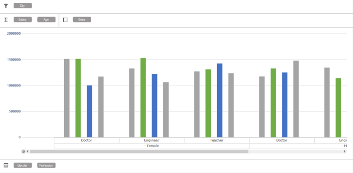

# Grouping Bar

PivotChart has four grouping areas to split the Pivotal items collection. This gives an intuitive way to present the data in the PivotChart.

* AxisFieldSection
* LegendFieldSection
* ValueFieldSection
* FilterFieldSection

The following screenshot displays the *PivotChart with Grouping Bar*

### AxisFieldSection

This section allows you to display the collection of FieldHeader values of PivotItems from *PivotAxis* and the items are placed at the bottom of the chart area.

### LegendFieldSection

This section allows you to display the collection of FieldHeader values of PivotItems from *PivotLegend* and items are placed inbetween the FilterFieldSection and chart area.

### ValueFieldSection

This section allows you to display the collection of FieldHeader values of PivotComputationInfo from *PivotCalculations* and items are placed inbetween the FilterFieldSection and chart area.

### FilterFieldSection

This section allows you to display the collection of DimensionHeader values of filter expression from *PivotFilters* and items are placed at the top of the chart area.

## Defining the Grouping Bar





        this.pivotChart1.AxisFieldSection.Visible = true;
        this.pivotChart1.LegendFieldSection.Visible = true;
        this.pivotChart1.ValueFieldSection.Visible = true;
        this.pivotChart1.FilterFieldSection.Visible = true;





        Me.pivotChart1.AxisFieldSection.Visible = True
        Me.pivotChart1.LegendFieldSection.Visible = True
        Me.pivotChart1.ValueFieldSection.Visible = True
        Me.pivotChart1.FilterFieldSection.Visible = True





## Customization

In Grouping Bar, field section values can be customized by using the following properties:

<table>
<tr>
<th>
Properties</th><th>
Description</th></tr>
<tr>
<td>
BackInterior</td><td>
Sets the background color for the entire section.</td></tr>
<tr>
<td>
ItemBackColor</td><td>
Sets the background color for the field section button.</td></tr>
<tr>
<td>
ItemForeColor</td><td>
Sets the foreground color for the field section button.</td></tr>
</th>
</table>

Please refer the below code snippets to define the BackInterior, ItemBackColor and ItemForeColor to specified sections in the Grouping Bar.





            Syncfusion.Windows.Forms.PivotChart.PivotFieldsSection section = this.pivotChart1.AxisFieldSection;
            section.ItemBackColor = Color.Yellow;
            section.ItemForeColor = Color.Black;
            section.BackInterior = Color.SkyBlue;





            Dim section As Syncfusion.Windows.Forms.PivotChart.PivotFieldsSection =  Me.pivotChart1.AxisFieldSection 
            section.ItemBackColor = Color.Yellow
            section.ItemForeColor = Color.Black
            section.BackInterior = Color.SkyBlue





The following screenshot illustrates *PivotFieldsSection* to be customized.

A sample demo is available at the following location:
    
{system drive}:\Users\&lt;User Name&gt;\AppData\Local\Syncfusion\EssentialStudio\&lt;Version Number&gt;\Windows\PivotChart.Windows\Samples\PivotChart Layout\GroupBar Demo