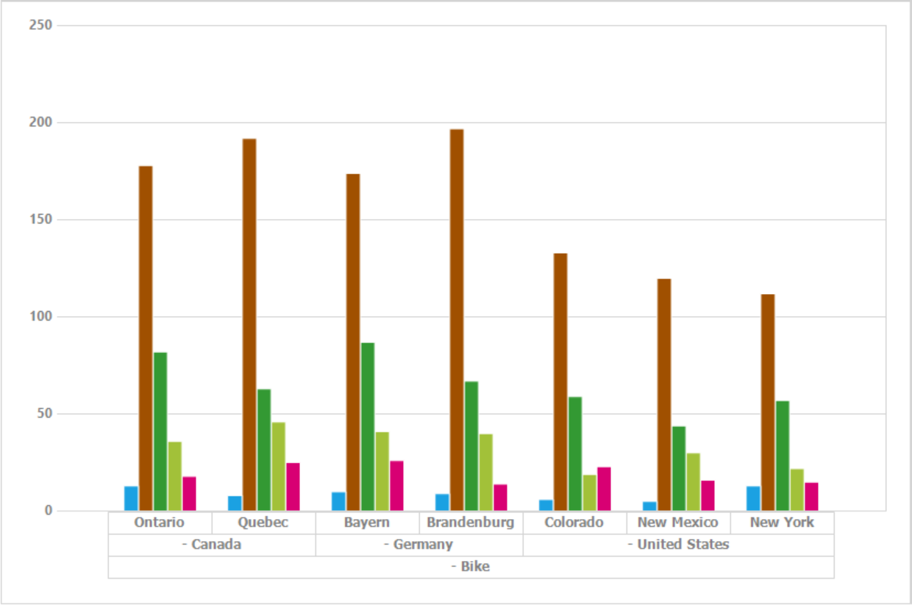

# Overview

The PivotChart control for Windows Forms is a lightweight control that reads pivot information and visualizes it in graphical format with the ability to drill up and down. It is easy to use and includes common chart types ranging from line charts to specialized charts. The PivotChart control is a visually stunning charting component that provides a perfect solution for developers to add advanced, rich and visually appealing charts to their applications with pivotal data.

## Key Features

The important features of PivotChart control are listed below:

* **Data binding** - Supports to populate the PivotChart with data sources such as IEnumerable list or data table.
* **Drill support** - Enables to navigate through inner levels of a particular element in the row axis.
* **Pivot table field list** - Provides a built-in pivot schema designer very similar to Microsoft’s Excel.
* **Grouping bar** - Interactive support to group the data in the PivotChart.
* **Legend** - Helps to differentiate between chart series using a color code along with labels to indicate that it applies to information from Series 1, Series 2, and so on.
* **Customization** - Easy customization options for each and every unit of PivotChart such as chart area, series, and legend.
* **Exporting** - Allows to export the PivotChart control into excel format.
* **Printing** - Allows to print the PivotChart control.
* **Zooming and scrolling** - Interactive support to zoom into an area of the chart so the data can be viewed more clearly.