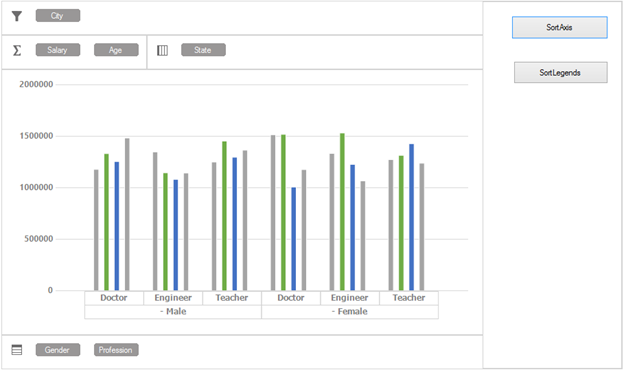

# Sorting
PivotChart provides support to sort both `PivotAxis` and `PivotLegends` programmatically in both ascending and descending order. By default, the PivotChart will populate the series in ascending order.

## Sort by Pivot Axis 
PivotAxis can be sorted by adding `PivotSortDescriptor` to the `SortedAxis` collection and `ListSortDirection` is used to specify the sorting order.

Here "Gender" is an `PivotAxis` item.



//Adding PivotAxis to the SortAxis collection for sorting.
this.pivotChart1.SortedAxis.Add(new PivotSortDescriptor("Gender", ListSortDirection.Ascending));



'Adding PivotAxis to the SortAxis collection for sorting.
Me.pivotChart1.SortedAxis.Add(New PivotSortDescriptor("Gender", ListSortDirection.Ascending))


 
Before applying sorting

 

After applying sorting on `PivotAxis` "Gender"

 

## Sort by Pivot Legends
`PivotLegends` can be sorted by adding `PivotSortDescriptor` to the `SortedLegends` collection and `ListSortDirection` is used to specify the sorting order.

Here "State" `FieldMappingName` of `PivotLegends` item and sorting order is ascending. 



//Adding PivotAxis to the SortLegends collection for sorting.
this.pivotChart1.SortedLegends.Add(new PivotSortDescriptor("State"));



'Adding PivotAxis to the SortAxis collection for sorting.
Me.pivotChart1.SortedLegends.Add(New PivotSortDescriptor("State"))



## Sort by values
`PivotLegends` can also be sorted based on the values by using `SortByCalculation` method of `PivotEngine`.



// Sorts the given indexed columns based on values in 
this.pivotChart1.PivotEngine.SortByCalculation(6, false, ListSortDirection.Descending);



' Sorts the given indexed columns based on values in 
Me.pivotChart1.PivotEngine.SortByCalculation(6, False, ListSortDirection.Descending)



## Events
There are two events available in both `SortedAxis` and `SortedLegends` of PivotChart to handle or notify the sorting operation.

<table>
<tr>
<th>S.No</th><th>Event name</th><th>Details</th><th>Event arguments</th>
</tr>
<tr>
<td>1</td><td>Changing</td><td>Occurs before a property in a nested element or the collection is changed.</td><td><a href="https://help.syncfusion.com/cr/cref_files/windowsforms/pivot%20chart/Syncfusion.PivotChart.Windows~Syncfusion.Windows.Forms.PivotChart.PivotItemSortingEventArgs.html">PivotItemSortingEventArgs</a></td>
<tr><td>2</td><td>Changed</td><td>Occurs after a property in a nested element or the collection is changed.	</td><td><a href="https://help.syncfusion.com/cr/cref_files/windowsforms/pivot%20chart/Syncfusion.PivotChart.Windows~Syncfusion.Windows.Forms.PivotChart.PivotItemSortedEventArgs.html">PivotItemSortedEventArgs</a></td>
</tr>
</table>

