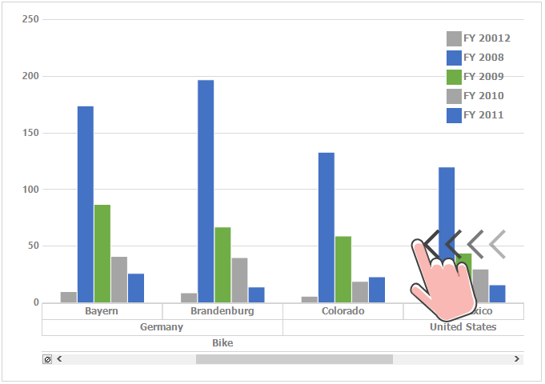

---
layout: post
title: Touch Support in PivotChart for Syncfusion Essential Windows Forms
description: This section explains about the touch support in PivotChart
platform: WindowsForms
control: PivotChart
documentation: ug
--- 

# Touch Support
PivotChart provides swipe scrolling, panning and zooming touch support. The touch support can be enabled by setting the [EnableTouchMode](https://help.syncfusion.com/cr/cref_files/windowsforms/pivot chart/Syncfusion.PivotChart.Windows~Syncfusion.Windows.Forms.PivotChart.PivotChart~EnableTouchMode.html#) property to `true`. This will enable the pivot chart to support the swiping, panning and zooming. The default value of `EnableTouchMode` property is `false`.


//Enable the touch mode for PivotChart
this.pivotChart1.EnableTouchMode = true;


'Enable the touch mode for PivotChart
Me.pivotChart1.EnableTouchMode = True


## Touch Swiping
PivotChart provides the swipe scrolling and panning support in horizontal direction.

## Touch Zooming
Touch zooming in both X axis and Y axis can be enabled by setting the [EnableXZooming](https://help.syncfusion.com/cr/cref_files/windowsforms/pivot chart/Syncfusion.PivotChart.Windows~Syncfusion.Windows.Forms.PivotChart.PivotChart~EnableXZooming.html#) and [EnableYZooming](https://help.syncfusion.com/cr/cref_files/windowsforms/pivot chart/Syncfusion.PivotChart.Windows~Syncfusion.Windows.Forms.PivotChart.PivotChart~EnableYZooming.html#) properties to `true`. The default value of `EnableXZooming` is `true`. And the default value of `EnableYZooming` is `false`.


//Enable the X axis zooming
this.pivotChart1.EnableXZooming = true;
//Enable the Y axis zooming
this.pivotChart1.EnableYZooming = true;


'Enable the X axis zooming
Me.pivotChart1.EnableXZooming = True
'Enable the Y axis zooming
Me.pivotChart1.EnableYZooming = True



### Disable zooming in X and Y axis
The zooming can be disabled in X axis and Y axis by setting the `EnableXZooming` and `EnableYZooming` properties to `false`.


//Disable the X axis zooming
this.pivotChart1.EnableXZooming = false;
//Disable the Y axis zooming
this.pivotChart1.EnableYZooming = false;


'Disable the X axis zooming
Me.pivotChart1.EnableXZooming = False
'Disable the Y axis zooming
Me.pivotChart1.EnableYZooming = False

