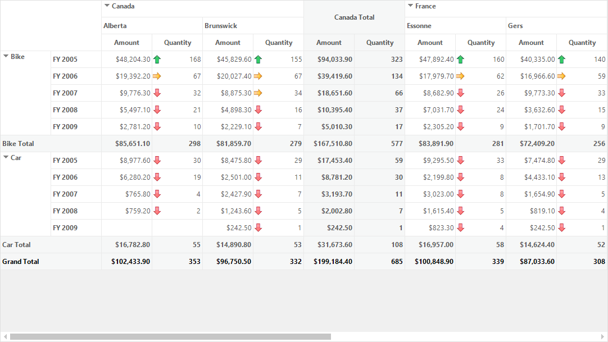
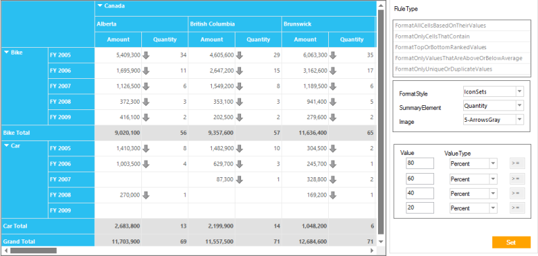

# Conditional Formatting

Conditional formatting changes the appearance of a specified cell range or pivot field based on rules applied by users. 

Properties

_Table_ _15__: Conditional Formatting Property Table_

<table>
<tr>
<td>
Property </td><td>
Description </td><td>
Type </td><td>
Data Type </td></tr>
<tr>
<td>
FormatStyle</td><td>
Sets the format of the style.</td><td>
FormatStyle</td><td>
Enum</td></tr>
<tr>
<td>
Image</td><td>
Sets the image.</td><td>
Image</td><td>
Enum</td></tr>
<tr>
<td>
RuleType</td><td>
Sets the type of the rule.</td><td>
RuleType</td><td>
Enum</td></tr>
<tr>
<td>
Ranges</td><td>
Assigns the range of the value cells in PivotGrid.</td><td>
Ranges</td><td>
GridRangeInfo</td></tr>
<tr>
<td>
ValueType</td><td>
Sets the value type, e.g., percent or number.</td><td>
ValueType</td><td>
Enum</td></tr>
<tr>
<td>
SummaryElement</td><td>
Sets the column name.</td><td>
SummaryElement</td><td>
String</td></tr>
<tr>
<td>
FormatAllType</td><td>
Assigns the format, e.g., duplicate or unique.</td><td>
FormatAllType</td><td>
Enum</td></tr>
<tr>
<td>
BackColor</td><td>
Sets a background color for the value cell that meets the criteria.</td><td>
BackColor</td><td>
Color</td></tr>
<tr>
<td>
TextColor</td><td>
Sets the text color of the value cell that meets the criteria.</td><td>
TextColor</td><td>
Color</td></tr>
</table>

Sample Location

{Installedpath}\Syncfusion\EssentialStudio\{Version}\Windows\PivotGrid.Windows\Samples\Product Showcase\Conditional Format Demo

{  | markdownify }
{:.image }

## Adding Conditional Formatting

Conditional formatting can be added to the PivotGrid as shown in the following code:

<table>
<tr>
<td>
[C#]            NewRuleConditionalFormat newRule1 = new NewRuleConditionalFormat();            newRule1.FormatStyle = FormatStyle.IconSets;            newRule1.SummaryElement = "Quantity";                        newRule1.Image = BitMapImageName.FourArrowsGray;                        newRule1.RuleType = RuleType.FormatAllCellsBasedOnTheirValues;                        PivotGridNewRuleConditionalFormat newRuleFormat1 = new PivotGridNewRuleConditionalFormat();            newRuleFormat1.NewRuleCollections.Add(newRule1); this.pivotGridControl1.TableControl.NewRuleConditionalFormat.Add(newRuleFormat1); </td></tr>
<tr>
<td>
 [VB]       Dim newRule1 As New NewRuleConditionalFormat()       newRule1.FormatStyle = FormatStyle.IconSets       newRule1.SummaryElement = "Quantity"       newRule1.Image = BitMapImageName.FourArrowsGray       newRule1.RuleType = RuleType.FormatAllCellsBasedOnTheirValues       Dim newRuleFormat1 As New PivotGridNewRuleConditionalFormat()       newRuleFormat1.NewRuleCollections.Add(newRule1)  Me.pivotGridControl1.TableControl.NewRuleConditionalFormat.Add(newRuleFormat1)</td></tr>
</table>

The following rule types are supported for applying conditional formats across value cell ranges and summary elements:

* Format All Cells Based On Their Values
* Format Only Cells That Contain
* Format Top Or Bottom Ranked Values
* Format Only Values That Are Above Or Below Average
* Format Only Unique Or Duplicate Values

{  | markdownify }
{:.image }

Format All Cells Based On Their Values: Classifies data into three, four, or five groups, each represented by a threshold value that expresses the range. Users define an icon set, and each icon represents a particular range. The icons are applied to value cells in their corresponding range. 

Format Only Cells That Contain: Applies formatting to value cells that either contain a specific value or meet defined criteria.

Format Top Or Bottom Ranked Values: Applies formatting to the highest or lowest values in the value cells based on the specified values.

Format Only Values That Are Above or Below Average: Applies formatting to value cells whose values are more or less than an average or standard values in a range or summary element.

Format Only Unique Or Duplicate Values: Applies formatting to value cells whose values are either identical or different from the other values in a range or summary element.

