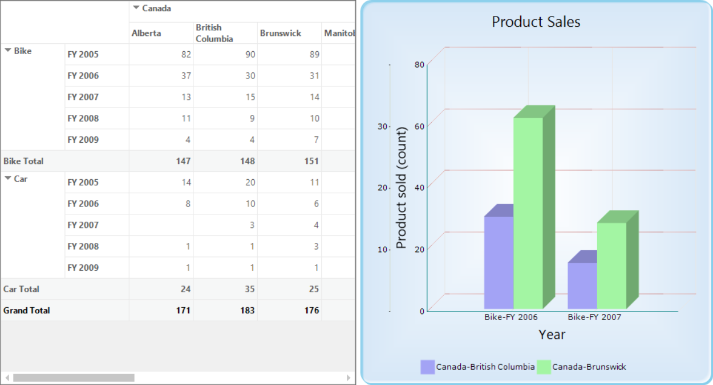
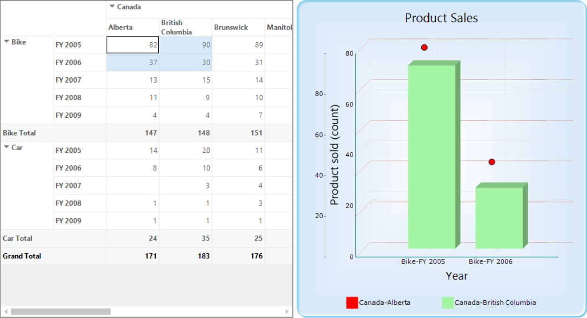
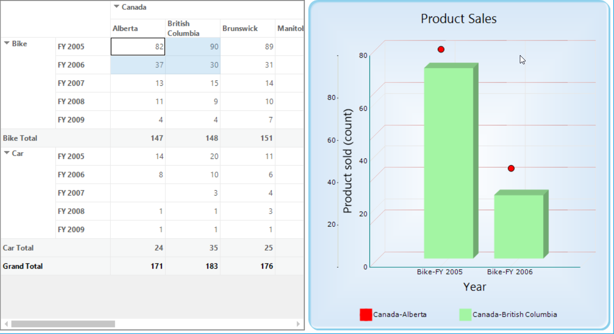

# How to Bind Pivot Grid with Chart

The [PivotGridChartHelper](https://help.syncfusion.com/cr/windowsforms/Syncfusion.GridHelperClasses.Windows~Syncfusion.GridHelperClasses.PivotGridChartHelper.html) class acts as an interface to bind the values of pivot grid control with chart control. Based on the selected ranges or values of pivot grid control, the chart control is rendered. To achieve this support, the [WireGrid](https://help.syncfusion.com/cr/windowsforms/Syncfusion.GridHelperClasses.Windows~Syncfusion.GridHelperClasses.PivotGridChartHelper~WireGrid(PivotGridControl,ChartControl).html) method of PivotGridChartHelper class should be used.

Please refer to the below code sample to bind the pivot grid control with chart control.





PivotGridChartHelper helper = new PivotGridChartHelper();
helper.WireGrid(this.pivotGridControl1, this.chartControl1);





Dim helper As New PivotGridChartHelper()
helper.WireGrid(Me.pivotGridControl1, Me.chartControl1)





## Customizing style and type of chart series

The style and type of chart series can be customized at run time by using the context menu of chart control. In order to show the context menu in chart control, the [ShowContextMenu](https://help.syncfusion.com/cr/windowsforms/Syncfusion.Chart.Windows~Syncfusion.Windows.Forms.Chart.ChartControl~ShowContextMenu.html) property of chart control should be set as true.

Please refer to the below code sample to view the context menu of chart control that is integrated with pivot grid control.





this.chartControl1.ShowContextMenu = true;





Me.chartControl1.ShowContextMenu = True





## Persisting style and type of chart series

By default, the style and type of chart series modified at run time are not persisted in the chart control and the chart control is rendered with default series type and style while selecting the values in the pivot grid control.

In order to persist the series type and style of chart control, the [WireGrid](https://help.syncfusion.com/cr/windowsforms/Syncfusion.GridHelperClasses.Windows~Syncfusion.GridHelperClasses.PivotGridChartHelper~WireGrid(PivotGridControl,ChartControl,Boolean).html) method of PivotGridChartHelper](https://help.syncfusion.com/cr/windowsforms/Syncfusion.GridHelperClasses.Windows~Syncfusion.GridHelperClasses.PivotGridChartHelper.html) class should be invoked with `true` parameter as specified in the below code sample.





PivotGridChartHelper helper = new PivotGridChartHelper();
helper.WireGrid(this.pivotGridControl1, this.chartControl1, true);





Dim helper As New PivotGridChartHelper()
helper.WireGrid(Me.pivotGridControl1, Me.chartControl1, True)





For example, the type and color of the first series is changed as scatter and red at run time as shown below.

Using this support, the type and color of chart series can be maintained in the chart control after selecting the new ranges in the pivot grid control as shown below.

A demo sample is available at the following location.

&lt;Installed Drive&gt;\Users\Public\Documents\Syncfusion\Windows\\&lt;Version Number&gt;\PivotGrid.Windows\Samples\Product Showcase\Pivotal Chart Demo