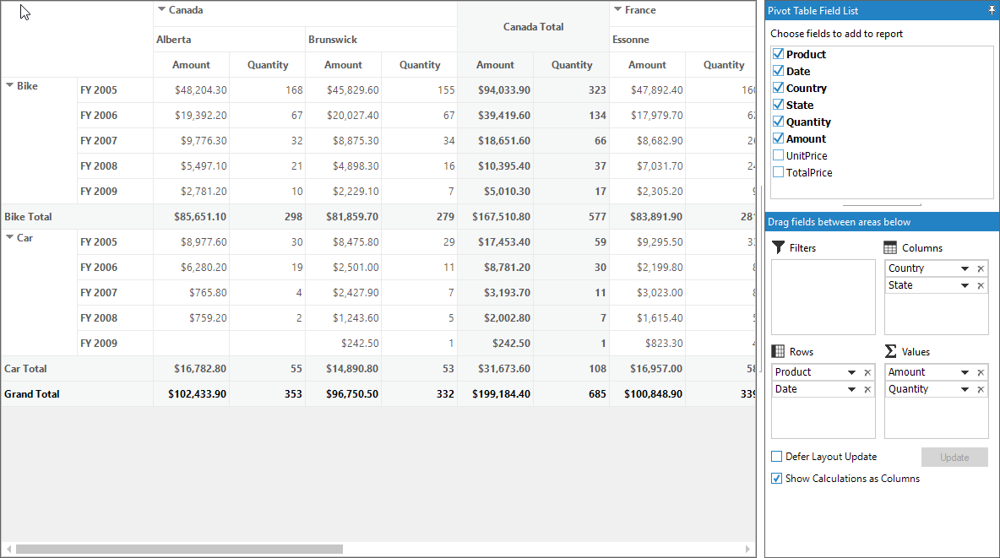

# How To Show Show Calculations As Columns

The pivot grid control provides support to support to show the calculation values by checking the check box "[Show Calculations as Columns](https://help.syncfusion.com/cr/cref_files/windowsforms/Syncfusion.PivotAnalysis.Windows~Syncfusion.Windows.Forms.PivotAnalysis.PivotSchemaDesigner~ShowCalculationsAsColumnCheckBox.html)" available at the bottom left corner of the pivot schema designer.

This support can also be achieved programmatically by setting the [ShowCalculationsAsColumns](https://help.syncfusion.com/cr/cref_files/windowsforms/Syncfusion.PivotAnalysis.Windows~Syncfusion.Windows.Forms.PivotAnalysis.PivotGridControl~ShowCalculationsAsColumns.html) property of pivot grid control as true.





this.pivotGridControl1.ShowCalculationsAsColumns = true;





Me.pivotGridControl1.ShowCalculationsAsColumns = true





