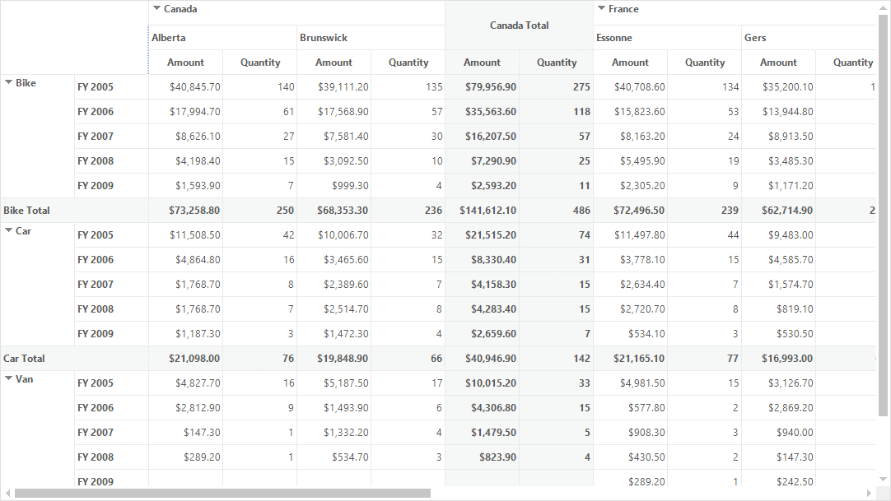

# Freezing Headers

The pivot grid control provides built-in support for freezing column and row headers. This support is quite useful when users want to make the headers visible at all times. The row and column headers are always visible when scrolling through the pivot grid with large number of rows and columns.

## Enabling frozen headers

The frozen headers support in pivot grid control can be enabled by setting the [FreezeHeaders](https://help.syncfusion.com/cr/windowsforms/Syncfusion.PivotAnalysis.Windows~Syncfusion.Windows.Forms.PivotAnalysis.PivotGridControlBase~FreezeHeaders.html) property to `true`. By default, the row and column headers are not frozen. This feature also enables the scrolling through the value cells.

Refer to the below code sample to freeze the headers of pivot grid control.





this.pivotGridControl1.TableControl.FreezeHeaders = true;





Me.PivotGridControl1.TableControl.FreezeHeaders = True





