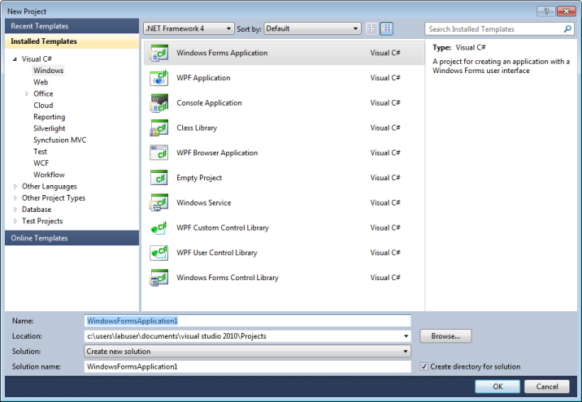
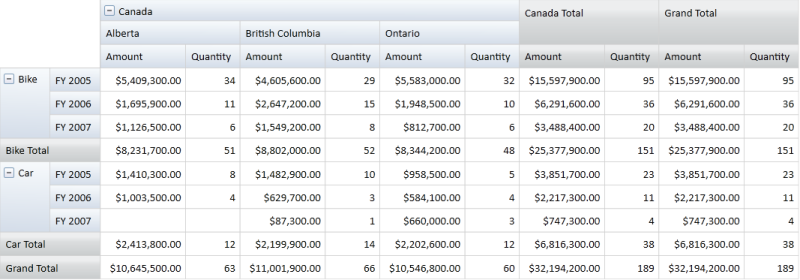

# Getting Started

## Creating PivotGrid through Visual Studio

To create the PivotGrid through Visual Studio:

1. Open the Start menu, and then click Microsoft Visual Studio 2008. 
2. On the File menu, click New Project. The New Project dialog box appears as follows.

   

3. Select Windows Forms Application, and then click OK.
4. Drag the PivotGridControl control from the Toolbox to the Design page.

   

## Populating Data to PivotGrid

The PivotGrid requires the following information in order to populate data:

* ItemSource - The data source for the pivot table. This object should be either an IEnumerable list or a DataTable.
* PivotRows - Elements that need to be added in PivotGrid rows.
* PivotColumns - Elements that need to be added in PivotGrid columns.
* PivotCalculations - Calculation values that appear as value cells in PivotGrid.

To populate a PivotGrid with the sample IList data, refer to the code below.



protected void Form1_Load(object sender, System.EventArgs e)
{
 // Specifying the ItemSource for Pivot Grid  
 this.PivotGridControl1.ItemSource = ProductSales.GetSalesData();      
 // Adding Pivot Rows to Grid
 this.PivotGridControl1.PivotRows.Add(new PivotItem { FieldMappingName = "Product", TotalHeader = "Total" });   
 this.PivotGridControl1.PivotRows.Add(new PivotItem { FieldMappingName = "Year", TotalHeader = "Total" });      
 // Adding Pivot Colums to Grid           
 this.PivotGridControl1.PivotColumns.Add(new PivotItem { FieldMappingName = "Country", TotalHeader = "Total" });   
 this.PivotGridControl1.PivotColumns.Add(new PivotItem { FieldMappingName = "State", TotalHeader = "Total" });        
 // Adding PivotCalculations to Grid          
 this.PivotGridControl1.PivotCalculations.Add(new PivotComputationInfo { FieldName = "Amount",Format="C" , SummaryType = SummaryType.DoubleTotalSum }); 
 this.PivotGridControl1.PivotCalculations.Add(new PivotComputationInfo { FieldName = "Quantity", Format ="#,##0"});
}





Protected Sub Form1_Load (ByVal sender As Object, ByVal e As System.EventArgs)
' Specifying the ItemSource for Pivot Grid
Me.PivotGridControl1.ItemSource = ProductSales.GetSalesData()
' Adding Pivot Rows to Grid
Me.PivotGridControl1.PivotRows.Add(New PivotItem With {.FieldMappingName = "Product", .TotalHeader = "Total"})
Me.PivotGridControl1.PivotRows.Add(New PivotItem With {.FieldMappingName = "Year", .TotalHeader = "Total"})
' Adding Pivot Colums to Grid
Me.PivotGridControl1.PivotColumns.Add(New PivotItem With {.FieldMappingName = "Country", .TotalHeader = "Total"})
Me.PivotGridControl1.PivotColumns.Add(New PivotItem With {.FieldMappingName = "State", .TotalHeader = "Total"})
' Adding PivotCalculations to Grid
Me.PivotGridControl1.PivotCalculations.Add(New PivotComputationInfo With {.FieldName = "Amount", .Format="C", .SummaryType = SummaryType.DoubleTotalSum})
Me.PivotGridControl1.PivotCalculations.Add(New PivotComputationInfo With {.FieldName = "Quantity", .Format ="#,##0"})
End Sub



When the code above runs, the following output is generated.

## Class Diagram

