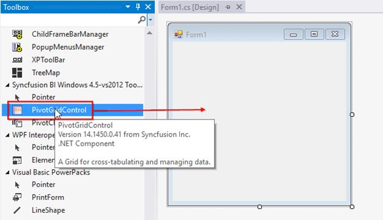
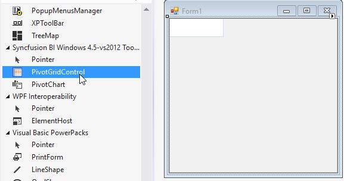
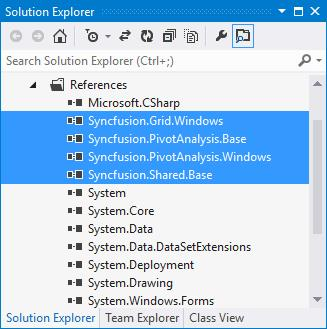

# Getting Started

This section will explain about creating simple PivotGridControl and the overview of its basic functionalities.

## Assembly Deployment

The following list of assemblies needs to be added as reference to use PivotGridControl in any application,

<table>
<tr>
<th>
Required assemblies  </th><th>
Description  </th></tr>
<tr>
<td>
{{'[Syncfusion.PivotAnalysis.Windows](http://help.syncfusion.com/cr/cref_files/windowsforms/pivot%20analysis/Syncfusion.PivotAnalysis.Windows~Syncfusion.Windows.Forms.PivotAnalysis_namespace.html)'| markdownify }}  </td><td>
Syncfusion.PivotAnalysis.Windows assembly contains classes that handles UI operations and other fundamentals of PivotGridControl.  </td></tr>
<tr>
<td>
{{'[Syncfusion.Grid.Windows](http://help.syncfusion.com/cr/cref_files/windowsforms/grid/Syncfusion.Grid.Windows.html)'| markdownify }}  </td><td>
Syncfusion.Grid.Windows assembly contains classes that handles all UI operations, fundamentals and base classes of GridControl.  </td></tr>
<tr>
<td>
{{'[Syncfusion.PivotAnalysis.Base](http://help.syncfusion.com/cr/cref_files/windowsforms/pivot analysis/Syncfusion.PivotAnalysis.Base.html)'| markdownify }}  </td><td>
Syncfusion.PivotAnalysis.Base allows you to easily access, manipulate, and display your data in a variety of configurations.  </td></tr>
<tr>
<td>
{{'[Syncfusion.Shared.Base](http://help.syncfusion.com/cr/cref_files/windowsforms/grid/Syncfusion.Shared.Base.html)'| markdownify }}  </td><td>
Syncfusion.Shared.Base contains style related properties and various editor controls which are used in GridControl.  </td></tr>
</table>
In addition to these assemblies, there are also other optional assemblies.

<table>
<tr>
<th>
Optional assemblies  </th><th>
Description  </th></tr>
<tr>
<td>
{{'[Syncfusion.Tools.Windows](http://help.syncfusion.com/cr/cref_files/windowsforms/tools/Syncfusion.Tools.Windows.html)'| markdownify }}  </td><td>
Syncfusion.Tools.Windows assembly contains classes that implements all the tools and its events and event handlers, interfaces, attributes and processing the exceptions.  </td></tr>
<tr>
<td>
{{'[Syncfusion.Linq.Base](http://help.syncfusion.com/cr/cref_files/windowsforms/pivot analysis/Syncfusion.Linq.Base.html)'| markdownify }}   </td><td>
Syncfusion.LinQ.Base contains fundamental and base classes for creating and manipulating Linq queries.  </td></tr>
<tr>
<td>
{{'[Syncfusion.XlsIO.Base](http://help.syncfusion.com/cr/cref_files/windowsforms/xlsio/Syncfusion.XlsIO.Base.html)'| markdownify }}  </td><td>
Syncfusion.XlsIO.Base. contains fundamental and base classes for creating and manipulating excel files.  </td></tr>
</table>

## Configuring a simple PivotGridControl

This section explains how to add the PivotGridControl through designer and also through code.

### Adding PivotGridControl through Designer

PivotGridControl can be added through designer by following the below steps.

1.Create a new **Windows** **Form** **Application**.

2.Drag and Drop PivotGridControl from the toolbox into the designer page.

3.Once you drag drop the PivotGridControl into the designer page, the PivotGridControl will be added successfully into the application with the required libraries. The below mentioned assemblies will be added automatically into the application.

* Syncfusion.Grid.Windows.dll
* Syncfusion.Linq.Base.dll
* Syncfusion.PivotAnalysis.Base.dll
* Syncfusion.PivotAnalysis.Windows.dll
* Syncfusion.Shared.Base.dll
* Syncfusion.Tools.Windows.dll

### Adding PivotGridControl through Code

PivotGridControl can be added through code-behind by following the below steps.

1.Create a new **Windows** **Form** **Application**.

2.Add the below assemblies into the project file.
* Syncfusion.Grid.Windows.dll
* Syncfusion.PivotAnalysis.Base.dll
* Syncfusion.PivotAnalysis.Windows.dll
* Syncfusion.Shared.Base.dll

3.Initialize a PivotGridControl by using the below code in code behind.




//Initialize a new PivotGrid.
private Syncfusion.Windows.Forms.PivotAnalysis.PivotGridControl pivotGridControl1 = new Syncfusion.Windows.Forms.PivotAnalysis.PivotGridControl();




'Initialize a new PivotGrid.
Private pivotGridControl1 As New Syncfusion.Windows.Forms.PivotAnalysis.PivotGridControl()




4.Use the below code for adding the initialized GridControl to the application.




// Add required size for the PivotGridControl
pivotGridControl1.Size = new System.Drawing.Size(344, 250);

// Add the PivotGridControl to the parent control.
this.Controls.Add(pivotGridControl1);




' Add required size for the PivotGridControl
pivotGridControl1.Size = New System.Drawing.Size(344, 250)

' Add the PivotGridControl to the parent control.
Me.Controls.Add(pivotGridControl1)




## Populating Data

This section will guide you on how to bind data source and its appropriate fields in a PivotGridControl. The data source assigned to PivotGridControl should either be an [IEnumerable](https://msdn.microsoft.com/en-us/library/9eekhta0.aspx) list or a [DataView](https://msdn.microsoft.com/en-us/library/system.data.dataview.aspx). In this example, you will learn how to assign an `IEnumerable` list data source to a PivotGridControl.

You can refer the below code which is a sample data source having the properties Product, Date, Country, State, Quantity, Amount, UnitPrice and TotalPrice.



public class ProductSales

{
public string Product { get; set; }

public string Date { get; set; }

public string Country { get; set; }

public string State { get; set; }

public int Quantity { get; set; }

public double Amount { get; set; }

public double UnitPrice { get; set; }

public double TotalPrice { get; set; }

public static ProductSalesCollection GetSalesData()
{

/// Geography
string[] countries = new string[] { "Australia", "Canada", "France", "Germany", "United Kingdom", "United States" };

string[] ausStates = new string[] { "New South Wales", "Queensland", "South Australia", "Tasmania", "Victoria" };

string[] canadaStates = new string[] { "Alberta", "British Columbia", "Brunswick", "Manitoba", "Ontario", "Quebec" };

string[] franceStates = new string[] { "Charente Maritime", "Essonne", "Garonne (Haute)", "Gers", };

string[] germanyStates = new string[] { "Bayern", "Brandenburg", "Hamburg", "Hessen", "Nordrhein Westfalen", "Saarland" };

string[] ukStates = new string[] { "England" };

string[] ussStates = new string[] { "New York", "North Carolina", "Alabama", "California", "Colorado", "New Mexico", "South Carolina" };

/// Time
string[] dates = new string[] { "FY 2005", "FY 2006", "FY 2007", "FY 2008", "FY 2009" };

/// Products
string[] products = new string[] { "Bike", "Car" };

Random r = new Random(123345345);
int numberOfRecords = 2000;
ProductSalesCollection listOfProductSales = new ProductSalesCollection();
for (int i = 0; i < numberOfRecords; i++)
{
ProductSales sales = new ProductSales();
sales.Country = countries[r.Next(1, countries.GetLength(0))];
sales.Quantity = r.Next(1, 12);

/// 1 percent discount for 1 quantity
double discount = (30000 * sales.Quantity) * (double.Parse(sales.Quantity.ToString()) / 100);
sales.Amount = (30000 * sales.Quantity) - discount;
sales.TotalPrice = sales.Amount * sales.Quantity;
sales.UnitPrice = sales.Amount / sales.Quantity;
sales.Date = dates[r.Next(r.Next(dates.GetLength(0) + 1))];
sales.Product = products[r.Next(r.Next(products.GetLength(0) + 1))];
switch (sales.Country)
{
case "Australia":
{
sales.State = ausStates[r.Next(ausStates.GetLength(0))];
break;
}
case "Canada":
{
sales.State = canadaStates[r.Next(canadaStates.GetLength(0))];
break;
}
case "France":
{
sales.State = franceStates[r.Next(franceStates.GetLength(0))];
break;
}
case "Germany":
{
sales.State = germanyStates[r.Next(germanyStates.GetLength(0))];
break;
}
case "United Kingdom":
{
sales.State = ukStates[r.Next(ukStates.GetLength(0))];
break;
}
case "United States":
{
sales.State = ussStates[r.Next(ussStates.GetLength(0))];
break;
}
}
listOfProductSales.Add(sales);
}
return listOfProductSales;
}

//Retrieve the item source from the ProductSalesCollection
public class ProductSalesCollection : List<ProductSales>
{
}
}




Public Class ProductSales
Public Property Product() As String
Public Property [Date]() As String
Public Property Country() As String
Public Property State() As String
Public Property Quantity() As Integer
Public Property Amount() As Double
Public Property UnitPrice() As Double
Public Property TotalPrice() As Double
Public Shared Function GetSalesData() As ProductSalesCollection

''' Geography
Dim countries() As String = {"Australia", "Canada", "France", "Germany", "United Kingdom", "United States"}
Dim ausStates() As String = {"New South Wales", "Queensland", "South Australia", "Tasmania", "Victoria"}
Dim canadaStates() As String = {"Alberta", "British Columbia", "Brunswick", "Manitoba", "Ontario", "Quebec"}
Dim franceStates() As String = {"Charente Maritime", "Essonne", "Garonne (Haute)", "Gers"}
Dim germanyStates() As String = {"Bayern", "Brandenburg", "Hamburg", "Hessen", "Nordrhein Westfalen", "Saarland"}
Dim ukStates() As String = {"England"}
Dim ussStates() As String = {"New York", "North Carolina", "Alabama", "California", "Colorado", "New Mexico", "South Carolina"}

''' Time
Dim dates() As String = {"FY 2005", "FY 2006", "FY 2007", "FY 2008", "FY 2009"}

''' Products
Dim products() As String = {"Bike", "Car"}
Dim r As New Random(123345345)
Dim numberOfRecords As Integer = 2000
Dim listOfProductSales As New ProductSalesCollection()
For i As Integer = 0 To numberOfRecords - 1
Dim sales As New ProductSales()
sales.Country = countries(r.Next(1, countries.GetLength(0)))
sales.Quantity = r.Next(1, 12)

''' 1 percent discount for 1 quantity
Dim discount As Double = (30000 * sales.Quantity) * (Double.Parse(sales.Quantity.ToString()) / 100)
sales.Amount = (30000 * sales.Quantity) - discount
sales.TotalPrice = sales.Amount * sales.Quantity
sales.UnitPrice = sales.Amount / sales.Quantity
sales.Date = dates(r.Next(r.Next(dates.GetLength(0) + 1)))
sales.Product = products(r.Next(r.Next(products.GetLength(0) + 1)))
Select Case sales.Country
Case "Australia"
sales.State = ausStates(r.Next(ausStates.GetLength(0)))
Exit Select
Case "Canada"
sales.State = canadaStates(r.Next(canadaStates.GetLength(0)))
Exit Select
Case "France"
sales.State = franceStates(r.Next(franceStates.GetLength(0)))
Exit Select
Case "Germany"
sales.State = germanyStates(r.Next(germanyStates.GetLength(0)))
Exit Select
Case "United Kingdom"
sales.State = ukStates(r.Next(ukStates.GetLength(0)))
Exit Select
Case "United States"
sales.State = ussStates(r.Next(ussStates.GetLength(0)))
Exit Select
End Select
listOfProductSales.Add(sales)
Next i
Return listOfProductSales
End Function

Public Class ProductSalesCollection
Inherits List(Of ProductSales)
End Class
End Class




N>
The `ProductSales` is a class which consists of the `IList` data. For more information, refer the Pivot Grid Demo sample which is located in this path <Installed_Location>\EssentialStudio\<Installed_Version>\Windows\PivotGrid.Windows\Samples\Appearance\Pivot Grid Demo

The PivotGridControl requires the following information in order to populate data from the data source

* [ItemSource](http://help.syncfusion.com/cr/cref_files/windowsforms/pivot analysis/Syncfusion.PivotAnalysis.Windows~Syncfusion.Windows.Forms.PivotAnalysis.PivotGridControl~ItemSource.html) - The data source for the pivot table. This object should be either an    [IEnumerable](https://msdn.microsoft.com/en-us/library/9eekhta0.aspx) list or a [DataTable](https://msdn.microsoft.com/en-in/library/system.data.datatable.aspx).
* [PivotRows](http://help.syncfusion.com/cr/cref_files/windowsforms/pivot analysis/Syncfusion.PivotAnalysis.Windows~Syncfusion.Windows.Forms.PivotAnalysis.PivotGridControl~PivotRows.html) - Elements that need to be added in PivotGridControl rows.
* [PivotColumns](http://help.syncfusion.com/cr/cref_files/windowsforms/pivot analysis/Syncfusion.PivotAnalysis.Windows~Syncfusion.Windows.Forms.PivotAnalysis.PivotGridControl~PivotColumns.html) - Elements that need to be added in PivotGridControl columns.
* [PivotCalculations](http://help.syncfusion.com/cr/cref_files/windowsforms/pivot analysis/Syncfusion.PivotAnalysis.Windows~Syncfusion.Windows.Forms.PivotAnalysis.PivotGridControl~PivotCalculations.html) - Calculation values that appear as value cells in PivotGridControl.

The data source can be assigned to PivotGridControl by using the [ItemSource](http://help.syncfusion.com/cr/cref_files/windowsforms/pivot analysis/Syncfusion.PivotAnalysis.Windows~Syncfusion.Windows.Forms.PivotAnalysis.PivotGridControl~ItemSource.html) property.



// Specifying the Item Source for Pivot Grid  
this.pivotGridControl1.ItemSource = ProductSales.GetSalesData();




' Specifying the Item Source for Pivot Grid  
Me.pivotGridControl1.ItemSource = ProductSales.GetSalesData()




After assigning the data source, the rows and columns that needs to be displayed in PivotGridControl has to be added. Make use of the [PivotRows](http://help.syncfusion.com/cr/cref_files/windowsforms/pivot analysis/Syncfusion.PivotAnalysis.Windows~Syncfusion.Windows.Forms.PivotAnalysis.PivotGridControl~PivotRows.html) and [PivotColumns](http://help.syncfusion.com/cr/cref_files/windowsforms/pivot analysis/Syncfusion.PivotAnalysis.Windows~Syncfusion.Windows.Forms.PivotAnalysis.PivotGridControl~PivotColumns.html) properties to achieve this.



// Adding Pivot Rows to Grid
this.pivotGridControl1.PivotRows.Add(new PivotItem { FieldMappingName = "Product", TotalHeader = "Total" });
this.pivotGridControl1.PivotRows.Add(new PivotItem { FieldMappingName = "Year", TotalHeader = "Total" });

// Adding Pivot Columns to Grid 
this.pivotGridControl1.PivotColumns.Add(new PivotItem { FieldMappingName = "Country", TotalHeader = "Total" });
this.pivotGridControl1.PivotColumns.Add(new PivotItem { FieldMappingName = "State", TotalHeader = "Total" });




' Adding Pivot Rows to Grid
Me.pivotGridControl1.PivotRows.Add(New PivotItem With {.FieldMappingName = "Product", .TotalHeader = "Total"})
Me.pivotGridControl1.PivotRows.Add(New PivotItem With {.FieldMappingName = "Year", .TotalHeader = "Total"})

' Adding Pivot Columns to Grid           
Me.pivotGridControl1.PivotColumns.Add(New PivotItem With {.FieldMappingName = "Country", .TotalHeader = "Total"})
Me.pivotGridControl1.PivotColumns.Add(New PivotItem With {.FieldMappingName = "State", .TotalHeader = "Total"})




After adding the rows and columns, the PivotGridControl needs to know the information for the calculations that appear in it. This can be achieved by using the [PivotCalculations](http://help.syncfusion.com/cr/cref_files/windowsforms/pivot analysis/Syncfusion.PivotAnalysis.Windows~Syncfusion.Windows.Forms.PivotAnalysis.PivotGridControlBase~PivotCalculations.html) property.



// Adding Pivot Calculations to Grid          
this.pivotGridControl1.PivotCalculations.Add(new PivotComputationInfo { FieldName = "Amount", Format = "C", SummaryType = SummaryType.DoubleTotalSum });
this.pivotGridControl1.PivotCalculations.Add(new PivotComputationInfo { FieldName = "Quantity", Format = "#,##0" });




' Adding Pivot Calculations to Grid          
Me.pivotGridControl1.PivotCalculations.Add(New PivotComputationInfo With {.FieldName = "Amount", .Format = "C", .SummaryType = SummaryType.DoubleTotalSum})
Me.pivotGridControl1.PivotCalculations.Add(New PivotComputationInfo With {.FieldName = "Quantity", .Format = "#,##0"})




## Pivot Schema Designer

Pivot Schema Designer is a layout which is supported in PivotGridControl that can be presented like as Microsoft Excel pivot table field list. It enables the drag-and-drop feature for fields between different areas, including column, row, value, and filter. By using PivotTableFieldList, you can add, rearrange, or remove fields to show data in a PivotGridControl in the exact way you want. For more information, refer [Pivot Schema Designer](http://help.syncfusion.com/windowsforms/pivotgrid/pivot-schema-designer) topic. This Pivot Schema Designer can be enabled in PivotGridControl by setting the [ShowPivotTableFieldList](http://help.syncfusion.com/cr/cref_files/windowsforms/pivot analysis/Syncfusion.PivotAnalysis.Windows~Syncfusion.Windows.Forms.PivotAnalysis.PivotGridControl~ShowPivotTableFieldList.html) property to `true`.



// Shows the Pivot Schema Designer.
this.pivotGridControl1.ShowPivotTableFieldList = true;




' Shows the Pivot Schema Designer.
Me.pivotGridControl1.ShowPivotTableFieldList = True




## Grouping

PivotGridControl contains a Grouping Bar which enables the drag and drop feature of fields between different areas such as column, row, value and filter. This Grouping Bar will be visible at the top of the PivotGridControl. By using the Grouping Bar, you can add, rearrange, or remove fields to show data in the PivotGridControl exactly the way you want. For enabling this option, you have to make use of the [ShowGroupBar](http://help.syncfusion.com/cr/cref_files/windowsforms/pivot analysis/Syncfusion.PivotAnalysis.Windows~Syncfusion.Windows.Forms.PivotAnalysis.PivotGridControl~ShowGroupBar.html) property. For more information, refer [Grouping](http://help.syncfusion.com/windowsforms/pivotgrid/grouping-bar) topic.



// Enables Grouping Bar.
this.pivotGridControl1.ShowGroupBar = true;




' Enables Grouping Bar.
Me.pivotGridControl1.ShowGroupBar = True




## Sorting

Sorting can be enabled or disabled by using the [AllowSorting](http://help.syncfusion.com/cr/cref_files/windowsforms/pivot analysis/Syncfusion.PivotAnalysis.Windows~Syncfusion.Windows.Forms.PivotAnalysis.PivotGridControl~AllowSorting.html) property. By default, the PivotGridControl will populate the data in ascending order. For more information, refer [Sorting](http://help.syncfusion.com/windowsforms/pivotgrid/sorting) topic.



// Enables Sorting in PivotGridControl.
this.pivotGridControl1.AllowSorting = true;




' Enables Sorting in PivotGridControl.
Me.pivotGridControl1.AllowSorting = True




## Filtering

Filtering can be enabled or disabled in PivotGridControl by using the [AllowFiltering](http://help.syncfusion.com/cr/cref_files/windowsforms/pivot analysis/Syncfusion.PivotAnalysis.Windows~Syncfusion.Windows.Forms.PivotAnalysis.PivotGridControl~AllowFiltering.html) property. You can apply filters to one or more columns. For more information, refer [Filtering](http://help.syncfusion.com/windowsforms/pivotgrid/filtering-support-for-calculation-columns) topic.



// Enables Filtering in PivotGridControl.
this.pivotGridControl1.AllowFiltering = true;




' Enables Filtering in PivotGridControl.

Me.pivotGridControl1.AllowFiltering = True




