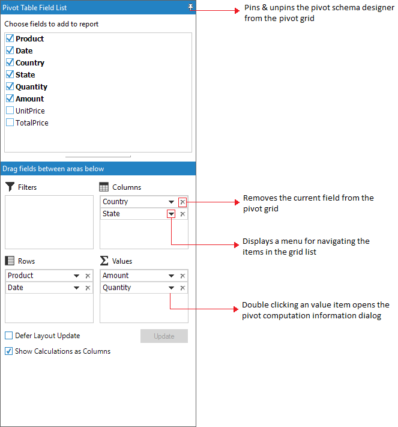
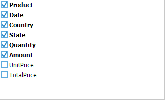

# Pivot Schema Designer

The pivot schema designer for Windows Forms can be supported in PivotGrid samples so that the PivotGrid can be presented like an ExcelPivotTable. It enables the drag-and-drop feature for fields between different areas, including column, row, value, and filter. By using the PivotTable Field List, users can add, rearrange, or remove fields to show data in a PivotGrid in the exact way that they want. The PivotTable Field List displays two sections consisting of the following items:

* A field section at the top for adding fields to and removing fields from the PivotGrid.
* A layout section at the bottom for rearranging and repositioning the fields in the PivotGrid.

{{ '' | markdownify }}
{:.image }

Fields Section

The Fields section consists of the list of fields present in the PivotGrid, including Row, Column, and Summary elements. A field will be added to the PivotGrid if it is checked, and will be removed from the PivotGrid if it is unchecked. By default, fields will be added to the row label if checked, and added to the column label by simply dragging the field and dropping it onto the column label area.

Layout Section

The layout section is used to rearrange and reposition the fields in a PivotGrid. It includes the following areas:

* Report Filter
* Column Label
* Row Label
* Values

Report Filter

The report filter is used to filter the entire report based on the selected item in the report filter. The report filter pop-up window can be launched by clicking on the expander icon available in the right corner of each filter item.

{{ '' | markdownify }}
{:.image }

Column Label

The column label is used to display fields as columns at the top of a report. A column lower in position is nested within another column immediately above it in the PivotGrid.

Row Label

The row label is used to display fields as rows at the top of a report. A row lower in position is nested within another row immediately above it in the PivotGrid

Values

Values are used to display summary values.

Pivot Computation Information window

The Pivot Computation Information window is used to change or edit value format and summary type.

{{ '' | markdownify }}
{:.image }

Properties

_Table_ _12__: Property Table_

<table>
<tr>
<td>
Property </td><td>
Description </td><td>
Type </td><td>
Data Type </td><td>
Reference links </td></tr>
<tr>
<td>
ShowPivotTableFieldList</td><td>
Gets or sets the value to enable PivotTableFieldList in the PivotGridControl</td><td>
Boolean</td><td>
Boolean</td><td>
</td></tr>
</table>

Sample Link

<InstalledLocation>\Syncfusion\EssentialStudio\[VersionNumber]\Windows\ PivotGrid.Windows\Samples\2.0\Product ShowCase\Pivot Customization Demo

## Adding the PivotSchemaDesigner to an Application 

The PivotSchemaDesigner is a built-in control associated with the PivotGridControl in Windows Forms. Users can enable or disable the schema designer through the Boolean property “ShowPivotTableFieldList.”

The following code can be used to enable the schema designer in PivotGridControl:

this.pivotGridControl1.ShowPivotTableFieldList = true;

{{ '' | markdownify }}
{:.image }

