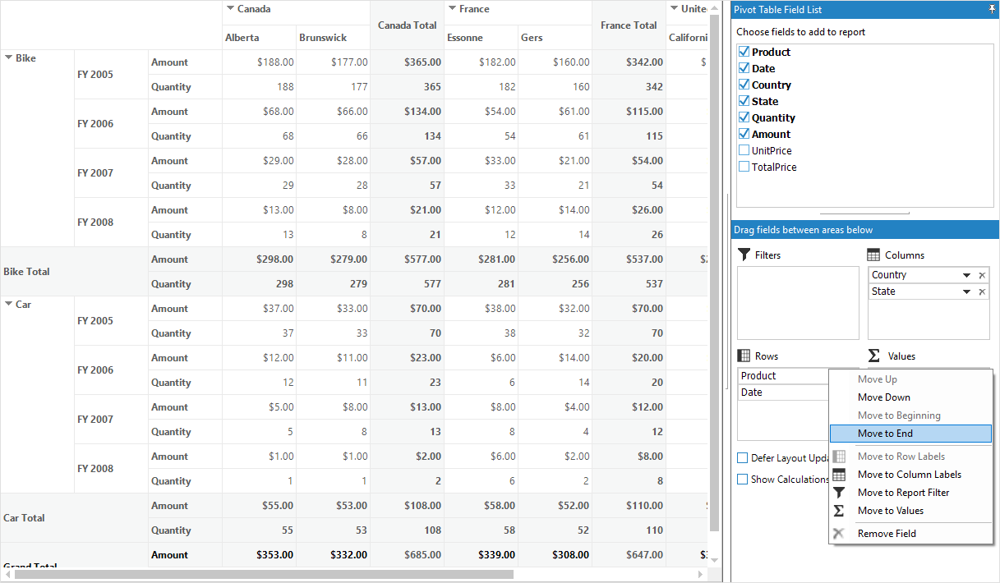
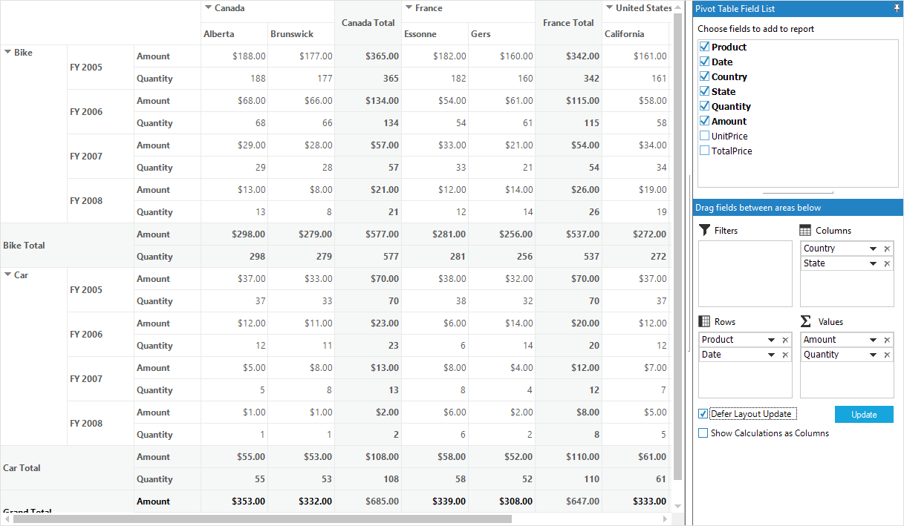

# Pivot Schema Designer

The [Pivot schema designer](https://help.syncfusion.com/cr/windowsforms/Syncfusion.PivotAnalysis.Windows~Syncfusion.Windows.Forms.PivotAnalysis.PivotGridControl~PivotSchemaDesigner.html) also known as pivot table field list allows to add, rearrange, filter and remove the pivot fields to show the data in pivot grid exactly the way as you desired.

Based on the data source bound to the pivot grid control, the pivot table field list will be automatically populated with the field names. The pivot table field list provides an Excel like appearance and behavior.

Pivot schema designer consists of two sections such as follows:

* **Fields section**: Presents at the top portion for adding and removing pivot fields in the pivot grid.
* **Layout section**: Presents at the bottom portion for rearranging and repositioning the pivot fields in the pivot grid.

## Fields section

The fields section contains the list of pivot items that are present in the data source of pivot grid. The [PivotFields](https://help.syncfusion.com/cr/windowsforms/Syncfusion.PivotAnalysis.Windows~Syncfusion.Windows.Forms.PivotAnalysis.PivotGridControl~PivotFields.html) property holds the collection of pivot items available in the fields section.

Using this fields section, the pivot fields can be dynamically added or removed in the pivot grid. If the pivot field is checked in the fields section, then it will be added to the pivot grid. Simultaneously, if the pivot field is unchecked in the fields section, then it will be removed from the pivot grid.

By default, the pivot field gets added to the row section. In order to add the pivot fields in any other layout section, it need to be dragged to dropped from fields section to required layout section.

## Layout Section

The layout section is segregated into four sections as denoted below:

* Filters section (Grid filter list)
* Columns section  (Grid Column list)
* Rows section  (Grid row list)
* Values Section  (Grid value list)

### Filters section

The filters section is used to filter the items in pivot grid based on the items selected in the report filter popup and it can be accessed using the property of [GridFilterList](https://help.syncfusion.com/cr/windowsforms/Syncfusion.PivotAnalysis.Windows~Syncfusion.Windows.Forms.PivotAnalysis.PivotGridControlBase~GridFilterList.html) available in the pivot grid control's `TableControl` property.

The report filter popup can be launched by clicking on the filter icon available in the right corner of each item in the filters section.

### Columns section

The columns section is used to display the pivot column fields added in the pivot grid control and it can be accessed using the property of [GridColumnList](https://help.syncfusion.com/cr/windowsforms/Syncfusion.PivotAnalysis.Windows~Syncfusion.Windows.Forms.PivotAnalysis.PivotGridControlBase~GridColumnList.html)

### Rows section

The rows section is used to display the pivot row fields added in the pivot grid control and it can be accessed using the property of [GridRowList](https://help.syncfusion.com/cr/windowsforms/Syncfusion.PivotAnalysis.Windows~Syncfusion.Windows.Forms.PivotAnalysis.PivotGridControlBase~GridRowList.html)

### Values section

The values section is used to display the summary value fields added in the pivot grid control and it can be accessed using the property of [GridValueList](https://help.syncfusion.com/cr/windowsforms/Syncfusion.PivotAnalysis.Windows~Syncfusion.Windows.Forms.PivotAnalysis.PivotGridControlBase~GridValueList.html)

## Enabling pivot table field list

To show the pivot table field list integrated with the pivot grid control, the [ShowPivotTableFieldList](https://help.syncfusion.com/cr/windowsforms/Syncfusion.PivotAnalysis.Windows~Syncfusion.Windows.Forms.PivotAnalysis.PivotGridControl~ShowPivotTableFieldList.html) property of pivot grid should be enabled. By default, it is set as false.

Refer to the below code sample to show the pivot table field along with pivot grid control.





this.pivotGridControl1.ShowPivotTableFieldList = true;





Me.pivotGridControl1.ShowPivotTableFieldList = True





## Interactive features

### Adding fields to pivot grid

The pivot fields in can be dynamically added to the pivot grid control by checking the check box besides the pivot fields available in the fields section.

### Reordering fields in pivot grid

The pivot fields can be reordered by doing drag and drop operation as well as using context menu available in the grid list.

#### By drag and drop between grid list and fields section

Any pivot field can be dragged and dropped from fields section to column or row or value or filter grid list available at the bottom of the pivot schema designer as shown below:

#### By drag and drop within grid lists

Any pivot field can be dragged and dropped from one grid list to some other grid list available at the bottom of the pivot schema designer as shown below:

#### By drag and drop between pivot schema designer and grouping bar

Any pivot field can be dragged and dropped from any of the pivot schema designer's grid list or field section to the required grouping bar's section as shown below:

#### By context menu of grid list

Any pivot field inside the grid lists can be reordered by using the context menu, which can be opened by clicking on down arrow icon available in each item of the grid lists.

### Removing fields from pivot grid

The pivot field can be dynamically removed from the pivot grid control. This can be achieved by any of the following ways:

* By unselecting the check box of required pivot field available in the fields section list.
* By clicking the "Remove Field" option available in the context menu, which can be opened by clicking on down arrow icon available in each item of the grid lists.
* By clicking on remove icon available in each item of the grid lists.

### Filtering field items in pivot grid

The items of the pivot field inside the filter section can only be filtered. The report filter popup will be opened by clicking on the filter icon present in the right corner of each item in the filters section. The items of the pivot field can be filtered by checking or unchecking the check box besides them.

N>
At least, one item should be in the checked state, otherwise the "OK" button will be disabled in the report filter popup to restrict filtering operation.

## Defer layout update

By default, the pivot grid control is updated for each and every action happened related to the pivot field. For pivot grid control containing large data source, these actions can take some time to complete. To handle this scenario, pivot grid provides defer layout update support which allows users to control when the pivot grid control is updated.

### Enabling defer layout update

The "[Defer Layout Update](https://help.syncfusion.com/cr/windowsforms/Syncfusion.PivotAnalysis.Windows~Syncfusion.Windows.Forms.PivotAnalysis.PivotSchemaDesigner~DeferLayoutUpdateCheckBox.html)" check box present at the bottom left corner of the pivot schema designer should be checked to enable this feature. When this checkbox is checked, the "[Update](https://help.syncfusion.com/cr/windowsforms/Syncfusion.PivotAnalysis.Windows~Syncfusion.Windows.Forms.PivotAnalysis.PivotSchemaDesigner~DeferLayoutUpdateButton.html)" button next to it will be enabled. Now, any operations can be performed on pivot fields without updating the pivot grid control. The pivot grid control will be updated only if the update button is clicked.

This support can also be be achieved programmatically by setting the [DeferLayoutUpdate](https://help.syncfusion.com/cr/windowsforms/Syncfusion.PivotAnalysis.Windows~Syncfusion.Windows.Forms.PivotAnalysis.PivotGridControl~DeferLayoutUpdate.html) property of pivot grid control.





this.pivotGridControl1.DeferLayoutUpdate = true;





Me.pivotGridControl1.DeferLayoutUpdate = True





## Displaying Calculations

PivotGrid provides support to show the calculation values either in column or in row. The "[Show Calculations as Columns](https://help.syncfusion.com/cr/windowsforms/Syncfusion.PivotAnalysis.Windows~Syncfusion.Windows.Forms.PivotAnalysis.PivotSchemaDesigner~ShowCalculationsAsColumnCheckBox.html)" check box present at the bottom left corner of the pivot schema designer should be checked or unchecked based on the requirement.

This support can also be achieved programmatically by using the [ShowCalculationsAsColumns](https://help.syncfusion.com/cr/windowsforms/Syncfusion.PivotAnalysis.Windows~Syncfusion.Windows.Forms.PivotAnalysis.PivotGridControl~ShowCalculationsAsColumns.html) property of pivot grid control.





this.pivotGridControl1.ShowCalculationsAsColumns = false;





Me.pivotGridControl1.ShowCalculationsAsColumns = False





## Pivot computation information dialog

The pivot computation information dialog is used to view the information about particular pivot calculation item. It is also used to edit the header, description, value format, summary type and calculation type of the pivot calculation item at run time. While double clicking on a calculation item under the value section, pivot computation information dialog will be displayed as shown below:

