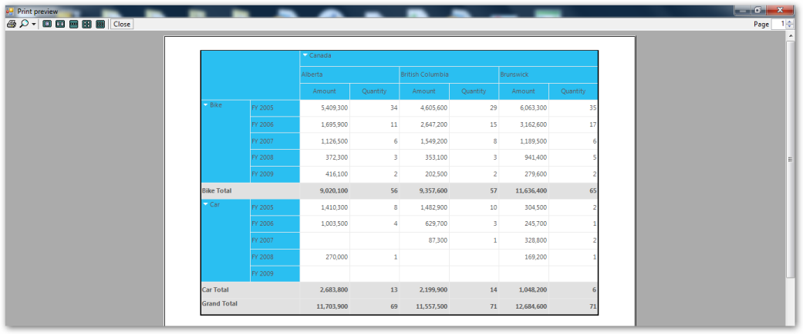

# Print Option

The print option is extended for the PivotGrid control to allow users to preview the contents before the contents are printed on paper.

This feature is used to print the PivotGrid control in landscape and portrait views. This feature has overridden the GridPrintDocumentAdv from Syncfusion.GridHelperClasses.Windows. 

The pivot grid visual style color is automatically applied in the printed document based on the visual styles of the grid. 

The print functionality can be invoked using the following code:

 [C#]

private void button1_Click_1(object sender, EventArgs e)

{

 try

   {

PivotGridPrintDocumentAdv pd = new PivotGridPrintDocumentAdv(this.pivotGridControl1);

pd.DefaultPageSettings.Margins = new System.Drawing.Printing.Margins(25, 25, 25, 25);

PrintPreviewDialog previewDialog = new PrintPreviewDialog();

previewDialog.Document = pd;

previewDialog.Show();

   }

catch (Exception ex)

   {

MessageBox.Show("Error while print preview" + ex.ToString());

   }

}

[VB]

Private Sub button1_Click_1(ByVal sender As Object, ByVal e As EventArgs)

 Try

Dim pd As New PivotGridPrintDocumentAdv(Me.pivotGridControl1)

pd.DefaultPageSettings.Margins = New System.Drawing.Printing.Margins(25, 25, 25, 25)

Dim previewDialog As New PrintPreviewDialog()

previewDialog.Document = pd

previewDialog.Show()

Catch ex As Exception

MessageBox.Show("Error while print preview" & ex.ToString())

End Try

End Sub

Headers and footers can also be added by using the DrawGridPrintHeader and DrawGridPrintFooter events. The following code illustrates how to add the header and footer.

[C#]

pd.DrawGridPrintHeader+=new

GridPrintDocumentAdv.DrawGridHeaderFooterEventHandler(pd_DrawGridPrintHeader)

;

pd.DrawGridPrintFooter+=new

GridPrintDocumentAdv.DrawGridHeaderFooterEventHandler(pd_DrawGridPrintFooter)

;

[VB]

AddHandler pd.DrawGridPrintHeader, AddressOf pd_DrawGridPrintHeader

AddHandler pd.DrawGridPrintFooter, AddressOf pd_DrawGridPrintFooter

The following image shows the printed output of the pivot grid:

{  | markdownify }
{:.image }

Sample Link

A sample is available in the following location:

&lt;InstalledLocation&gt;\Syncfusion\EssentialStudio\[Version Number]\Windows\PivotGrid.Windows \Samples\2.0\Print\Print Grid Demo

