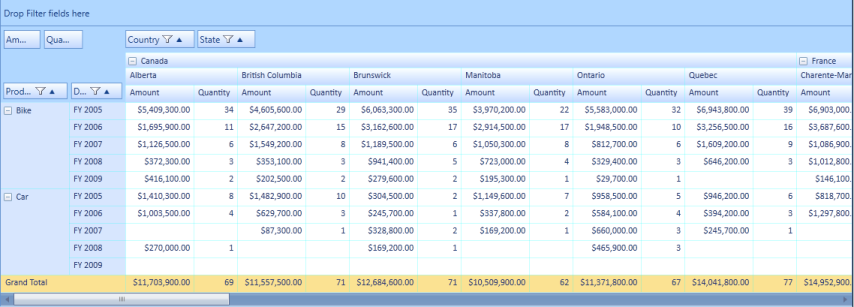

# Subtotal Hiding

The subtotal hiding feature is used to show or hide the subtotals in the PivotGrid. In the case of larger data table, this feature enables the user to have an abstract view of the data by hiding subtotals using the ShowSubTotals__property.

Use Case Scenarios

When the user has more computational fields with subtotals in each group of their PivotGrid, the user might find it difficult to view all the data. In that case, the user can hide the subtotals and make it visible when required.

The following screenshots show the PivotGrid with shown and hidden sub totals.

{  | markdownify }
{:.image }

{  | markdownify }
{:.image }

Properties

_Table_ _13__: Property Table_

<table>
<tr>
<td>
Property </td><td>
Description </td><td>
Data Type </td><td>
Reference links </td></tr>
<tr>
<td>
ShowSubTotals</td><td>
Shows or hides the sub totals </td><td>
Boolean </td><td>
- </td></tr>
</table>

Methods

_Table_ _14__: Method Table_

<table>
<tr>
<th>
Method </th><th>
Description </th><th>
Parameters </th><th>
Return Type </th><th>
Reference links </th></tr>
<tr>
<th>
SubTotalsRendering</th><th>
Handles rendering of cells(showing or hiding the cells) by calculating the cell range values in the Pivot Engine based on the ShowSubTotals property value in the control</th><th>
- </th><th>
Void </th><th>
- </th></tr>
</table>

Sample Link

To view a sample of this feature:

1. Select Start > Programs > Syncfusion > Essential Studio x.x.x.x -> Dashboard.
2. Click Run Samples under UI edition.
3. Select PivotGrid.
4. Navigate to Selection > Cell Selection Demo.
## Showing or Hiding Subtotals in PivotGrid

The user can show or hide the PivotGrid subtotals using ShowSubTotals property.  To show sub totals, set this property to true. To hide subtotals, set this property to false.  By default the value of the ShowSubTotals property is set to true.

The following code example illustrates how to set values for the _ShowSubTotals_ property to show the subtotals.

<table>
<tr>
<td>
[C#]this.pivotGridControl1.ShowSubTotals = true;</td></tr>
<tr>
<td>
 [VB]Me.pivotGridControl1.ShowSubTotals = True</td></tr>
</table>

The following code example illustrates how to set values for the _ShowSubTotals_ property to hide the subtotals.

<table>
<tr>
<td>
[C#]this.pivotGridControl1.ShowSubTotals = false;</td></tr>
<tr>
<td>
 [VB]Me.pivotGridControl1.ShowSubTotals = False</td></tr>
</table>

