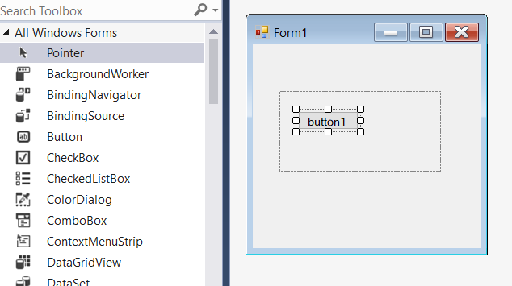
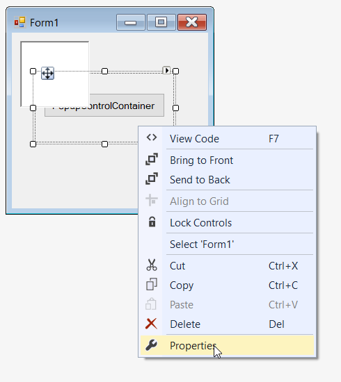
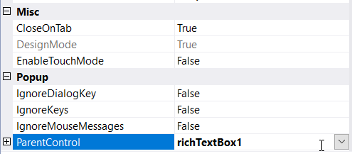
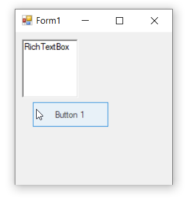

# Getting Started with Windows Forms Popup (PopupControlContainer)

## Assembly deployment

Refer to the [control dependencies](https://help.syncfusion.com/windowsforms/control-dependencies#popupcontrolcontainer) section to get the list of assemblies or NuGet package that needs to be added as a reference to use the control in any application.

You can find more details about installing the NuGet packages in a Windows Forms application in the following link: 

[How to install nuget packages](https://help.syncfusion.com/windowsforms/visual-studio-integration/nuget-packages)

### Create a simple application with TrackBarEx

You can create a Windows Forms application with [PopupControlContainer](https://help.syncfusion.com/cr/windowsforms/Syncfusion.Windows.Forms.PopupControlContainer.html) using the following steps:

### Create a project

Create a new Windows Forms project in Visual Studio to display the [PopupControlContainer](https://help.syncfusion.com/cr/windowsforms/Syncfusion.Windows.Forms.PopupControlContainer.html) control.

## Add control through designer

The PopupControlContainer control can be added through designer by following the below steps:

**1.** Drag the PopupControlContainer control from the toolbox to designer page. The following assembly references are added automatically:

* Syncfusion.Shared.Base.dll
* Syncfusion.Licensing.dll

**2.** Add the child controls like button, label, TextBox, ColorPicker, etc., to the PopupControlContainer. The following screenshot illustrates adding button as child control.

**3.** After the child control has been added, associate it as a pop-up for other controls like RichTextBox, label, button, etc. The following screenshot illustrates adding RichTextBox as parent control for mapping the pop-up container.

**4.** Associate the [RichTextBox](https://docs.microsoft.com/en-us/dotnet/api/system.windows.controls.richtextbox?view=netframework-4.7.2) instance in the Properties panel of PopupControlContainer under the [ParentControl](https://help.syncfusion.com/cr/windowsforms/Syncfusion.Windows.Forms.PopupControlContainer.html#Syncfusion_Windows_Forms_PopupControlContainer_ParentControl).

**5.** Handle the [Click event](https://docs.microsoft.com/en-us/dotnet/api/system.windows.forms.control.click?view=netframework-4.7.2) of RichTextBox and call [ShowPopup](https://help.syncfusion.com/cr/windowsforms/Syncfusion.Windows.Forms.PopupControlContainer.html#Syncfusion_Windows_Forms_PopupControlContainer_ShowPopup_System_Drawing_Point_) method of PopupControlContainer to display the pop-up at a desired location. The appropriate code to do this is given in the following section.

## Add control manually in code

To add the control manually in C#, follow the given steps:

**1.** Add the **Syncfusion.Shared.Base** assembly reference to the project: 

**2.** Include the **Syncfusion.Windows.Forms** namespace.



using Syncfusion.Windows.Forms;


Imports Syncfusion.Windows.Forms

 

**3.** Create a [PopupControlContainer](https://help.syncfusion.com/cr/windowsforms/Syncfusion.Windows.Forms.PopupControlContainer.html) instance, and add it to the window.



//Create instance of PopupControlContainer
PopupControlContainer popupControlContainer1= new PopupControlContainer();
this.Controls.Add(popupControlContainer1);


'Create instance of PopupControlContainer
Dim popupControlContainer1 As PopupControlContainer = New PopupControlContainer
Me.Controls.Add(popupControlContainer1)



**4.** Add child controls like button, label, TextBox, ColorPicker, etc., to the PopupControlContainer. 



// Declaration 
private Syncfusion.Windows.Forms.PopupControlContainer popupControlContainer1;
private System.Windows.Forms.Button button1;
private System.Windows.Forms.RichTextBox richTextBox1;

// Initializing 
this.popupControlContainer1 = new Syncfusion.Windows.Forms.PopupControlContainer();
this.button1 = new System.Windows.Forms.Button();
this.richTextBox1 = new System.Windows.Forms.RichTextBox();

// popupControlContainer1
this.popupControlContainer1.Controls.Add(this.button1);
this.popupControlContainer1.Location = new System.Drawing.Point(33, 58);
this.popupControlContainer1.Name = "popupControlContainer2";
this.popupControlContainer1.ParentControl = this.richTextBox1;
this.popupControlContainer1.Size = new System.Drawing.Size(200, 100);

// button1
this.button1.Location = new System.Drawing.Point(13, 29);
this.button1.Name = "button1";
this.button1.Size = new System.Drawing.Size(174, 35);
this.button1.Text = "PopupControlContainer";

// richTextBox1
this.richTextBox1.Location = new System.Drawing.Point(12, 12);
this.richTextBox1.Name = "richTextBox1";
this.richTextBox1.Size = new System.Drawing.Size(100, 96);
this.richTextBox1.Click += RichTextBox1_Click1;

// Form1
this.ClientSize = new System.Drawing.Size(282, 253);
this.Controls.Add(this.richTextBox1);
this.Name = "Form1";
this.Text = "Form1";   

private void RichTextBox1_Click1(object sender, EventArgs e)
{
    this.popupControlContainer1.ShowPopup(Point.Empty);
}



'Declaration 
Private popupControlContainer1 As Syncfusion.Windows.Forms.PopupControlContainer
Private button1 As System.Windows.Forms.Button
Private richTextBox1 As System.Windows.Forms.RichTextBox

'Initializing 
Me.popupControlContainer1 = New Syncfusion.Windows.Forms.PopupControlContainer()
Me.button1 = New System.Windows.Forms.Button()
Me.richTextBox1 = New System.Windows.Forms.RichTextBox()

' popupControlContainer1
Me.popupControlContainer1.Controls.Add(Me.button1)
Me.popupControlContainer1.Location = New System.Drawing.Point(33, 58)
Me.popupControlContainer1.Name = "popupControlContainer2"
Me.popupControlContainer1.ParentControl = Me.richTextBox1
Me.popupControlContainer1.Size = New System.Drawing.Size(200, 100)

' button1
Me.button1.Location = New System.Drawing.Point(13, 29)
Me.button1.Name = "button1"
Me.button1.Size = New System.Drawing.Size(174, 35)
Me.button1.Text = "PopupControlContainer"

' richTextBox1
Me.richTextBox1.Location = New System.Drawing.Point(12, 12)
Me.richTextBox1.Name = "richTextBox1"
Me.richTextBox1.Size = New System.Drawing.Size(100, 96)
Me.richTextBox1.Click += RichTextBox1_Click1

' Form1
Me.ClientSize = New System.Drawing.Size(282, 253)
Me.Controls.Add(Me.richTextBox1)
Me.Name = "Form1"
Me.Text = "Form1"

Private Sub RichTextBox1_Click1(ByVal sender As Object, ByVal e As EventArgs)
    Me.popupControlContainer1.ShowPopup(Point.Empty)
End Sub



## Show or hide pop-up

You can show or hide the pop-up by calling the [ShowPopup](https://help.syncfusion.com/cr/windowsforms/Syncfusion.Windows.Forms.PopupControlContainer.html#Syncfusion_Windows_Forms_PopupControlContainer_ShowPopup_System_Drawing_Point_) or [HidePopup](https://help.syncfusion.com/cr/windowsforms/Syncfusion.Windows.Forms.PopupControlContainer.html#Syncfusion_Windows_Forms_PopupControlContainer_HidePopup) method of the PopupControlContainer control, respectively.



// Show the pop-up
this.popupControlContainer1.ShowPopup(Point.Empty);

// Hide the pop-up
this.popupControlContainer1.HidePopup();


'Show the pop-up
Me.popupControlContainer1.ShowPopup(Point.Empty)

'Hide the pop-up
Me.popupControlContainer1.HidePopup()

 

