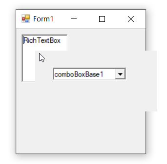

# Hosting ComboBoxBase Control in Windows Forms Popup

We can place the ComboBoxBase control within PopupControlContainer such that the PopupControlContainer does not close when the ComboBoxBase's Popup is displayed.

User can do this by deriving from the PopupControlContainer, overriding the OnPopup method, and setting the focus to the derived control. This will ensure that the derived PopupControlContainer does not lose focus and close prematurely.




public class CustomPopupControlContainer : Syncfusion.Windows.Forms.PopupControlContainer
{
    public CustomPopupControlContainer()
    {
    }
    public CustomPopupControlContainer(IContainer container):this()
    {
        container.Add(this);
    }
    protected override void OnPopup(EventArgs args)
    {
        base.OnPopup(args);
        this.Focus();
    } 
}





Public Class CustomPopupControlContainer
Inherits Syncfusion.Windows.Forms.PopupControlContainer
Public Sub New()
End Sub
Public  Sub New(ByVal container As IContainer) : Me()
container.Add(Me)
End Sub
Protected Overrides Sub OnPopup(ByVal args As EventArgs)
MyBase.OnPopup(args)
Me.Focus()
End Sub
End Class




It is also necessary to specify the parent-child relationship between the ComboBoxBase’s pop-up and the PopupControlContainer. This can be done by handling the ComboBoxBase’s [`DropDown`](https://help.syncfusion.com/cr/windowsforms/Syncfusion.Windows.Forms.Tools.ComboDropDown.html#Syncfusion_Windows_Forms_Tools_ComboDropDown_DropDown) event as shown in the code sample below.




//Declaration
private Syncfusion.Windows.Forms.PopupControlContainer popupControlContainer1;
private Syncfusion.Windows.Forms.Tools.ComboBoxBase comboBoxBase1;
private System.Windows.Forms.RichTextBox richTextBox1;

//Initializing
this.popupControlContainer1 = new Syncfusion.Windows.Forms.PopupControlContainer(this.components);
this.comboBoxBase1 = new Syncfusion.Windows.Forms.Tools.ComboBoxBase();
this.richTextBox1 = new System.Windows.Forms.RichTextBox();

// popupControlContainer1
this.popupControlContainer1.Controls.Add(this.comboBoxBase1);
this.popupControlContainer1.Location = new System.Drawing.Point(37, 68);
this.popupControlContainer1.Name = "popupControlContainer1";
this.popupControlContainer1.ParentControl = this.richTextBox1;
this.popupControlContainer1.Size = new System.Drawing.Size(200, 100);

// comboBoxBase1
this.comboBoxBase1.Location = new System.Drawing.Point(29, 28);
this.comboBoxBase1.Name = "comboBoxBase1";
this.comboBoxBase1.Size = new System.Drawing.Size(121, 24);
this.comboBoxBase1.Text = "comboBoxBase1";
this.comboBoxBase1.DropDown += ComboBoxBase1_DropDown;

// richTextBox1
this.richTextBox1.Location = new System.Drawing.Point(12, 12);
this.richTextBox1.Name = "richTextBox1";
this.richTextBox1.Size = new System.Drawing.Size(100, 96);
this.richTextBox1.Click += RichTextBox1_Click;

// Form1
this.ClientSize = new System.Drawing.Size(282, 253);
this.Controls.Add(this.richTextBox1);
this.Name = "Form1";
this.Text = "Form1";
        
private void RichTextBox1_Click(object sender, EventArgs e)
{
   this.popupControlContainer1.ShowPopup(Point.Empty);
}           

private void ComboBoxBase1_DropDown(object sender, System.EventArgs e)
{
    /* Setup the relationship between the ComboBoxBase’s dropdown and it's parent         
    PopupControlContainer, so that the pop-up will not close when the ComboBoxBase’s     
    dropdown is shown */
    this.comboBoxBase1.PopupContainer.PopupParent = this.popupControlContainer1;
    this.popupControlContainer1.CurrentPopupChild = this.comboBoxBase1.PopupContainer;
}





'Declaration
Private popupControlContainer1 As Syncfusion.Windows.Forms.PopupControlContainer
Private comboBoxBase1 As Syncfusion.Windows.Forms.Tools.ComboBoxBase
Private richTextBox1 As System.Windows.Forms.RichTextBox

'Initializing
Me.popupControlContainer1 = New Syncfusion.Windows.Forms.PopupControlContainer(Me.components)
Me.comboBoxBase1 = New Syncfusion.Windows.Forms.Tools.ComboBoxBase()
Me.richTextBox1 = New System.Windows.Forms.RichTextBox()

' popupControlContainer1
Me.popupControlContainer1.Controls.Add(Me.comboBoxBase1)
Me.popupControlContainer1.Location = New System.Drawing.Point(37, 68)
Me.popupControlContainer1.Name = "popupControlContainer1"
Me.popupControlContainer1.ParentControl = Me.richTextBox1
Me.popupControlContainer1.Size = New System.Drawing.Size(200, 100)

' comboBoxBase1
Me.comboBoxBase1.Location = New System.Drawing.Point(29, 28)
Me.comboBoxBase1.Name = "comboBoxBase1"
Me.comboBoxBase1.Size = New System.Drawing.Size(121, 24)
Me.comboBoxBase1.Text = "comboBoxBase1"
AddHandler Me.comboBoxBase1.DropDown, AddressOf ComboBoxBase1_DropDown

' richTextBox1
Me.richTextBox1.Location = New System.Drawing.Point(12, 12)
Me.richTextBox1.Name = "richTextBox1"
Me.richTextBox1.Size = New System.Drawing.Size(100, 96)
AddHandler Me.richTextBox1.Click, AddressOf RichTextBox1_Click

' Form1
Me.ClientSize = New System.Drawing.Size(282, 253)
Me.Controls.Add(Me.richTextBox1)
Me.Name = "Form1"
Me.Text = "Form1"

private void RichTextBox1_Click(Object sender, EventArgs e)
   Me.popupControlContainer1.ShowPopup(Point.Empty)

private void ComboBoxBase1_DropDown(Object sender, System.EventArgs e)
'     Setup the relationship between the ComboBoxBase’s dropdown and it's parent         
'    PopupControlContainer, so that the pop-up will not close when the ComboBoxBase’s     
'    dropdown is shown 
	Me.comboBoxBase1.PopupContainer.PopupParent = Me.popupControlContainer1
	Me.popupControlContainer1.CurrentPopupChild = Me.comboBoxBase1.PopupContainer




