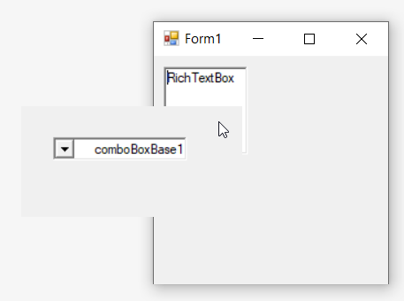

---
layout: post
title: RTL in Windows Forms Popup | Syncfusion®
description: RTL support enables displaying popup content in right-to-left layouts for regional and language-specific requirements.
platform: windowsforms
control: PopupControlContainer
documentation: ug
---

# RTL in Windows Forms Popup (PopupControlContainer)

RTL is used to display the content from right to left by setting the [RightToLeft](https://learn.microsoft.com/en-us/dotnet/api/system.windows.forms.control.righttoleft?redirectedfrom=MSDN&view=netframework-4.7.2#System_Windows_Forms_Control_RightToLeft) property to `Yes`.

The following code sample explains how to display the control from right-to-left.




this.popupControlContainer1.RightToLeft = System.Windows.Forms.RightToLeft.Yes;





Me.popupControlContainer1.RightToLeft = System.Windows.Forms.RightToLeft.Yes




