# Appearance Customization

In this section, the appearance customization of popup menu is discussed like grouping of menu items, adding images menu items and customizing it with various menu states.

## Popup menu modes

The popup menu can be set to applicable modes when it gets associated with a menu control. [Associate a popup menu with bar manager](https://help.syncfusion.com/windowsforms/popupmenu/faq/how-to-associate-popup-menu-with-bar-manager) and then select the paint style of the parent bar item associated with the menu. This can be done via the `PaintStyle` property of the parent bar item.

## Partial menus

The popup menu items can be prioritized to display the menu items that are being used frequently rather than the order of the items added to the popup menu. This can be done by enabling the boolean property [`UsePartialMenus`](https://help.syncfusion.com/cr/cref_files/windowsforms/Syncfusion.Tools.Windows~Syncfusion.Windows.Forms.Tools.XPMenus.ParentBarItem~UsePartialMenus.html) of the parent bar item associated with the popup menu. The below code snippet shows how to enable the partial menu property in popup menu.





this.popupMenu1.ParentBarItem.UsePartialMenus = true;





Me.popupMenu1.ParentBarItem.UsePartialMenus = True





Now, the priority of the menu items can be set by using the property [`IsRecentlyUsedItem`](https://help.syncfusion.com/cr/cref_files/windowsforms/Syncfusion.Tools.Windows~Syncfusion.Windows.Forms.Tools.XPMenus.BarItem~IsRecentlyUsedItem.html). By default, its set to `true` and so we can disable the menu items that are low priority. The below code snippet sets the menu items with low priority.





this.popupMenu1.ParentBarItem.UsePartialMenus = true;
this.barItem1.IsRecentlyUsedItem = false;
this.barItem2.IsRecentlyUsedItem = false;
this.barItem3.IsRecentlyUsedItem = false;





Me.popupMenu1.ParentBarItem.UsePartialMenus = True
Me.barItem1.IsRecentlyUsedItem = False
Me.barItem2.IsRecentlyUsedItem = False
Me.barItem3.IsRecentlyUsedItem = False





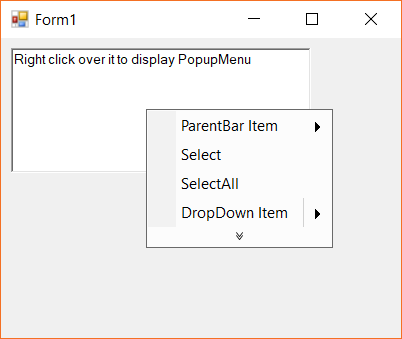

## Grouping menu items

To group the required menu items, the collection property [`SeparatorIndices`](https://help.syncfusion.com/cr/cref_files/windowsforms/Syncfusion.Tools.Windows~Syncfusion.Windows.Forms.Tools.XPMenus.ParentBarItem~SeparatorIndices.html) of the associated `ParentBarItem` of the popup menu is used. The following code snippet shows the menu items being grouped with its associated parent bar item.





this.parentBarItem1.SeparatorIndices.AddRange(new int[] { 1, 3 });





Me.parentBarItem1.SeparatorIndices.AddRange(New Integer() { 1, 3 })





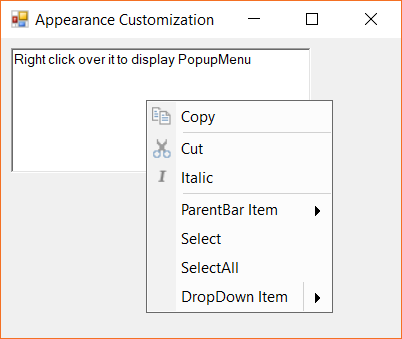

### Methods

| Method | Description |
|----------|--------------------|
| [`BeginGroupAt`](https://help.syncfusion.com/cr/cref_files/windowsforms/Syncfusion.Tools.Windows~Syncfusion.Windows.Forms.Tools.XPMenus.ParentBarItem~BeginGroupAt.html) | Begins the grouping of menu items from the bar item instance specified. |
| [`RemoveGroupAt`](https://help.syncfusion.com/cr/cref_files/windowsforms/Syncfusion.Tools.Windows~Syncfusion.Windows.Forms.Tools.XPMenus.ParentBarItem~RemoveGroupAt.html) | Removes the grouping of menu items from the bar item instance specified. |
| [`IsGroupBeginning`](https://help.syncfusion.com/cr/cref_files/windowsforms/Syncfusion.Tools.Windows~Syncfusion.Windows.Forms.Tools.XPMenus.ParentBarItem~IsGroupBeginning.html) | Returns a boolean value whether the specified bar item instance is at the begining of the grouping or not. |

## Showing check box in menu items

The menu items can be marked as a checked state item by enabling the boolean property `Checked` to `true`. The following code snippet shows the menu item is being marked as checked.





barItem1.Checked = true;





barItem1.Checked = True





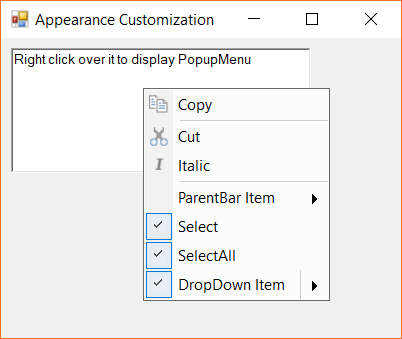

## Adding images to menu item

This section discusses the image associated with a menu item depending upon its state either it is enabled, disabled, highlighted or performed an action upon it.

### Adding normal state images

Images can be added to menu items directly via the property [`Image`](https://help.syncfusion.com/cr/cref_files/windowsforms/Syncfusion.Tools.Windows~Syncfusion.Windows.Forms.Tools.XPMenus.BarItem~Image.html). The following code snippet shows the image added to a bar item.





barItem1.Image = new ImageExt(Image.FromFile(Application.ExecutablePath + @"\..\..\..\Resources\Copy.ico"));





barItem1.Image = New ImageExt(Image.FromFile(Application.ExecutablePath & "\..\..\..\Resources\Copy.ico"))





#### Properties

The below table discuss the image properties of customizing the image associated with a menu item.

| Properties | Description |
|-------------------|-------------------|
| [`ImageList`](https://help.syncfusion.com/cr/cref_files/windowsforms/Syncfusion.Tools.Windows~Syncfusion.Windows.Forms.Tools.XPMenus.BarItem~ImageList.html) | Gets or sets the image list associated with a menu a item instance. |
| [`ImageListAdv`](https://help.syncfusion.com/cr/cref_files/windowsforms/Syncfusion.Tools.Windows~Syncfusion.Windows.Forms.Tools.XPMenus.BarItem~ImageListAdv.html) | Gets or sets the image list associated with a menu item instance. |
| [`ImageSize`](https://help.syncfusion.com/cr/cref_files/windowsforms/Syncfusion.Tools.Windows~Syncfusion.Windows.Forms.Tools.XPMenus.BarItem~ImageSize.html) | Gets or sets the size of an image. |
| [`LargeImageList`](https://help.syncfusion.com/cr/cref_files/windowsforms/Syncfusion.Tools.Windows~Syncfusion.Windows.Forms.Tools.XPMenus.BarItem~LargeImageList.html) | Gets or sets the ImageList that contains the images to display in the disabled state, if the bar manager is loaded with large icons mode. |
| [`LargeImageListAdv`](https://help.syncfusion.com/cr/cref_files/windowsforms/Syncfusion.Tools.Windows~Syncfusion.Windows.Forms.Tools.XPMenus.BarItem~LargeImageListAdv.html) | Gets or sets the ImageList that contains the images to display in the disabled state, if the bar manager is loaded with large icons mode. |
| [`ImageIndex`](https://help.syncfusion.com/cr/cref_files/windowsforms/Syncfusion.Tools.Windows~Syncfusion.Windows.Forms.Tools.XPMenus.BarItem~ImageIndex.html) | Gets or sets the index of the image list collections. |

N> By default, the `ImageIndex` is set to -1, the corresponding image in the list should be specified with a proper index value.

### Adding disabled state images

When a menu item tends to be in a disabled state, a different image can be associated with that menu item via the property [`DisabledImage`](https://help.syncfusion.com/cr/cref_files/windowsforms/Syncfusion.Tools.Windows~Syncfusion.Windows.Forms.Tools.XPMenus.BarItem~DisabledImage.html). The following code snippet shows the image associated with a disabled state menu item.





barItem1.DisabledImage = new ImageExt(Image.FromFile(Application.ExecutablePath + @"\..\..\..\Resources\New.ico"));





barItem1.DisabledImage = New ImageExt(Image.FromFile(Application.ExecutablePath & "\..\..\..\Resources\New.ico"))





#### Properties

The below table discuss the image properties of customizing the disabled state image associated with a menu item.

| Properties | Description |
|-------------------|-------------------|
| [`DisabledImageList`](https://help.syncfusion.com/cr/cref_files/windowsforms/Syncfusion.Tools.Windows~Syncfusion.Windows.Forms.Tools.XPMenus.BarItem~DisabledImageList.html) | Gets or sets the ImageList that contains the images to display in the disabled menu item. |
| [`DisabledImageListAdv`](https://help.syncfusion.com/cr/cref_files/windowsforms/Syncfusion.Tools.Windows~Syncfusion.Windows.Forms.Tools.XPMenus.BarItem~DisabledImageListAdv.html) | Gets or sets the ImageList that contains the images to display in the disabled menu item. |
| [`DisabledLargeImageList`](https://help.syncfusion.com/cr/cref_files/windowsforms/Syncfusion.Tools.Windows~Syncfusion.Windows.Forms.Tools.XPMenus.BarItem~DisabledLargeImageList.html) | Gets or sets the ImageList that contains the images to display in the disabled state, if the bar manager is loaded with large icons mode. |
| [`DisabledLargeImageListAdv`](https://help.syncfusion.com/cr/cref_files/windowsforms/Syncfusion.Tools.Windows~Syncfusion.Windows.Forms.Tools.XPMenus.BarItem~DisabledLargeImageListAdv.html) | Gets or sets the ImageList that contains the images to display in the disabled state, if the bar manager is loaded with large icons mode. |
| [`DisabledImageIndex`](https://help.syncfusion.com/cr/cref_files/windowsforms/Syncfusion.Tools.Windows~Syncfusion.Windows.Forms.Tools.XPMenus.BarItem~DisabledImageIndex.html) | Gets or sets the index of the image collections. |

N> By default, the `DisabledImageIndex` is set to -1, the corresponding image in the list should be specified with a proper index value.

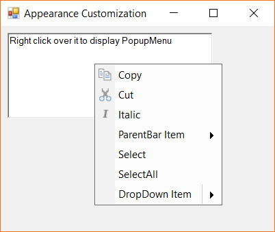

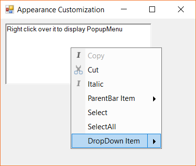

### Adding highlighted state images

When a menu item is selected or highlighted, the image associated to the menu item can be set via the [`HighlightedImage`](https://help.syncfusion.com/cr/cref_files/windowsforms/Syncfusion.Tools.Windows~Syncfusion.Windows.Forms.Tools.XPMenus.BarItem~HighlightedImage.html) property. The following code snippet shows the image associated with a highlighted state menu item.





barItem1.HighlightedImage = new ImageExt(Image.FromFile(Application.ExecutablePath + @"\..\..\..\Resources\Cut.ico"));





barItem1.HighlightedImage = New ImageExt(Image.FromFile(Application.ExecutablePath & "\..\..\..\Resources\Cut.ico"))





#### Properties

The below table discuss the image properties of customizing the selected state image associated with a menu item.

| Properties | Description |
|-------------------|-------------------|
| [`HighlightedImageList`](https://help.syncfusion.com/cr/cref_files/windowsforms/Syncfusion.Tools.Windows~Syncfusion.Windows.Forms.Tools.XPMenus.BarItem~HighlightedImageList.html) | Gets or sets the ImageList that contains the images to display in the disabled menu item. |
| [`HighlightedImageListAdv`](https://help.syncfusion.com/cr/cref_files/windowsforms/Syncfusion.Tools.Windows~Syncfusion.Windows.Forms.Tools.XPMenus.BarItem~HighlightedImageListAdv.html) | Gets or sets the ImageList that contains the images to display in the disabled menu item. |
| [`HighlightedLargeImageList`](https://help.syncfusion.com/cr/cref_files/windowsforms/Syncfusion.Tools.Windows~Syncfusion.Windows.Forms.Tools.XPMenus.BarItem~HighlightedLargeImageList.html) | Gets or sets the ImageList that contains the images to display in the disabled state, if the bar manager is loaded with large icons mode. |
| [`HighlightedImageLargeListAdv`](https://help.syncfusion.com/cr/cref_files/windowsforms/Syncfusion.Tools.Windows~Syncfusion.Windows.Forms.Tools.XPMenus.BarItem~HighlightedLargeImageListAdv.html) | Gets or sets the ImageList that contains the images to display in the disabled state, if the bar manager is loaded with large icons mode. |
| [`HighlightedImageIndex`](https://help.syncfusion.com/cr/cref_files/windowsforms/Syncfusion.Tools.Windows~Syncfusion.Windows.Forms.Tools.XPMenus.BarItem~HighlightedImageIndex.html) | Gets or sets the index of the image collections. |

N> By default, the `HighlightedImageIndex` is set to -1, the corresponding image in the list should be specified with a proper index value.

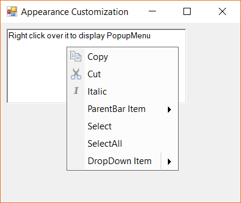

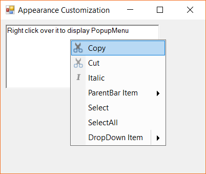

### Adding pressed state images

When a menu item is pressed, the image associated to the menu item can be set via the [`PressedImageListAdv`](https://help.syncfusion.com/cr/cref_files/windowsforms/Syncfusion.Tools.Windows~Syncfusion.Windows.Forms.Tools.XPMenus.BarItem~PressedImageListAdv.html) property. The following code snippet shows the image associated with a pressed state menu item.





ImageListAdv pressedStateImages = new ImageListAdv();
barItem1.PressedImageIndex = 2;
pressedStateImages.Images.AddRange(new Image[]
{
    Image.FromFile(Application.ExecutablePath + @"\..\..\..\Resources\Cut.ico"),
    Image.FromFile(Application.ExecutablePath + @"\..\..\..\Resources\SaveAll.ico"),
    Image.FromFile(Application.ExecutablePath + @"\..\..\..\Resources\New.ico"),
    Image.FromFile(Application.ExecutablePath + @"\..\..\..\Resources\Save.ico")
});
barItem1.PressedImageListAdv = pressedStateImages;





Dim pressedStateImages As New ImageListAdv()
barItem1.PressedImageIndex = 2
pressedStateImages.Images.AddRange(New Image()
{
   Image.FromFile(Application.ExecutablePath & "\..\..\..\Resources\Cut.ico"),
   Image.FromFile(Application.ExecutablePath & "\..\..\..\Resources\SaveAll.ico"),
   Image.FromFile(Application.ExecutablePath & "\..\..\..\Resources\New.ico"),
   Image.FromFile(Application.ExecutablePath & "\..\..\..\Resources\Save.ico")
})
barItem1.PressedImageListAdv = pressedStateImages





#### Properties

The below table discuss the image properties of customizing the pressed state image associated with a menu item.

| Properties | Description |
|-------------------|-------------------|
| [`PressedLargeImageList`](https://help.syncfusion.com/cr/cref_files/windowsforms/Syncfusion.Tools.Windows~Syncfusion.Windows.Forms.Tools.XPMenus.BarItem~PressedLargeImageList.html) | Gets or sets the ImageList that contains the images to display in the disabled state, if the bar manager is loaded with large icons mode. |
| [`PressedLargeImageListAdv`](https://help.syncfusion.com/cr/cref_files/windowsforms/Syncfusion.Tools.Windows~Syncfusion.Windows.Forms.Tools.XPMenus.BarItem~PressedLargeImageListAdv.html) | Gets or sets the ImageList that contains the images to display in the disabled state, if the bar manager is loaded with large icons mode. |

## Overlapping check box and images

By default the checked state and the images associated with a menu item is overlapped. This is done via the boolean property `OverlapCheckBoxImageBounds` of the parent bar item. By enabling this property, to `true` the image border is drawn to mark the menu item as checked state.

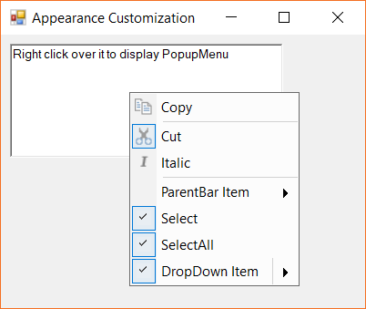

If this property is set to `false`, then the check state of the menu items will be drawn separately.





this.popupMenu1.ParentBarItem.OverlapCheckBoxImageBounds = false;





Me.popupMenu1.ParentBarItem.OverlapCheckBoxImageBounds = False





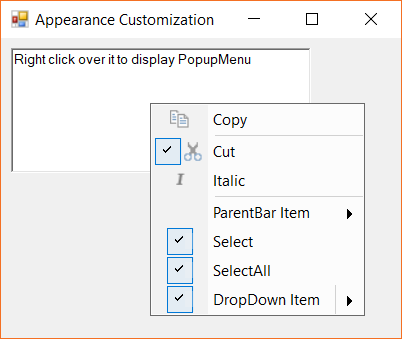

## Displaying shortcut text in menu item

The menu items can be slected and the respective action can be via the shortcuts appened to a menu item. This can be done by specifieng the shortcuts via the `Shortcut` property. The below code snippet shows a shortcut is beign assigned to a menu item.





this.dropDownItem.Shortcut = Shortcut.AltDownArrow;





Me.dropDownItem.Shortcut = Shortcut.AltDownArrow





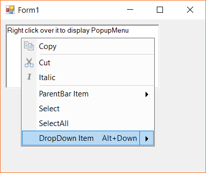

## Displaying Mnemonic in menu items

The menu items of popup menu suport to add mnemonic text. As usual, the required character is appended with `&` symbol in the `Text` property of the menu item. This character cna be made visibile all the time using the `ShowMnemonicUnderlinesAlways` property of the menu item.

The below snippet shows the drop down item is applied with the mnemonics.





this.dropDownItem.Text = "Drop do&wn item";
this.dropDownItem.ShowMnemonicUnderlinesAlways = true;





Me.dropDownItem.Text = "Drop do&wn item"
Me.dropDownItem.ShowMnemonicUnderlinesAlways = true





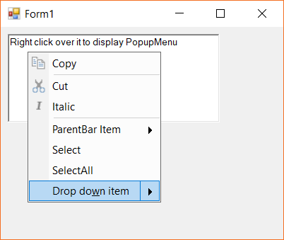