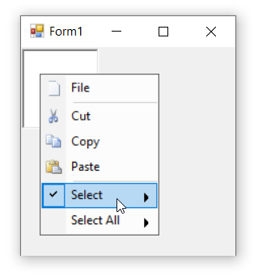

# Checked/unchecked bar items in Windows Forms PopupMenu

This support will help users to easily acknowledge the selected bar item by using the check mark. The [`Checked`](https://help.syncfusion.com/cr/windowsforms/Syncfusion.Windows.Forms.Tools.XPMenus.BarItem.html#Syncfusion_Windows_Forms_Tools_XPMenus_BarItem_Checked) property indicates whether a check mark should appear before the text of the bar item. On runtime, user can toggle the state manually through the [`Click`](https://help.syncfusion.com/cr/windowsforms/Syncfusion.Windows.Forms.Tools.XPMenus.BarItem.html#Syncfusion_Windows_Forms_Tools_XPMenus_BarItem_Click) event of the bar item.

>**NOTE**        
In this illustration we have used **ParentBarItem**. Similarly, we have to set for BarItem, DropDownBarItem,ComboBoxBarItem, ListBarItem, StaticBarItem and TextBoxBarItem.

The below code snippet will explain the checked state of the bar item.




this.parentBarItem2.Checked = true;





Me.parentBarItem2.Checked = True




