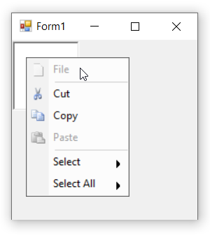

# Disable bar items in Windows Forms PopupMenu

>**NOTE**       
1. This feature is not applicable for ListBarItem and StaticBarItem.             
2. In this illustration we have used **BarItem**. Similarly, we have to set for ParentBarItem, DropDownBarItem,ComboBoxBarItem, ListBarItem, StaticBarItem and TextBoxBarItem.

We can disable the unused or unsupported bar items by using this feature. BarItems are enabled by default when they are created, but this can be changed based on user requirement through the [`Enabled`](https://help.syncfusion.com/cr/windowsforms/Syncfusion.Windows.Forms.Tools.XPMenus.BarItem.html#Syncfusion_Windows_Forms_Tools_XPMenus_BarItem_Enabled) property.

The below code snippet will explain how to disable the BarItems.




this.barItem1.Enabled = false;
this.barItem4.Enabled = false;





Me.barItem1.Enabled = False
Me.barItem4.Enabled = False




