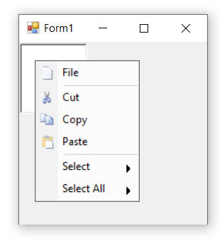
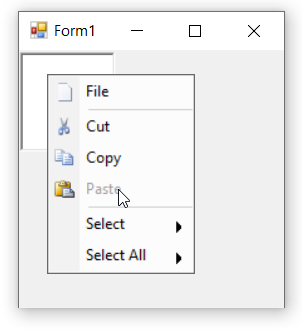
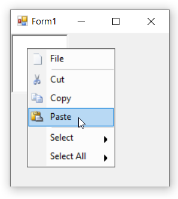

# Display image in bar items in Windows Forms PopupMenu

Displaying an image besides each bar item helps users to easily identify the operation through iconic representation and also to improve the visual appearance of the popup menu. Images can associated with a bar item depending upon its state either it is enabled, disabled, highlighted upon it.

>**NOTE**    
In this illustration we have set image for **BarItem**. Similarly, we have to set for ParentBarItem, DropDownBarItem, ComboBoxBarItem, ListBarItem, StaticBarItem and TextBoxBarItem.

## Adding enable state images

Images can be added to bar items directly via the [`Image`](https://help.syncfusion.com/cr/windowsforms/Syncfusion.Windows.Forms.Tools.XPMenus.BarItem.html#Syncfusion_Windows_Forms_Tools_XPMenus_BarItem_Image) property. The following code snippet illustrates the same.




this.barItem4.Image = new ImageExt(System.Drawing.Image.FromFile(@"..\..\..\PasteIcon.png"));





Me.barItem4.Image = New ImageExt(System.Drawing.Image.FromFile("..\..\..\PasteIcon.png"))




## Adding disabled state images

When a bar item is in disabled state, it's appropriate image can be also be disabled using the [`DisabledImage`](https://help.syncfusion.com/cr/windowsforms/Syncfusion.Windows.Forms.Tools.XPMenus.BarItem.html#Syncfusion_Windows_Forms_Tools_XPMenus_BarItem_DisabledImage) property.

The following code snippet illustrates how to add disabled image for bar item.




this.barItem4.DisabledImage = new ImageExt(System.Drawing.Image.FromFile(@"..\..\..\Paste16.png"));





Me.barItem4.DisabledImage = New ImageExt(System.Drawing.Image.FromFile("..\..\..\Paste16.png"))




## Adding highlighted state images

When a bar item is selected or highlighted, it's appropriate image can also be highlighted using the [`HighlightedImage`](https://help.syncfusion.com/cr/windowsforms/Syncfusion.Windows.Forms.Tools.XPMenus.BarItem.html#Syncfusion_Windows_Forms_Tools_XPMenus_BarItem_HighlightedImage) property. 

The following code snippet illustrates how to set highlighted image for a bar item.




this.barItem4.HighlightedImage = new ImageExt(System.Drawing.Image.FromFile(@"..\..\..\PasteHS.png"));





Me.barItem4.HighlightedImage = New ImageExt(System.Drawing.Image.FromFile("..\..\..\PasteHS.png"))




