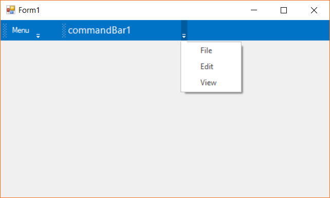

# How to associate popup menu with Bar manager

The popup menu instance can be associated with a bar manager through a command bar as dropdown menu. This can be done by associating the popup menu instance with the [`PopupMenu`](https://help.syncfusion.com/cr/cref_files/windowsforms/Syncfusion.Tools.Windows~Syncfusion.Windows.Forms.Tools.CommandBar~PopupMenu.html) property of the [CommandBar](https://help.syncfusion.com/cr/cref_files/windowsforms/Syncfusion.Tools.Windows~Syncfusion.Windows.Forms.Tools.CommandBar.html) instance of the bar manager.

The following code snippet shows the popup menu is being set to the command bar.





PopupMenu popup_Menu = new PopupMenu();
popup_Menu.ParentBarItem = new ParentBarItem();
popup_Menu.ParentBarItem.Items.AddRange(new BarItem[]
{
    new BarItem() { BarName="baarItem1", Text="File" },
    new BarItem() { BarName="baarItem2", Text="Edit" },
    new BarItem() { BarName="baarItem3", Text="View" }
});
this.commandBar1.PopupMenu = popup_Menu;





Dim popup_Menu As New PopupMenu()
popup_Menu.ParentBarItem = New ParentBarItem()
popup_Menu.ParentBarItem.Items.AddRange(New BarItem()
{
    New BarItem() With {.BarName="baarItem1", .Text="File"},
    New BarItem() With {.BarName="baarItem2", .Text="Edit"},
    New BarItem() With {.BarName="baarItem3", .Text="View"}
})
Me.commandBar1.PopupMenu = popup_Menu





