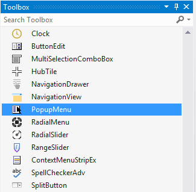
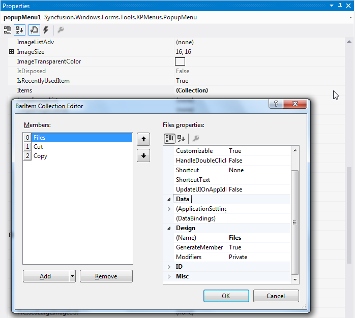
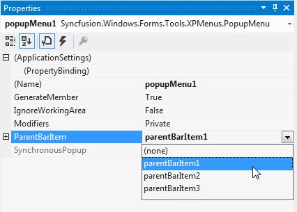

# Getting Started

>**Important**
Starting with v16.2.0.x, if you refer to Syncfusion assemblies from trial setup or from the NuGet feed, include a license key in your projects. Refer to this [link](https://help.syncfusion.com/common/essential-studio/licensing/license-key) to learn about registering Syncfusion license key in your Windows Forms application to use our components.

## Adding the PopupMenu

Drag and drop a PopupMenu from the toolbox onto the designer form. 

Filling the Popup Menu

## Filling the PopupMenu

**In the absence of a BarManager**

The PopupMenu needs to be associated with a ParentBarItem in order to fill it with menu items. Right click the PopupMenu and select "Add Default ParentBarItem" if there is no ParentBarItem added for the Menus before.

In the absence of a BarManager, use the PopupMenu.ParentBarItem.Items property's collection editor to add items to the popup menu. 

N> With such a custom ParentBarItem associated with the popup menu, you cannot add items using drag-and-drop from the BarManager.

**In the presence of the BarManager**

You can also reuse the ParentBarItem that you have already created for your menu structure using BarManager to fill the Popup menu. To do so, set the ParentBarItem property of the Popup menu to one of the available ParentBarItems. 

In the presence of a BarManager, the user can just drag BarItems into the popup menu. Right-click on the popupMenu1 and select Customize to invoke this dialog and drag the required menu items.

