# Getting Started

This section provides a quick overview to work with the popup menu in Windows Forms.

>**Important**
Starting with v16.2.0.x, if you refer to Syncfusion assemblies from trial setup or from the NuGet feed, include a license key in your projects. Refer to this [link](https://help.syncfusion.com/common/essential-studio/licensing/license-key) to learn about registering Syncfusion license key in your Windows Forms application to use our components.

## Assembly deployment

Refer [control dependencies](https://help.syncfusion.com/windowsforms/control-dependencies#popupmenu) section to get the list of assemblies or NuGet package needs to be added as reference to use the control in any application. Please find more details regarding [installation of nuget packages](https://help.syncfusion.com/windowsforms/nuget-packages) in a windows form application.

## Creating application with popup menu

This section guides you to create an application with popup menu either via designer or code and then associating the popup menu with the control.

### Adding control via designer

The popup menu can be added to the application by dragging it from the toolbox and dropping it to the designer view. The following required assembly references will be added automatically.

* Syncfusion.Grid.Base.dll
* Syncfusion.Grid.Windows.dll
* Syncfusion.Shared.Base.dll
* Syncfusion.Shared.Windows.dll
* Syncfusion.Tools.Base.dll
* Syncfusion.Tools.Windows.dll
* Syncfusion.Licensing.dll
* Syncfusion.SpellChecker.Base.dll

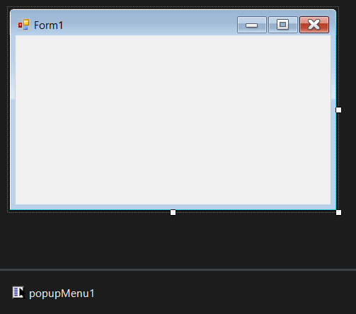

### Adding control via code

The [`PopupMenu`](https://help.syncfusion.com/cr/cref_files/windowsforms/Syncfusion.Tools.Windows~Syncfusion.Windows.Forms.Tools.XPMenus.PopupMenu.html) control can be added manually via the code either by using C# or VB. Follow the below steps initially.

**Step 1** : Add the following required assembly references to the project:

* Syncfusion.Tools.Base.dll
* Syncfusion.Tools.Windows.dll
* Syncfusion.Shared.Base.dll
* Syncfusion.Shared.Windows.dll
* Syncfusion.Grid.Base.dll
* Syncfusion.Grid.Windows.dll
* Syncfusion.Licensing.dll
* Syncfusion.SpellChecker.Base.dll

**Step 2** : Include the namespace **Syncfusion.Windows.Forms.Tools**.





using Syncfusion.Windows.Forms.Tools;





Imports Syncfusion.Windows.Forms.Tools





**Step 3** : Create [PopupMenu](https://help.syncfusion.com/cr/cref_files/windowsforms/Syncfusion.Tools.Windows~Syncfusion.Windows.Forms.Tools.XPMenus.PopupMenu.html) control instance by initializing it with default properties.





PopupMenu popupMenu = new PopupMenu();





Dim popupMenu As New PopupMenu()





### Associating popup menu with a control

This section will guide you on how to associate a popup menu to other controls. Here it is explained with the [`RichTextBox`](https://docs.microsoft.com/en-us/dotnet/framework/winforms/controls/richtextbox-control-overview-windows-forms) control.

#### Associating via designer

The [PopupMenuManager](https://help.syncfusion.com/cr/cref_files/windowsforms/Syncfusion.Tools.Windows~Syncfusion.Windows.Forms.Tools.XPMenus.PopupMenusManager.html) component needs to be drag and dropped from the toolbox to the form. Then add a RichTextBox control to the form.

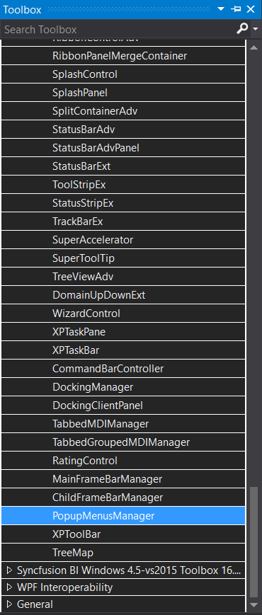

Now from the properties tab of the rich textbox instance, set the `XPContextMenu` property on the created popup menu manager to the already created popup menu instance. The below image shows the popup menu is being associated with the rich textbox control.

#### Associating via code

An instance of [PopupMenuManager](https://help.syncfusion.com/cr/cref_files/windowsforms/Syncfusion.Tools.Windows~Syncfusion.Windows.Forms.Tools.XPMenus.PopupMenusManager.html) needs to be initialized and for associating the popup menu [`SetXPContextMenu`](https://help.syncfusion.com/cr/cref_files/windowsforms/Syncfusion.Tools.Windows~Syncfusion.Windows.Forms.Tools.XPMenus.PopupMenusManager~SetXPContextMenu.html) method is used. The below code snippet shows the popup menu gets associated with the rich textbox control.

The below code snippet shows the popup menu instance is being associated withe rich text box control.





PopupMenusManager popupMenusManager = new PopupMenusManager();
popupMenusManager.SetXPContextMenu(this.richTextBox, this.popupMenu);





Dim popupMenusManager As New PopupMenusManager()
popupMenusManager.SetXPContextMenu(Me.richTextBox, Me.popupMenu)





## Adding menu items via designer

The popup menu needs to be associated with a default parent bar item in order to fill it with menu items. Right click the popup menu and select `Add Default ParentBarItem` option. You can also add the default parent bar item by selecting the `Add Default ParentBarItem...` option from the **Smart tag** menu.

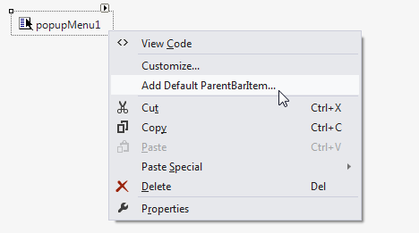

Now, the menu items can be added via the `Items` property of the `ParentBarItem` of popup menu. This opens the **BarItem Collection Editor** to add the specified menu items.

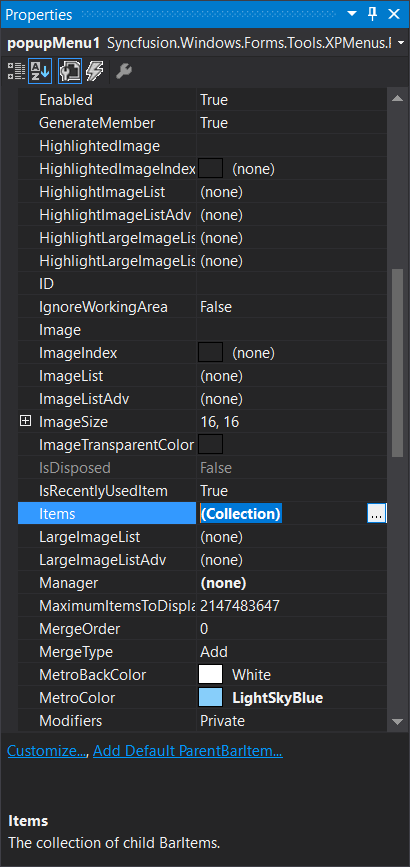

N> For a popup menu control, the default parent bar item should be added to initialize the other child menu items or sub-menus.

### Adding parent item

The [ParentBarItem](https://help.syncfusion.com/cr/cref_files/windowsforms/Syncfusion.Tools.Windows~Syncfusion.Windows.Forms.Tools.XPMenus.ParentBarItem.html) is a type of bar item which acts a parent control for sub-menu or itself holds child menu items for a popup menu. It can be used when a sub-menu needs to be added for a popup menu.

The below image shows the parent bar item is added with its child bar items.

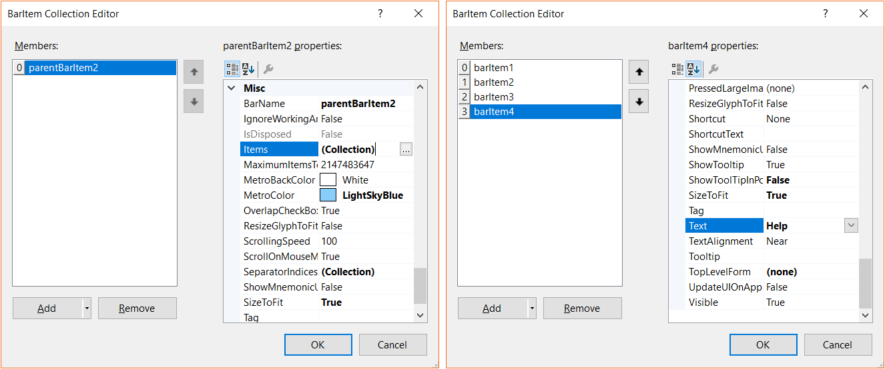

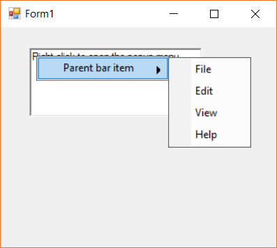

### Adding drop down item

The [DropDownBarItem](https://help.syncfusion.com/cr/cref_files/windowsforms/Syncfusion.Tools.Windows~Syncfusion.Windows.Forms.Tools.XPMenus.DropDownBarItem.html) is a type of bar item, which will display a popup menu when clicked. A custom control can also be loaded to be shown when the menu item is clicked. This can be done by assigning the required component to the [`PopupControlContainer`](https://help.syncfusion.com/cr/cref_files/windowsforms/Syncfusion.Tools.Windows~Syncfusion.Windows.Forms.Tools.XPMenus.DropDownBarItem~PopupControlContainer.html) property of the drop down bar item.

Here the drop down item is loaded with color picker control. Drag and drop the **PopupControlContainer** and place the **ColorPickerAdv** inside the popup container control. Then, select the drop down menu item's `PopupControlContainer` to the newly added _PopupControlContainer_ instance.

The below image shows the drop down item is added with the custom control.

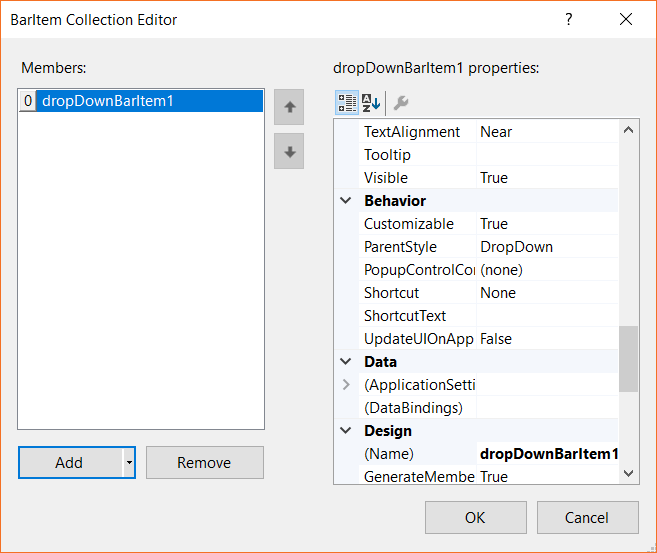

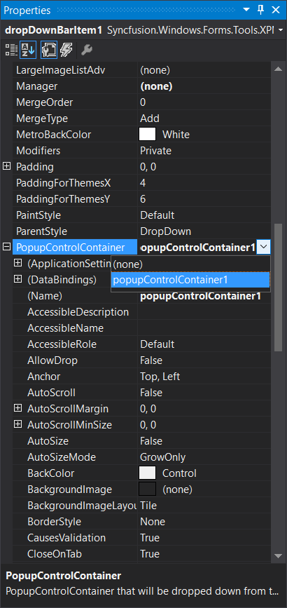

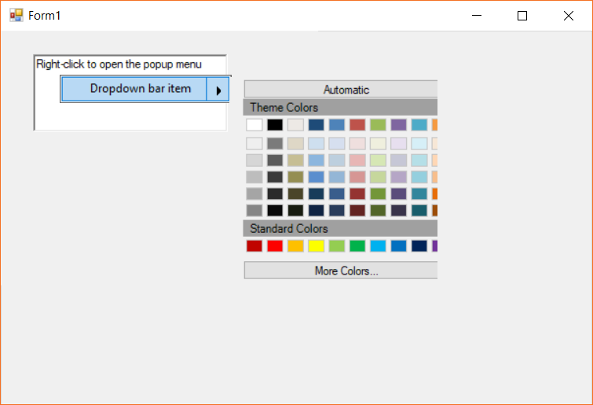

### Adding combo box item

The [ComboBoxBarItem](https://help.syncfusion.com/cr/cref_files/windowsforms/Syncfusion.Tools.Windows~Syncfusion.Windows.Forms.Tools.XPMenus.ComboBoxBarItem.html) is a type of bar item, which behaves like combo box control. The items collection can be specified using the [`ChoiceList`](https://help.syncfusion.com/cr/cref_files/windowsforms/Syncfusion.Tools.Windows~Syncfusion.Windows.Forms.Tools.XPMenus.ComboBoxBarItem~ChoiceList.html) property. The **String Collection Editor** gets opened to add or edit the items of the combo box bar item.

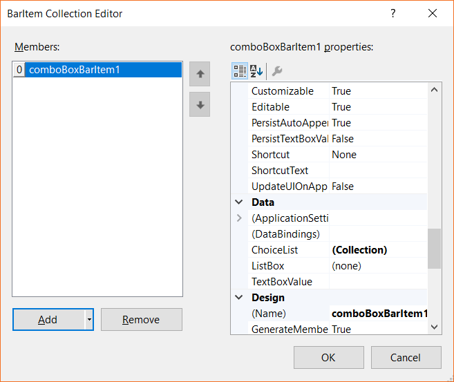

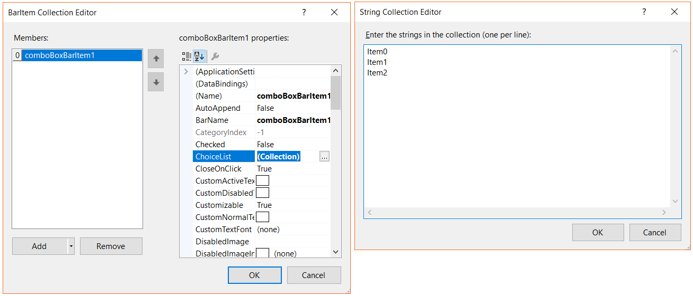

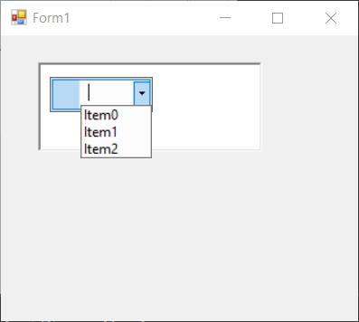

### Adding list item

The [ListBarItem](https://help.syncfusion.com/cr/cref_files/windowsforms/Syncfusion.Tools.Windows~Syncfusion.Windows.Forms.Tools.XPMenus.ListBarItem.html) is a type of bar item, which behaves like list  control. The child items can be set using the [`ChildCaptions`](https://help.syncfusion.com/cr/cref_files/windowsforms/Syncfusion.Tools.Windows~Syncfusion.Windows.Forms.Tools.XPMenus.ListBarItem~ChildCaptions.html) property.

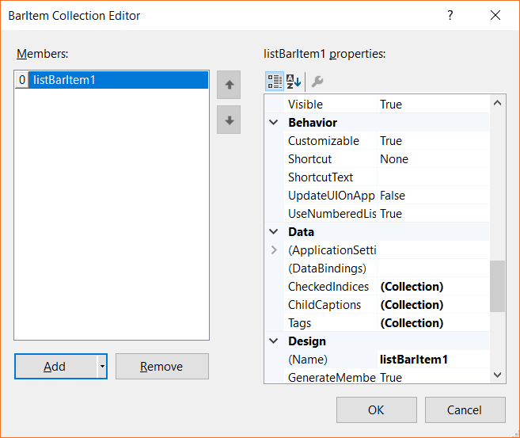

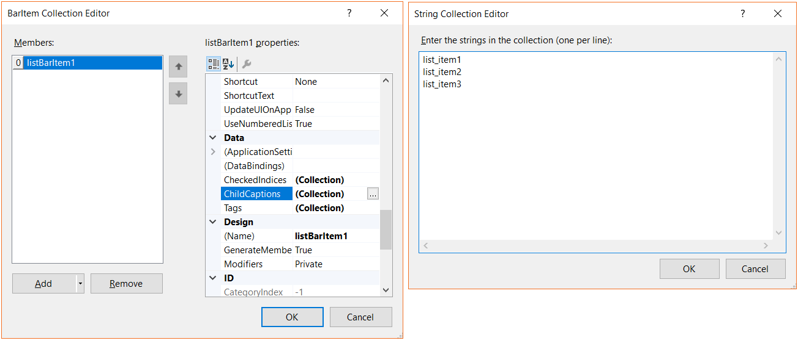

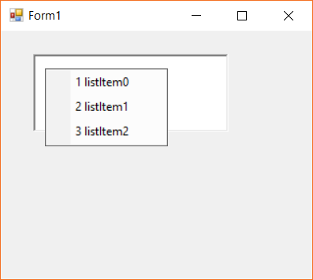

### Adding static item

A [StaticBarItem](https://help.syncfusion.com/cr/cref_files/windowsforms/Syncfusion.Tools.Windows~Syncfusion.Windows.Forms.Tools.XPMenus.StaticBarItem.html) is a type of bar item, which behaves like Label control. The [`Text`](https://help.syncfusion.com/cr/cref_files/windowsforms/Syncfusion.Tools.Windows~Syncfusion.Windows.Forms.Tools.XPMenus.BarItem~Text.html) property can be used to set the menu content.

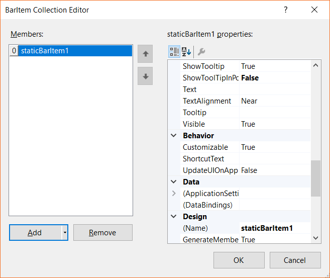

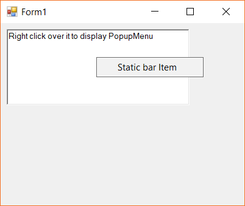

### Adding text box item

The [TextBoxBarItem](https://help.syncfusion.com/cr/cref_files/windowsforms/Syncfusion.Tools.Windows~Syncfusion.Windows.Forms.Tools.XPMenus.TextBoxBarItem.html) is a type of bar item, which behaves like text box control. The text edited can be obtained via the [`TextBoxValue`](https://help.syncfusion.com/cr/cref_files/windowsforms/Syncfusion.Tools.Windows~Syncfusion.Windows.Forms.Tools.XPMenus.TextBoxBarItem~TextBoxValue.html) property.

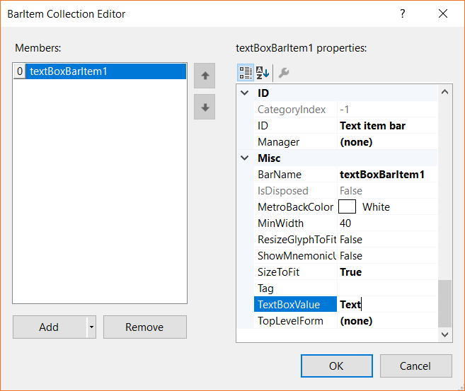

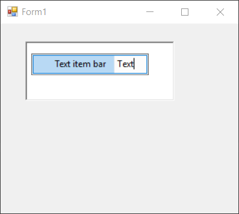

## Adding menu items via code

The popup menu needs to be associated with a default parent bar item in order to fill it with menu items. This default parent bar instance can be associated to the `ParentBarItem` property of the popup menu. The below code snippet shows the adding of default parent bar item.





ParentBarItem parent_Bar_Item = new ParentBarItem();
this.popupMenu1.ParentBarItem = parent_Bar_Item;





Dim parent_Bar_Item As New ParentBarItem()
Me.popupMenu1.ParentBarItem = parent_Bar_Item





### Adding parent item

The [ParentBarItem](https://help.syncfusion.com/cr/cref_files/windowsforms/Syncfusion.Tools.Windows~Syncfusion.Windows.Forms.Tools.XPMenus.ParentBarItem.html) is a type of [bar item](https://help.syncfusion.com/cr/cref_files/windowsforms/Syncfusion.Tools.Windows~Syncfusion.Windows.Forms.Tools.XPMenus.BarItem.html), that acts as a parent component for child bar items and sub-menu.

The below code snippet shows how to associate a parent bar item to the popup menu.

The sub-menu and the child menu items can be added via the `Items` property of the parent bar item.





ParentBarItem parent_Bar_Item = new ParentBarItem();
parent_Bar_Item.BarName = "parent_Bar_Item";
parent_Bar_Item.Text = "Parent Bar Item";

BarItem barItem1 = new BarItem();
barItem1.Text = "New";
BarItem barItem2 = new BarItem();
barItem2.Text = "Open";
BarItem barItem3 = new BarItem();
barItem3.Text = "Save";
BarItem barItem4 = new BarItem();
barItem4.Text = "Save As";

parent_Bar_Item.Items.AddRange(new Syncfusion.Windows.Forms.Tools.XPMenus.BarItem[] { barItem1, barItem2, barItem3, barItem4 });

this.popupMenu1.ParentBarItem = parent_Bar_Item;





Dim parent_Bar_Item As New ParentBarItem()
parent_Bar_Item.BarName = "parent_Bar_Item"
parent_Bar_Item.Text = "Parent Bar Item"

Dim barItem1 As New BarItem()
barItem1.Text = "New"
Dim barItem2 As New BarItem()
barItem2.Text = "Open"
Dim barItem3 As New BarItem()
barItem3.Text = "Save"
Dim barItem4 As New BarItem()
barItem4.Text = "Save As"

parent_Bar_Item.Items.AddRange(New Syncfusion.Windows.Forms.Tools.XPMenus.BarItem() { barItem1, barItem2, barItem3, barItem4 })

Me.popupMenu1.ParentBarItem = parent_Bar_Item





### Adding drop down item

The [DropDownBarItem](https://help.syncfusion.com/cr/cref_files/windowsforms/Syncfusion.Tools.Windows~Syncfusion.Windows.Forms.Tools.XPMenus.DropDownBarItem.html) is a type of bar item, which will display a popup menu when clicked. A custom control can also be loaded when the menu item is clicked. This can be done by assigning the required component to the [`PopupControlContainer`](https://help.syncfusion.com/cr/cref_files/windowsforms/Syncfusion.Tools.Windows~Syncfusion.Windows.Forms.Tools.XPMenus.DropDownBarItem~PopupControlContainer.html) property of the drop down bar item.

The following code snippet shows the drop down item is being added with a color picker control.





DropDownBarItem dropDownItem = new DropDownBarItem();
dropDownItem.Text = "Dropdown item";
dropDownItem.BarName = "dropDownItem";
ColorPickerUIAdv colorPicker = new ColorPickerUIAdv();
PopupControlContainer popupContainer = new PopupControlContainer();
popupContainer.Size = new Size(300, 300);
colorPicker.Dock = DockStyle.Fill;
popupContainer.Controls.Add(colorPicker);
dropDownItem.PopupControlContainer = popupContainer;
this.popupMenu1.ParentBarItem.Items.Add(dropDownItem);





Dim dropDownItem As New DropDownBarItem()
dropDownItem.Text = "Dropdown item"

dropDownItem.BarName = "dropDownItem"
Dim colorPicker As New ColorPickerUIAdv()
Dim popupContainer As New PopupControlContainer()
popupContainer.Size = New Size(300, 300)
colorPicker.Dock = DockStyle.Fill
popupContainer.Controls.Add(colorPicker)
dropDownItem.PopupControlContainer = popupContainer
Me.popupMenu1.ParentBarItem.Items.Add(dropDownItem)





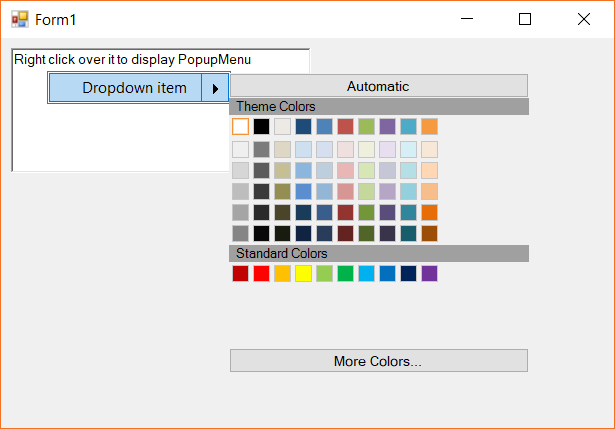

### Adding combo box item

The [ComboBoxBarItem](https://help.syncfusion.com/cr/cref_files/windowsforms/Syncfusion.Tools.Windows~Syncfusion.Windows.Forms.Tools.XPMenus.ComboBoxBarItem.html) is a type of bar item, which behaves like combo box control. The items collection can be specified using the [`ChoiceList`](https://help.syncfusion.com/cr/cref_files/windowsforms/Syncfusion.Tools.Windows~Syncfusion.Windows.Forms.Tools.XPMenus.ComboBoxBarItem~ChoiceList.html) property.

The below code snippet shows the combo box is being added with a collection of items via the `ChoiceList` property.





ComboBoxBarItem comboboxBarItem = new ComboBoxBarItem();
comboboxBarItem.Text = "Combobox item";
comboboxBarItem.BarName = "comboboxBarItem";
comboboxBarItem.ChoiceList.AddRange(new string[] { "item0", "item1", "item2", "item3" });
this.popupMenu1.ParentBarItem.Items.Add(comboboxBarItem);





Dim comboboxBarItem As New ComboBoxBarItem()
comboboxBarItem.Text = "Combobox item"
comboboxBarItem.BarName = "comboboxBarItem"
comboboxBarItem.ChoiceList.AddRange(New String() { "item0", "item1", "item2", "item3" })
Me.popupMenu1.ParentBarItem.Items.Add(comboboxBarItem)





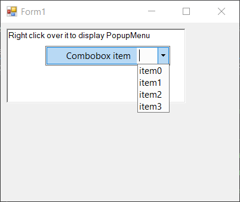

### Adding list item

The [ListBarItem](https://help.syncfusion.com/cr/cref_files/windowsforms/Syncfusion.Tools.Windows~Syncfusion.Windows.Forms.Tools.XPMenus.ListBarItem.html) is a type of bar item, which behaves like list  control. It displays the child items when the menu item is displayed. The child items can be set using the [`ChildCaptions`](https://help.syncfusion.com/cr/cref_files/windowsforms/Syncfusion.Tools.Windows~Syncfusion.Windows.Forms.Tools.XPMenus.ListBarItem~ChildCaptions.html) property.

The below code snippet shows the list bar is added to the popup menu.





ListBarItem listBarItem = new ListBarItem();
listBarItem.Text = "List bar item";
listBarItem.BarName = "listBarItem";
this.listBarItem.ChildCaptions.AddRange(new string[] { "listItem0", "listItem1", "listItem2", "listItem3" });
this.popupMenu1.ParentBarItem.Items.Add(listBarItem);





Dim listBarItem As New ListBarItem()
listBarItem.Text = "List bar item"
listBarItem.BarName = "listBarItem"
Me.listBarItem.ChildCaptions.AddRange(New String() { "listItem0", "listItem1", "listItem2", "listItem3" })
Me.popupMenu1.ParentBarItem.Items.Add(listBarItem)





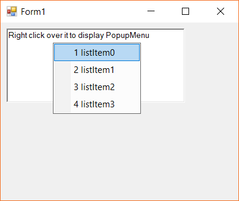

### Adding static item

A [StaticBarItem](https://help.syncfusion.com/cr/cref_files/windowsforms/Syncfusion.Tools.Windows~Syncfusion.Windows.Forms.Tools.XPMenus.StaticBarItem.html) is a type of bar item, which behaves like Label control.

The below code snippet shows the static bar item is added to the menu.





StaticBarItem staticBarItem = new StaticBarItem();
staticBarItem.Text = "Static bar item";
staticBarItem.BarName = "staticBarItem";
this.popupMenu1.ParentBarItem.Items.Add(staticBarItem);





Dim staticBarItem As New StaticBarItem()
staticBarItem.Text = "Static bar item"
staticBarItem.BarName = "staticBarItem"
Me.popupMenu1.ParentBarItem.Items.Add(staticBarItem)





### Adding textbox item

The [TextBoxBarItem](https://help.syncfusion.com/cr/cref_files/windowsforms/Syncfusion.Tools.Windows~Syncfusion.Windows.Forms.Tools.XPMenus.TextBoxBarItem.html) is a type of bar item, which behaves like text box control. The text edited can be obtained via the [`TextBoxValue`](https://help.syncfusion.com/cr/cref_files/windowsforms/Syncfusion.Tools.Windows~Syncfusion.Windows.Forms.Tools.XPMenus.TextBoxBarItem~TextBoxValue.html) property.

The below code snippet shows the text item is added to the popup menu.





TextBoxBarItem textboxBarItem = new TextBoxBarItem();
textboxBarItem.Text = "Text bar item";
textboxBarItem.BarName = "textboxBarItem";
textboxBarItem.TextBoxValue = "Text item";
this.popupMenu1.ParentBarItem.Items.Add(textboxBarItem);





Dim textboxBarItem As New TextBoxBarItem()
textboxBarItem.Text = "Text bar item"
textboxBarItem.BarName = "textboxBarItem"
textboxBarItem.TextBoxValue = "Text item"
Me.popupMenu1.ParentBarItem.Items.Add(textboxBarItem)





