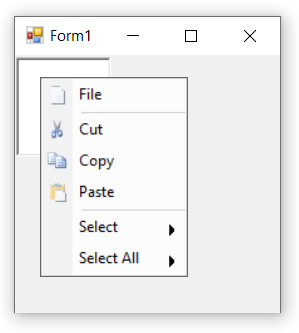
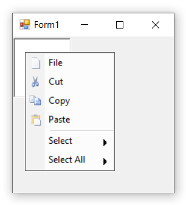

# Grouping Bar Items in Windows Forms PopupMenu

Grouping allows to add separator between a collection of bar items which are relevant to one another. To group the required bar items, the [`SeparatorIndices`](https://help.syncfusion.com/cr/windowsforms/Syncfusion.Windows.Forms.Tools.XPMenus.ParentBarItem.html#Syncfusion_Windows_Forms_Tools_XPMenus_ParentBarItem_SeparatorIndices) property of the associated ParentBarItem is used.

The below code snippets add a **Separator** to the PopupMenu control.




this.parentBarItem1.SeparatorIndices.AddRange(new int[] { 1, 4});





Me.parentBarItem1.SeparatorIndices.AddRange(New Integer() { 1, 4})




Grouping can also be done by using the below mentioned methods.

* [`BeginGroupAt`](https://help.syncfusion.com/cr/windowsforms/Syncfusion.Windows.Forms.Tools.XPMenus.ParentBarItem.html#Syncfusion_Windows_Forms_Tools_XPMenus_ParentBarItem_BeginGroupAt_Syncfusion_Windows_Forms_Tools_XPMenus_BarItem_) : Begins the categorization (grouping) of items immediately before the BarItem instance specified.

* [`RemoveGroupAt`](https://help.syncfusion.com/cr/windowsforms/Syncfusion.Windows.Forms.Tools.XPMenus.ParentBarItem.html#Syncfusion_Windows_Forms_Tools_XPMenus_ParentBarItem_RemoveGroupAt_Syncfusion_Windows_Forms_Tools_XPMenus_BarItem_) : Ends the categorization (grouping) of items immediately before the BarItem instance specified. 

* [`IsGroupBeginning`](https://help.syncfusion.com/cr/windowsforms/Syncfusion.Windows.Forms.Tools.XPMenus.ParentBarItem.html#Syncfusion_Windows_Forms_Tools_XPMenus_ParentBarItem_IsGroupBeginning_Syncfusion_Windows_Forms_Tools_XPMenus_BarItem_) : Returns a boolean value whether the specified bar item instance is at the beginning of the grouping or not. 

The below code snippets will explain how to set grouping by using the methods.




this.parentBarItem1.BeginGroupAt(this.barItem2);
this.parentBarItem1.BeginGroupAt(this.parentBarItem2);
this.parentBarItem1.RemoveGroupAt(this.barItem2);





Me.parentBarItem1.BeginGroupAt(Me.barItem2)
Me.parentBarItem1.BeginGroupAt(Me.parentBarItem2)
Me.parentBarItem1.RemoveGroupAt(Me.barItem2)




