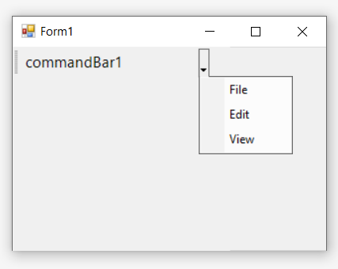

# How to associate popup menu with Bar manager

The popup menu instance can be associated with a bar manager through a command bar as dropdown menu. This can be done by associating the popup menu instance with the [`PopupMenu`](https://help.syncfusion.com/cr/windowsforms/Syncfusion.Windows.Forms.Tools.CommandBar.html#Syncfusion_Windows_Forms_Tools_CommandBar_PopupMenu) property of the CommandBar instance of the bar manager.

The below code snippet shows the popup menu is being set to the command bar.




//Declaration
private Syncfusion.Windows.Forms.Tools.CommandBarController commandBarController1;
private Syncfusion.Windows.Forms.Tools.CommandBar commandBar1;
private Syncfusion.Windows.Forms.Tools.XPMenus.PopupMenu popupMenu1;
private Syncfusion.Windows.Forms.Tools.XPMenus.ParentBarItem parentBarItem1;
private Syncfusion.Windows.Forms.Tools.XPMenus.BarItem barItem1;
private Syncfusion.Windows.Forms.Tools.XPMenus.BarItem barItem2;
private Syncfusion.Windows.Forms.Tools.XPMenus.BarItem barItem3;

//Initializing
this.commandBarController1 = new Syncfusion.Windows.Forms.Tools.CommandBarController(this.components);
this.commandBar1 = new Syncfusion.Windows.Forms.Tools.CommandBar();
this.popupMenu1 = new Syncfusion.Windows.Forms.Tools.XPMenus.PopupMenu(this.components);
this.parentBarItem1 = new Syncfusion.Windows.Forms.Tools.XPMenus.ParentBarItem();
this.barItem1 = new Syncfusion.Windows.Forms.Tools.XPMenus.BarItem();
this.barItem2 = new Syncfusion.Windows.Forms.Tools.XPMenus.BarItem();
this.barItem3 = new Syncfusion.Windows.Forms.Tools.XPMenus.BarItem();

// commandBarController1
this.commandBarController1.CommandBars.Add(this.commandBar1);
            
// commandBar1
this.commandBar1.DockState = Syncfusion.Windows.Forms.Tools.CommandBarDockState.Top;
this.commandBar1.Font = new System.Drawing.Font("Segoe UI", 15F, System.Drawing.FontStyle.Regular, System.Drawing.GraphicsUnit.World);
this.commandBar1.Name = "commandBar1";
this.commandBar1.PopupMenu = this.popupMenu1;
this.commandBar1.Text = "commandBar1";
        
// popupMenu1
this.popupMenu1.ParentBarItem = this.parentBarItem1;
             
// parentBarItem1
this.parentBarItem1.Items.AddRange(new Syncfusion.Windows.Forms.Tools.XPMenus.BarItem[] {this.barItem1, this.barItem2, this.barItem3});
this.parentBarItem1.SizeToFit = true;

// barItem1
this.barItem1.SizeToFit = true;
this.barItem1.Text = "File";
            
// barItem2
this.barItem2.SizeToFit = true;
this.barItem2.Text = "Edit";
          
// barItem3
this.barItem3.SizeToFit = true;
this.barItem3.Text = "View";
           
// Form1
this.ClientSize = new System.Drawing.Size(282, 253);
this.Name = "Form1";
this.Text = "Form1";
this.ResumeLayout(false);





'Declaration
Private commandBarController1 As Syncfusion.Windows.Forms.Tools.CommandBarController
Private commandBar1 As Syncfusion.Windows.Forms.Tools.CommandBar
Private popupMenu1 As Syncfusion.Windows.Forms.Tools.XPMenus.PopupMenu
Private parentBarItem1 As Syncfusion.Windows.Forms.Tools.XPMenus.ParentBarItem
Private barItem1 As Syncfusion.Windows.Forms.Tools.XPMenus.BarItem
Private barItem2 As Syncfusion.Windows.Forms.Tools.XPMenus.BarItem
Private barItem3 As Syncfusion.Windows.Forms.Tools.XPMenus.BarItem

'Initializing
Me.commandBarController1 = New Syncfusion.Windows.Forms.Tools.CommandBarController(Me.components)
Me.commandBar1 = New Syncfusion.Windows.Forms.Tools.CommandBar()
Me.popupMenu1 = New Syncfusion.Windows.Forms.Tools.XPMenus.PopupMenu(Me.components)
Me.parentBarItem1 = New Syncfusion.Windows.Forms.Tools.XPMenus.ParentBarItem()
Me.barItem1 = New Syncfusion.Windows.Forms.Tools.XPMenus.BarItem()
Me.barItem2 = New Syncfusion.Windows.Forms.Tools.XPMenus.BarItem()
Me.barItem3 = New Syncfusion.Windows.Forms.Tools.XPMenus.BarItem()

' commandBarController1
Me.commandBarController1.CommandBars.Add(Me.commandBar1)

' commandBar1
Me.commandBar1.DockState = Syncfusion.Windows.Forms.Tools.CommandBarDockState.Top
Me.commandBar1.Font = New System.Drawing.Font("Segoe UI", 15F, System.Drawing.FontStyle.Regular, System.Drawing.GraphicsUnit.World)
Me.commandBar1.Name = "commandBar1"
Me.commandBar1.PopupMenu = Me.popupMenu1
Me.commandBar1.Text = "commandBar1"

' popupMenu1
Me.popupMenu1.ParentBarItem = Me.parentBarItem1

' parentBarItem1
Me.parentBarItem1.Items.AddRange(New Syncfusion.Windows.Forms.Tools.XPMenus.BarItem() {Me.barItem1, Me.barItem2, Me.barItem3})
Me.parentBarItem1.SizeToFit = True

' barItem1
Me.barItem1.SizeToFit = True
Me.barItem1.Text = "File"

' barItem2
Me.barItem2.SizeToFit = True
Me.barItem2.Text = "Edit"

' barItem3
Me.barItem3.SizeToFit = True
Me.barItem3.Text = "View"

' Form1
Me.ClientSize = New System.Drawing.Size(282, 253)
Me.Name = "Form1"
Me.Text = "Form1"
Me.ResumeLayout(False)




