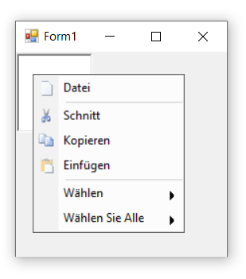

# Localization in Windows Forms PopupMenu

Localization is the process of making application multilingual by formatting the content according to the cultures. This involves configuring the application for a specific language. Culture is the combination of language and location. For example, en-US is the culture for English spoken in United States; en-GB is the culture for English spoken in Great Britain.

The below code snippet will explain how to set the localize text in **German** culture.




this.barItem1.Text = "Datei";
this.barItem2.Text = "Ausschneiden";
this.barItem3.Text = "Kopieren";
this.barItem4.Text = "Einfügen";
this.parentBarItem2.Text = "Auswählen";
this.parentBarItem3.Text = "Alles auswählen";





Me.barItem1.Text = "Datei"
Me.barItem2.Text = "Ausschneiden"
Me.barItem3.Text = "Kopieren"
Me.barItem4.Text = "Einfügen"
Me.parentBarItem2.Text = "Auswählen"
Me.parentBarItem3.Text = "Alles auswählen"




**German Culture**

