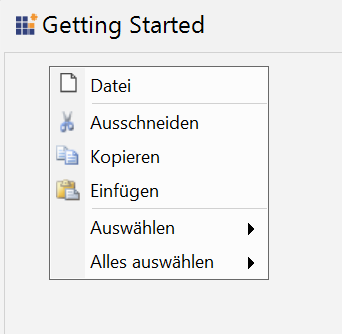

# Localization in Windows Forms PopupMenu

Localization is the process of making application multilingual by formatting the content according to the cultures. This involves configuring the application for a specific language. Culture is the combination of language and location. For example, en-US is the culture for English spoken in United States; en-GB is the culture for English spoken in Great Britain.

The below code snippet will explain how to set the localize text in **German** culture.




private Syncfusion.Windows.Forms.Tools.XPMenus.PopupMenu popupMenu1;
private System.Windows.Forms.RichTextBox richTextBox1;
private Syncfusion.Windows.Forms.Tools.XPMenus.ParentBarItem parentBarItem1;
private Syncfusion.Windows.Forms.Tools.XPMenus.ParentBarItem parentBarItem2;
private Syncfusion.Windows.Forms.Tools.XPMenus.ParentBarItem parentBarItem3;
private Syncfusion.Windows.Forms.Tools.XPMenus.BarItem barItem1;
private Syncfusion.Windows.Forms.Tools.XPMenus.BarItem barItem2;
private Syncfusion.Windows.Forms.Tools.XPMenus.BarItem barItem3;
private Syncfusion.Windows.Forms.Tools.XPMenus.BarItem barItem4;
private Syncfusion.Windows.Forms.Tools.XPMenus.PopupMenusManager popupMenusManager1;

System.ComponentModel.ComponentResourceManager resources = new System.ComponentModel.ComponentResourceManager(typeof(Form1));
popupMenu1 = new Syncfusion.Windows.Forms.Tools.NavigationView.PopupMenu(this.components);
richTextBox1 = new System.Windows.Forms.RichTextBox();
parentBarItem1 = new Syncfusion.Windows.Forms.Tools.XPMenus.ParentBarItem();
parentBarItem2 = new Syncfusion.Windows.Forms.Tools.XPMenus.ParentBarItem();
parentBarItem3 = new Syncfusion.Windows.Forms.Tools.XPMenus.ParentBarItem();
barItem1 = new Syncfusion.Windows.Forms.Tools.XPMenus.BarItem();
barItem2 = new Syncfusion.Windows.Forms.Tools.XPMenus.BarItem();
barItem3 = new Syncfusion.Windows.Forms.Tools.XPMenus.BarItem();
barItem4 = new Syncfusion.Windows.Forms.Tools.XPMenus.BarItem();
popupMenusManager1 = new Syncfusion.Windows.Forms.Tools.XPMenus.PopupMenusManager(this.components);

this.popupMenu1.ParentBarItem = this.parentBarItem1;

this.parentBarItem1.Items.AddRange(new Syncfusion.Windows.Forms.Tools.XPMenus.BarItem[] {
    this.barItem1,
    this.barItem2,
    this.barItem3,
    this.barItem4,
    this.parentBarItem2,
    this.parentBarItem3});
    this.parentBarItem1.SeparatorIndices.AddRange(new int[] { 1, 4 });

this.barItem1.ID = "File";
this.barItem1.Image = ((Syncfusion.Windows.Forms.Tools.XPMenus.ImageExt)(resources.GetObject("newBarItem6.Image")));
this.barItem1.Text = "Datei";

this.barItem2.ID = "Cut";
this.barItem2.Image = ((Syncfusion.Windows.Forms.Tools.XPMenus.ImageExt)(resources.GetObject("cutBarItem1.Image")));
this.barItem2.Text = "Ausschneiden";

this.barItem3.ID = "Copy";
this.barItem3.Image = ((Syncfusion.Windows.Forms.Tools.XPMenus.ImageExt)(resources.GetObject("copyBarItem2.Image")));
this.barItem3.Text = "Kopieren";

this.barItem4.ID = "Paste";
this.barItem4.Image = ((Syncfusion.Windows.Forms.Tools.XPMenus.ImageExt)(resources.GetObject("pasteBarItem3.Image")));
this.barItem4.Text = "Einfügen";

this.parentBarItem2.ID = "Select";
this.parentBarItem2.Text = "Auswählen";

this.parentBarItem3.ID = "SelectAll";
this.parentBarItem3.Text = "Alles auswählen";

this.popupMenusManager1.SetXPContextMenu(this.richTextBox1, this.popupMenu1);

this.Controls.Add(this.richTextBox1);





Dim resources As New ComponentResourceManager(GetType(Form1))

popupMenu1 = New PopupMenu(Me.components)
richTextBox1 = New RichTextBox()
parentBarItem1 = New ParentBarItem()
parentBarItem2 = New ParentBarItem()
parentBarItem3 = New ParentBarItem()
barItem1 = New BarItem()
barItem2 = New BarItem()
barItem3 = New BarItem()
barItem4 = New BarItem()
popupMenusManager1 = New PopupMenusManager(Me.components)

popupMenu1.ParentBarItem = parentBarItem1

parentBarItem1.Items.AddRange(New BarItem() {barItem1, barItem2, barItem3, barItem4, parentBarItem2, parentBarItem3})
parentBarItem1.SeparatorIndices.AddRange(New Integer() {1, 4})

barItem1.ID = "File"
barItem1.Image = CType(resources.GetObject("newBarItem6.Image"), ImageExt)
barItem1.Text = "Datei"

barItem2.ID = "Cut"
barItem2.Image = CType(resources.GetObject("cutBarItem1.Image"), ImageExt)
barItem2.Text = "Ausschneiden"

barItem3.ID = "Copy"
barItem3.Image = CType(resources.GetObject("copyBarItem2.Image"), ImageExt)
barItem3.Text = "Kopieren"

barItem4.ID = "Paste"
barItem4.Image = CType(resources.GetObject("pasteBarItem3.Image"), ImageExt)
barItem4.Text = "Einfügen"

parentBarItem2.ID = "Select"
parentBarItem2.Text = "Auswählen"

parentBarItem3.ID = "SelectAll"
parentBarItem3.Text = "Alles auswählen"

popupMenusManager1.SetXPContextMenu(richTextBox1, popupMenu1)

Me.Controls.Add(richTextBox1)




**German Culture**

