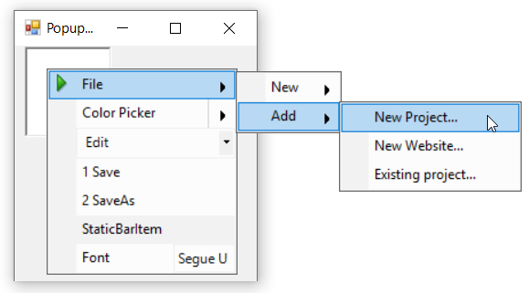

# Multi-level Menu Items in Windows Forms PopupMenu

Multi-level menu items refer to creating and adding submenu or child items to the popup menu. The below code snippet shows how to add submenu or child items to the PopupMenu control.




//Declaration
private Syncfusion.Windows.Forms.Tools.XPMenus.PopupMenu popupMenu1;
private Syncfusion.Windows.Forms.Tools.XPMenus.ParentBarItem parentBarItem1;
private Syncfusion.Windows.Forms.Tools.XPMenus.ParentBarItem parentBarItem2;
private Syncfusion.Windows.Forms.Tools.XPMenus.PopupMenusManager popupMenusManager1;
private System.Windows.Forms.RichTextBox richTextBox1;
private Syncfusion.Windows.Forms.Tools.XPMenus.DropDownBarItem dropDownBarItem1;
private Syncfusion.Windows.Forms.PopupControlContainer popupControlContainer1;
private Syncfusion.Windows.Forms.Tools.ColorPickerUIAdv colorPickerUIAdv1;
private Syncfusion.Windows.Forms.Tools.XPMenus.ComboBoxBarItem comboBoxBarItem1;
private Syncfusion.Windows.Forms.Tools.XPMenus.ListBarItem listBarItem1;
private Syncfusion.Windows.Forms.Tools.XPMenus.StaticBarItem staticBarItem1;
private Syncfusion.Windows.Forms.Tools.XPMenus.TextBoxBarItem textBoxBarItem1;
private Syncfusion.Windows.Forms.Tools.XPMenus.ParentBarItem parentBarItem3;
private Syncfusion.Windows.Forms.Tools.XPMenus.ParentBarItem parentBarItem4;
private Syncfusion.Windows.Forms.Tools.XPMenus.BarItem barItem4;
private Syncfusion.Windows.Forms.Tools.XPMenus.BarItem barItem5;
private Syncfusion.Windows.Forms.Tools.XPMenus.BarItem barItem6;

//Initializing
this.popupMenu1 = new Syncfusion.Windows.Forms.Tools.XPMenus.PopupMenu(this.components);
this.parentBarItem1 = new Syncfusion.Windows.Forms.Tools.XPMenus.ParentBarItem();
this.parentBarItem2 = new Syncfusion.Windows.Forms.Tools.XPMenus.ParentBarItem();
this.dropDownBarItem1 = new Syncfusion.Windows.Forms.Tools.XPMenus.DropDownBarItem();
this.popupControlContainer1 = new Syncfusion.Windows.Forms.PopupControlContainer();
this.colorPickerUIAdv1 = new Syncfusion.Windows.Forms.Tools.ColorPickerUIAdv();
this.comboBoxBarItem1 = new Syncfusion.Windows.Forms.Tools.XPMenus.ComboBoxBarItem();
this.listBarItem1 = new Syncfusion.Windows.Forms.Tools.XPMenus.ListBarItem();
this.staticBarItem1 = new Syncfusion.Windows.Forms.Tools.XPMenus.StaticBarItem();
this.textBoxBarItem1 = new Syncfusion.Windows.Forms.Tools.XPMenus.TextBoxBarItem();
this.popupMenusManager1 = new Syncfusion.Windows.Forms.Tools.XPMenus.PopupMenusManager(this.components);
this.richTextBox1 = new System.Windows.Forms.RichTextBox();
this.parentBarItem3 = new Syncfusion.Windows.Forms.Tools.XPMenus.ParentBarItem();
this.parentBarItem4 = new Syncfusion.Windows.Forms.Tools.XPMenus.ParentBarItem();
this.barItem4 = new Syncfusion.Windows.Forms.Tools.XPMenus.BarItem();
this.barItem5 = new Syncfusion.Windows.Forms.Tools.XPMenus.BarItem();
this.barItem6 = new Syncfusion.Windows.Forms.Tools.XPMenus.BarItem();

// popupMenu1
this.popupMenu1.ParentBarItem = this.parentBarItem1;

// parentBarItem1
this.parentBarItem1.Items.AddRange(new Syncfusion.Windows.Forms.Tools.XPMenus.BarItem[] { this.parentBarItem2, this.dropDownBarItem1, this.comboBoxBarItem1, this.listBarItem1, this.staticBarItem1, this.textBoxBarItem1});
this.parentBarItem1.MetroColor = System.Drawing.Color.LightSkyBlue;
this.parentBarItem1.SizeToFit = true;

// parentBarItem2
this.parentBarItem2.Image = new ImageExt(System.Drawing.Image.FromFile(@"..\..\..\File.png"));
this.parentBarItem2.MetroColor = System.Drawing.Color.LightSkyBlue;
this.parentBarItem2.SizeToFit = true;
this.parentBarItem2.Text = "File";
this.parentBarItem2.Items.AddRange(new Syncfusion.Windows.Forms.Tools.XPMenus.BarItem[] { this.parentBarItem3, this.parentBarItem4});

// parentBarItem3
this.parentBarItem3.MetroColor = System.Drawing.Color.LightSkyBlue;
this.parentBarItem3.SizeToFit = true;
this.parentBarItem3.Text = "New";

// parentBarItem4
this.parentBarItem4.MetroColor = System.Drawing.Color.LightSkyBlue;
this.parentBarItem4.SizeToFit = true;
this.parentBarItem4.Text = "Add";
this.parentBarItem4.Items.AddRange(new Syncfusion.Windows.Forms.Tools.XPMenus.BarItem[] { this.barItem4, this.barItem5, this.barItem6});
            
// barItem4
this.barItem4.SizeToFit = true;
this.barItem4.Text = "New Project...";
    
// barItem5
this.barItem5.SizeToFit = true;
this.barItem5.Text = "New Website...";
                    
// barItem6
this.barItem6.SizeToFit = true;
this.barItem6.Text = "Existing project...";

// dropDownBarItem1
this.dropDownBarItem1.PopupControlContainer = this.popupControlContainer1;
this.dropDownBarItem1.SizeToFit = true;
this.dropDownBarItem1.Text = "Color Picker";

// popupControlContainer1
this.popupControlContainer1.Controls.Add(this.colorPickerUIAdv1);
this.popupControlContainer1.Name = "popupControlContainer1";
this.popupControlContainer1.Size = new System.Drawing.Size(200, 100);

// colorPickerUIAdv1.RecentGroup
this.colorPickerUIAdv1.RecentGroup.HeaderHeight = 17;
this.colorPickerUIAdv1.RecentGroup.Name = "Recent Colors";
this.colorPickerUIAdv1.RecentGroup.Visible = false;

// colorPickerUIAdv1.StandardGroup
this.colorPickerUIAdv1.StandardGroup.HeaderHeight = 17;
this.colorPickerUIAdv1.StandardGroup.Name = "Standard Colors";

// colorPickerUIAdv1.ThemeGroup
this.colorPickerUIAdv1.ThemeGroup.HeaderHeight = 17;
this.colorPickerUIAdv1.ThemeGroup.IsSubItemsVisible = true;
this.colorPickerUIAdv1.ThemeGroup.Name = "Theme Colors";

// colorPickerUIAdv1
this.colorPickerUIAdv1.BeforeTouchSize = new System.Drawing.Size(13, 13);
this.colorPickerUIAdv1.ButtonsHeight = 25;
this.colorPickerUIAdv1.ColorItemSize = new System.Drawing.Size(17, 17);
this.colorPickerUIAdv1.Location = new System.Drawing.Point(3, 3);
this.colorPickerUIAdv1.MetroColor = System.Drawing.Color.FromArgb(((int)(((byte)(22)))), ((int)(((byte)(165)))), ((int)(((byte)(220)))));
this.colorPickerUIAdv1.MinimumSize = new System.Drawing.Size(136, 193);
this.colorPickerUIAdv1.Name = "colorPickerUIAdv1";
this.colorPickerUIAdv1.SelectedColor = System.Drawing.Color.Empty;
this.colorPickerUIAdv1.Size = new System.Drawing.Size(212, 237);
this.colorPickerUIAdv1.Style = Syncfusion.Windows.Forms.Tools.ColorPickerUIAdv.visualstyle.Default;
this.colorPickerUIAdv1.TabIndex = 0;
this.colorPickerUIAdv1.Text = "colorPickerUIAdv1";
this.colorPickerUIAdv1.UseOffice2007Style = false;

// comboBoxBarItem1
this.comboBoxBarItem1.ChoiceList.AddRange(new string[] { "Cut", "Copy", "Paste", "Undo", "Redo"});
this.comboBoxBarItem1.SizeToFit = true;
this.comboBoxBarItem1.TextBoxValue = "Edit";

// listBarItem1
this.listBarItem1.SizeToFit = true;
this.listBarItem1.Text = "ListBarItem";            
this.listBarItem1.ChildCaptions.AddRange(new string[] { "Save", "SaveAs"});

// staticBarItem1
this.staticBarItem1.SizeToFit = true;
this.staticBarItem1.Text = "StaticBarItem";

// textBoxBarItem1
this.textBoxBarItem1.SizeToFit = true;
this.textBoxBarItem1.Text = "Font";
this.textBoxBarItem1.TextBoxValue = "Segue UI";
this.textBoxBarItem1.Value = "Segue UI";

// richTextBox1
this.richTextBox1.Location = new System.Drawing.Point(76, 66);
this.richTextBox1.Name = "richTextBox1";
this.richTextBox1.Size = new System.Drawing.Size(100, 96);
this.popupMenusManager1.SetXPContextMenu(this.richTextBox1, this.popupMenu1);

// Form1
this.ClientSize = new System.Drawing.Size(282, 253);
this.Controls.Add(this.richTextBox1);
this.Name = "Form1";
this.Text = "PopupMenu";
this.popupControlContainer1.ResumeLayout(false);
((System.ComponentModel.ISupportInitialize)(this.comboBoxBarItem1)).EndInit();
this.ResumeLayout(false);
        




'Declaration
Private popupMenu1 As Syncfusion.Windows.Forms.Tools.XPMenus.PopupMenu
Private parentBarItem1 As Syncfusion.Windows.Forms.Tools.XPMenus.ParentBarItem
Private parentBarItem2 As Syncfusion.Windows.Forms.Tools.XPMenus.ParentBarItem
Private popupMenusManager1 As Syncfusion.Windows.Forms.Tools.XPMenus.PopupMenusManager
Private richTextBox1 As System.Windows.Forms.RichTextBox
Private dropDownBarItem1 As Syncfusion.Windows.Forms.Tools.XPMenus.DropDownBarItem
Private popupControlContainer1 As Syncfusion.Windows.Forms.PopupControlContainer
Private colorPickerUIAdv1 As Syncfusion.Windows.Forms.Tools.ColorPickerUIAdv
Private comboBoxBarItem1 As Syncfusion.Windows.Forms.Tools.XPMenus.ComboBoxBarItem
Private listBarItem1 As Syncfusion.Windows.Forms.Tools.XPMenus.ListBarItem
Private staticBarItem1 As Syncfusion.Windows.Forms.Tools.XPMenus.StaticBarItem
Private textBoxBarItem1 As Syncfusion.Windows.Forms.Tools.XPMenus.TextBoxBarItem
Private parentBarItem3 As Syncfusion.Windows.Forms.Tools.XPMenus.ParentBarItem
Private parentBarItem4 As Syncfusion.Windows.Forms.Tools.XPMenus.ParentBarItem
Private barItem4 As Syncfusion.Windows.Forms.Tools.XPMenus.BarItem
Private barItem5 As Syncfusion.Windows.Forms.Tools.XPMenus.BarItem
Private barItem6 As Syncfusion.Windows.Forms.Tools.XPMenus.BarItem

'Initializing
Me.popupMenu1 = New Syncfusion.Windows.Forms.Tools.XPMenus.PopupMenu(Me.components)
Me.parentBarItem1 = New Syncfusion.Windows.Forms.Tools.XPMenus.ParentBarItem()
Me.parentBarItem2 = New Syncfusion.Windows.Forms.Tools.XPMenus.ParentBarItem()
Me.dropDownBarItem1 = New Syncfusion.Windows.Forms.Tools.XPMenus.DropDownBarItem()
Me.popupControlContainer1 = New Syncfusion.Windows.Forms.PopupControlContainer()
Me.colorPickerUIAdv1 = New Syncfusion.Windows.Forms.Tools.ColorPickerUIAdv()
Me.comboBoxBarItem1 = New Syncfusion.Windows.Forms.Tools.XPMenus.ComboBoxBarItem()
Me.listBarItem1 = New Syncfusion.Windows.Forms.Tools.XPMenus.ListBarItem()
Me.staticBarItem1 = New Syncfusion.Windows.Forms.Tools.XPMenus.StaticBarItem()
Me.textBoxBarItem1 = New Syncfusion.Windows.Forms.Tools.XPMenus.TextBoxBarItem()
Me.popupMenusManager1 = New Syncfusion.Windows.Forms.Tools.XPMenus.PopupMenusManager(Me.components)
Me.richTextBox1 = New System.Windows.Forms.RichTextBox()
Me.parentBarItem3 = New Syncfusion.Windows.Forms.Tools.XPMenus.ParentBarItem()
Me.parentBarItem4 = New Syncfusion.Windows.Forms.Tools.XPMenus.ParentBarItem()
Me.barItem4 = New Syncfusion.Windows.Forms.Tools.XPMenus.BarItem()
Me.barItem5 = New Syncfusion.Windows.Forms.Tools.XPMenus.BarItem()
Me.barItem6 = New Syncfusion.Windows.Forms.Tools.XPMenus.BarItem()

' popupMenu1
Me.popupMenu1.ParentBarItem = Me.parentBarItem1

' parentBarItem1
Me.parentBarItem1.Items.AddRange(New Syncfusion.Windows.Forms.Tools.XPMenus.BarItem() { Me.parentBarItem2, Me.dropDownBarItem1, Me.comboBoxBarItem1, Me.listBarItem1, Me.staticBarItem1, Me.textBoxBarItem1})
Me.parentBarItem1.MetroColor = System.Drawing.Color.LightSkyBlue
Me.parentBarItem1.SizeToFit = True

' parentBarItem2
Me.parentBarItem2.Image = New ImageExt(System.Drawing.Image.FromFile("..\..\..\File.png"))
Me.parentBarItem2.MetroColor = System.Drawing.Color.LightSkyBlue
Me.parentBarItem2.SizeToFit = True
Me.parentBarItem2.Text = "File"
Me.parentBarItem2.Items.AddRange(New Syncfusion.Windows.Forms.Tools.XPMenus.BarItem() { Me.parentBarItem3, Me.parentBarItem4})

' parentBarItem3
Me.parentBarItem3.MetroColor = System.Drawing.Color.LightSkyBlue
Me.parentBarItem3.SizeToFit = True
Me.parentBarItem3.Text = "New"

' parentBarItem4
Me.parentBarItem4.MetroColor = System.Drawing.Color.LightSkyBlue
Me.parentBarItem4.SizeToFit = True
Me.parentBarItem4.Text = "Add"
Me.parentBarItem4.Items.AddRange(New Syncfusion.Windows.Forms.Tools.XPMenus.BarItem() { Me.barItem4, Me.barItem5, Me.barItem6})

' barItem4
Me.barItem4.SizeToFit = True
Me.barItem4.Text = "New Project..."

' barItem5
Me.barItem5.SizeToFit = True
Me.barItem5.Text = "New Website..."

' barItem6
Me.barItem6.SizeToFit = True
Me.barItem6.Text = "Existing project..."

' dropDownBarItem1
Me.dropDownBarItem1.PopupControlContainer = Me.popupControlContainer1
Me.dropDownBarItem1.SizeToFit = True
Me.dropDownBarItem1.Text = "Color Picker"

' popupControlContainer1
Me.popupControlContainer1.Controls.Add(Me.colorPickerUIAdv1)
Me.popupControlContainer1.Name = "popupControlContainer1"
Me.popupControlContainer1.Size = New System.Drawing.Size(200, 100)

' colorPickerUIAdv1.RecentGroup
Me.colorPickerUIAdv1.RecentGroup.HeaderHeight = 17
Me.colorPickerUIAdv1.RecentGroup.Name = "Recent Colors"
Me.colorPickerUIAdv1.RecentGroup.Visible = False

' colorPickerUIAdv1.StandardGroup
Me.colorPickerUIAdv1.StandardGroup.HeaderHeight = 17
Me.colorPickerUIAdv1.StandardGroup.Name = "Standard Colors"

' colorPickerUIAdv1.ThemeGroup
Me.colorPickerUIAdv1.ThemeGroup.HeaderHeight = 17
Me.colorPickerUIAdv1.ThemeGroup.IsSubItemsVisible = True
Me.colorPickerUIAdv1.ThemeGroup.Name = "Theme Colors"

' colorPickerUIAdv1
Me.colorPickerUIAdv1.BeforeTouchSize = New System.Drawing.Size(13, 13)
Me.colorPickerUIAdv1.ButtonsHeight = 25
Me.colorPickerUIAdv1.ColorItemSize = New System.Drawing.Size(17, 17)
Me.colorPickerUIAdv1.Location = New System.Drawing.Point(3, 3)
Me.colorPickerUIAdv1.MetroColor = System.Drawing.Color.FromArgb((CInt(Fix((CByte(22))))), (CInt(Fix((CByte(165))))), (CInt(Fix((CByte(220))))))
Me.colorPickerUIAdv1.MinimumSize = New System.Drawing.Size(136, 193)
Me.colorPickerUIAdv1.Name = "colorPickerUIAdv1"
Me.colorPickerUIAdv1.SelectedColor = System.Drawing.Color.Empty
Me.colorPickerUIAdv1.Size = New System.Drawing.Size(212, 237)
Me.colorPickerUIAdv1.Style = Syncfusion.Windows.Forms.Tools.ColorPickerUIAdv.visualstyle.Default
Me.colorPickerUIAdv1.TabIndex = 0
Me.colorPickerUIAdv1.Text = "colorPickerUIAdv1"
Me.colorPickerUIAdv1.UseOffice2007Style = False

' comboBoxBarItem1
Me.comboBoxBarItem1.ChoiceList.AddRange(New String() { "Cut", "Copy", "Paste", "Undo", "Redo"})
Me.comboBoxBarItem1.SizeToFit = True
Me.comboBoxBarItem1.TextBoxValue = "Edit"

' listBarItem1
Me.listBarItem1.SizeToFit = True
Me.listBarItem1.Text = "ListBarItem"
Me.listBarItem1.ChildCaptions.AddRange(New String() { "Save", "SaveAs"})

' staticBarItem1
Me.staticBarItem1.SizeToFit = True
Me.staticBarItem1.Text = "StaticBarItem"

' textBoxBarItem1
Me.textBoxBarItem1.SizeToFit = True
Me.textBoxBarItem1.Text = "Font"
Me.textBoxBarItem1.TextBoxValue = "Segue UI"
Me.textBoxBarItem1.Value = "Segue UI"

' richTextBox1
Me.richTextBox1.Location = New System.Drawing.Point(76, 66)
Me.richTextBox1.Name = "richTextBox1"
Me.richTextBox1.Size = New System.Drawing.Size(100, 96)
Me.popupMenusManager1.SetXPContextMenu(Me.richTextBox1, Me.popupMenu1)

' Form1
Me.ClientSize = New System.Drawing.Size(282, 253)
Me.Controls.Add(Me.richTextBox1)
Me.Name = "Form1"
Me.Text = "PopupMenu"
Me.popupControlContainer1.ResumeLayout(False)
CType(Me.comboBoxBarItem1, System.ComponentModel.ISupportInitialize).EndInit()
Me.ResumeLayout(False)




