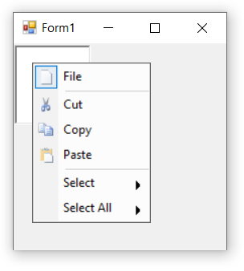
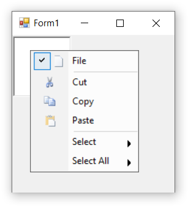

# Overlapping check box and images in Windows Forms PopupMenu

By default, both checked state and images associated with a bar item are overlapped. If the property [`OverlapCheckBoxImageBounds`](https://help.syncfusion.com/cr/windowsforms/Syncfusion.Windows.Forms.Tools.XPMenus.ParentBarItem.html#Syncfusion_Windows_Forms_Tools_XPMenus_ParentBarItem_OverlapCheckBoxImageBounds) of the parent bar item is set to `true`, a border for the image will be drawn to indicate the checked state. Or, if the property is set to `false` the check state of the bar item will be drawn separately. By default the [`OverlapCheckBoxImageBounds`](https://help.syncfusion.com/cr/windowsforms/Syncfusion.Windows.Forms.Tools.XPMenus.ParentBarItem.html#Syncfusion_Windows_Forms_Tools_XPMenus_ParentBarItem_OverlapCheckBoxImageBounds) property is set as `true`.

The below code snippet will explain the overlapping of check box and images in the PopupMenu control.




this.parentBarItem1.OverlapCheckBoxImageBounds = false;





Me.parentBarItem1.OverlapCheckBoxImageBounds = False




