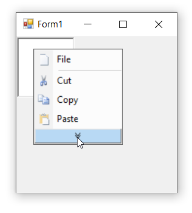

# Partial Menus in Windows Forms PopupMenu

The popup menu items which are frequently used can be prioritized for display and rest can be temporarily hidden within the menu. [`UsePartialMenus`](https://help.syncfusion.com/cr/windowsforms/Syncfusion.Windows.Forms.Tools.XPMenus.ParentBarItem.html#Syncfusion_Windows_Forms_Tools_XPMenus_ParentBarItem_UsePartialMenus) property of the parent bar item associated with the popup menu is used to enable the partial menus option and the priority of the bar items can be set by using the property [`IsRecentlyUsedItem`](https://help.syncfusion.com/cr/windowsforms/Syncfusion.Windows.Forms.Tools.XPMenus.ParentBarItem.html#Syncfusion_Windows_Forms_Tools_XPMenus_ParentBarItem_IsRecentlyUsedItem). By default, its set to `true`.

The below code snippet will enable the partial menus feature in popup menu control.




this.popupMenu1.ParentBarItem.UsePartialMenus = true;
this.parentBarItem2.IsRecentlyUsedItem = false;
this.parentBarItem3.IsRecentlyUsedItem = false;





Me.popupMenu1.ParentBarItem.UsePartialMenus = True
Me.parentBarItem2.IsRecentlyUsedItem = False
Me.parentBarItem3.IsRecentlyUsedItem = False




