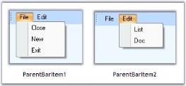
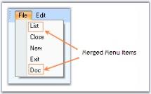
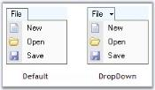
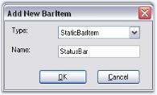
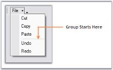

# Popup MenuContext MenuXPMenu Bars

This section discusses about the types of menu Bars, the types of bar items that can be added to the Menus and also the BarManagers involved.

## Bar Types

XPMenus Framework defines the below three types of bars based on the BarStyle property.

MainMenuBar

This is a horizontal menu that appears on top of a window. By default, each option in a menu bar is associated with a pull-down menu. 

For MainMenuBars, BarStyles IsMainMenuBar option will have to be checked. There can be only one menu bar at the top of the screen. The MainMenuBar is always visible and it fills the entire dock area row on which it appears.

### Standard Bar

This is a horizontal menu that appears on top of a window with BarStyle 'IsMainMenu' option Unchecked. It does not fill the entire dock area row on which it appears. Other toolbars can also be docked on the same row. It gives 'Customize toolbar' options.

{:.image }

### Status Bar

This is a horizontal menu that appears on the bottom of a window and has the BarStyle 'IsStatusBar' checked. Any number of static bar items can be added to it.



[Bar Items](http://help.syncfusion.com/windowsforms/popupmenu/popup-menucontext-menuxpmenu-bars#bar-items), 
[BarManagers](http://help.syncfusion.com/windowsforms/popupmenu/popup-menucontext-menuxpmenu-bars#barmanagers),
Bar Styles

Toolbar Properties



The properties of a toolbar are as follows.

Table 468 : Property Table

<table>
<tr>
<th>
Bar Property</th><th>
Description</th></tr>
<tr>
<td>
Items</td><td>
Collection of bar items representing the menu items in the toolbar. This invokes the customize dialog at design time.</td></tr>
<tr>
<td>
AllowCustomizing</td><td>
Indicates whether dragging and dropping of bar items into the bar is allowed or not, at run time.</td></tr>
<tr>
<td>
AllowItemsReorderOnShrunk</td><td>
When the toolbar shrunk to show more bar items, the bar items will be automatically reordered, when AllowItemsReorderOnShrunk property is set to true. The default value is true.</td></tr>
<tr>
<td>
Bar Styles</td><td>
Specifies the BarStyle.</td></tr>
<tr>
<td>
AllowHiding </td><td>
Specifies if the toolbar can be hidden by the user at run time. By default this property is true. When this is set to false, user will not be able to hide the toolbar at run time, as the checkbox will be disabled at run time.</td></tr>
</table>

### Default Docking

The XPMenus bar can be docked on any of the four sides of the host form, both at design time and run time, without a single property setting. This is an in-built feature in the XPMenus. 

#### Floating Bar Properties

_Table_ _469_: _Property Table_

<table>
<tr>
<th>
Bar Property</th><th>
Description</th></tr>
<tr>
<td>
AllowResizing</td><td>
Specifies whether to allow resizing of the toolbar when the toolbar is floating.</td></tr>
</table>

_Table_ _470_: _Property Table_

<table>
<tr>
<th>
Bar Property</th><th>
Description</th></tr>
<tr>
<td>
BarName</td><td>
Name of the toolbar.</td></tr>
<tr>
<td>
Caption</td><td>
Caption for the toolbar which is displayed in floating mode.</td></tr>
</table>



How To Reset Bar To The Designer State?

How to show or hide close and dropdown buttons of a floating bar in XPMenus?



## Bar Items	

This section will discuss various types of bar items, their properties and customization using the properties. 

### Customize Dialog

Bar items can be added to a BarManager using Customize dialog through Designer. See Adding Bar Items to a BarManager to know how to add bar items.

### Customize Dialog

The Customize Dialog can be accessed at design time and also at runtime. It lets the end users to add and customize menus, toolbars and layout items during design time. This can be invoked at design time, by right-clicking the mainFrameBarManager and selecting the Customize option in the designer.

At run time, Customize dialog can be accessed by right-clicking on the Bar and clicking the Customize option. This dialog lets you control the layout of items in a toolbar.

(BarStyle=IsMainMenu Unchecked)

N> To avoid displaying the bar items in Customize dialog at run time, set BarManager.ShowItemsInCustomizationDialog property to false

N> If you want to disable Customizing option for the users at run time, set BarManager.EnableCustomizing property to false. This will not provide option to open the Customize dialog at run time.



Bar Styles

Customize Dialog Appearance

Types of Bar Items



### Types of Bar Items

The following Bar items are discussed in this section.

#### BarItem

A BarItem is a simple child bar item which can be dragged and dropped to a ParentBarItem. By selecting the Type as BarItem and giving the name, in the Add New BarItem dialog, we can create a new BarItem. 

#### Behavior Properties

Some properties are as follows.

_Table_ _471__: Property Table_

<table>
<tr>
<th>
ParentBarItem Property</th><th>
Description</th></tr>
<tr>
<td>
Checked</td><td>
Draws the bar item with a checked appearance.</td></tr>
<tr>
<td>
Enabled</td><td>
Enables or disables the bar item. Default value is true.</td></tr>
<tr>
<td>
IsRecentlyUsedItem</td><td>
Indicates whether this item will appear in its parent's partial menus list. Partial Menus is discussed in ParentBarItem topic.</td></tr>
<tr>
<td>
Visible</td><td>
Sets the visibility of the bar item.</td></tr>
<tr>
<td>
MergeOrder</td><td>
Relative Position of the bar item when it is merged with another.</td></tr>
<tr>
<td>
MergeType</td><td>
Sets behavior of the bar item when its bar is merged with another. The options are,Add - Adds to the existing menu items. (Default)Replace - Replaces an existing menu items at the same position in a merged menu.MergeItems - Merged with an existing menu items at the same position in a merged menu.Remove - Menu item will not be included in the merged menu. See ParentBarItem for merging the bar items.</td></tr>
<tr>
<td>
Customizable</td><td>
Specifies whether the bar item is involved in the customization.</td></tr>
<tr>
<td>
Padding</td><td>
Gets or sets padding for items.</td></tr>
<tr>
<td>
PaddingForThemesX</td><td>
Specifies padding for theme control X.</td></tr>
<tr>
<td>
PaddingForThemesY</td><td>
Specifies padding for theme control Y.</td></tr>
<tr>
<td>
ShowMnemonicUnderlinesAlways</td><td>
It indicates whether to show underlines with mnemonic always.</td></tr>
</table>

#### Other Common properties

For setting images see Image Settings; 

For Editing the text and setting text alignments, See BarItem Text; 

For setting shortcuts for the bar items, see Keyboard shortcuts and 

For changing the Paint Style, see PaintStyle topic. 

Appearance of the Text can be customized. See Foreground Settings for details.



Customization Options, UpdateUIOnAppIdle property in UI Command Update Patterns topic



#### ParentBarItem

A ParentBarItem represents a submenu (drop-down menu) which can display one or more child BarItems on drop-down. A ParentBarItem can be placed inside a toolbar and it can contain another ParentBarItem as its child bar item. ParentBarItem comes with properties to control its appearance and behavior.

#### Behavior Settings

The following properties let you control the behavior of the ParentBarItem.

_Table_ _472__: Property Table_

<table>
<tr>
<th>
ParentBarItem Property</th><th>
Description</th></tr>
<tr>
<td>
Checked</td><td>
Draws the bar item with a checked appearance.</td></tr>
<tr>
<td>
Enabled</td><td>
Enables or disables the bar item. Default value is true.</td></tr>
<tr>
<td>
IsRecentlyUsedItem</td><td>
Indicates whether this item will appear in its parent's partial menus list.</td></tr>
<tr>
<td>
Visible</td><td>
Sets the visibility of the bar item.</td></tr>
<tr>
<td>
MergeOrder</td><td>
Relative Position of the bar item when it is merged with another.</td></tr>
<tr>
<td>
MergeType</td><td>
Sets behavior of the bar item when its bar is merged with another. The options are,Add - Adds to the existing menu items. (Default)Replace - Replaces an existing menu items at the same position in a merged menu.MergeItems - Merged with an existing menu items at the same position in a merged menu.Remove - Menu item will not be included in the merged menu.</td></tr>
<tr>
<td>
Customizable</td><td>
Specifies whether the bar item is involved in the customization.</td></tr>
<tr>
<td>
ParentStyle</td><td>
Specifies the ParentStyle on which the menu will be drawn. The options are,Default (Default),DropDown.</td></tr>
<tr>
<td>
Padding</td><td>
Gets or sets padding for items.</td></tr>
<tr>
<td>
ScrollingSpeed</td><td>
Specifies the scrolling speed for the displayed child menu items.</td></tr>
<tr>
<td>
ScrollOnMouseMove</td><td>
Specifies scroll items in menu when mouse moves over scroll buttons.</td></tr>
<tr>
<td>
UsePartialMenus</td><td>
Specifies whether ParentBarItem will first show a list of  recently used items and an Expand button when dropped down.</td></tr>
<tr>
<td>
ShowMnemonicUnderlinesAlways</td><td>
It indicates whether to show underlines with mnemonic always.</td></tr>
</table>

#### Merging

XPMenus FrameWork lets you merge menu items of different ParentBarItems using MergeItems method.

_Table_ _473__: Property Table_

<table>
<tr>
<th>
ParentBarItem Method</th><th>
Description</th></tr>
<tr>
<td>
MergeItems</td><td>
Merges BarItems of one ParentBarItem with another ParentBarItem. Two ParentBarItems can be merged into one, based on the MergeOrder and MergeType properties of its children (/ menu item). Parameter is,parentItemSrc - The ParentBarItem which is merged with this ParentBarItem.</td></tr>
</table>



//Setting merge order and merge type of bar item5 (List) of ParentBarItem2

this.barItem5.MergeOrder = 0;

this.barItem5.MergeType = MenuMerge.MergeItems;

//Merging parentbaritem2 menu items to parentbaritem1

this.parentBarItem1.MergeItems(parentBarItem3);





'Setting merge order and merge type of bar item5 (List) of ParentBarItem2

Me.barItem5.MergeOrder = 0

Me.barItem5.MergeType = MenuMerge.MergeItems

'Merging parentbaritem2 menu items to parentbaritem1

Me.parentBarItem1.MergeItems(parentBarItem3)



#### Parent Style

The following figures display the parent styles.

#### Partial Menus

The ParentBarItem can hide some of its menu items and display them on clicking an expand button at the bottom of the menu list, by using the UsePartialMenus and IsRecentlyUsedItem properties. With this feature we can display only the recently used items and can hide the rest. We can do this in ParentBarItem.BeforePopup event.

_Table_ _474_: _Property Table_

<table>
<tr>
<th>
BarManager Property</th><th>
Description</th></tr>
<tr>
<td>
ExpandPartialMenusAfterDelay</td><td>
Enables automatic expansion of the partial menus into full menus after a delay.</td></tr>
<tr>
<td>
UsePartialMenus</td><td>
Enables or disables partial menus mode in submenu.</td></tr>
<tr>
<td>
PartialMenusResetDelay</td><td>
Specifies the delay in days after an item's recently used setting will be replaced.</td></tr>
</table>

N> To know all the properties of BarManager, click here.

#### Applying Partial Menus

_Table475: Event Table_

<table>
<tr>
<th>
ParentBarItem Event</th><th>
Description</th></tr>
<tr>
<td>
BeforePopUp</td><td>
Handled before the popup menu is shown. Parameter is,cancel - lets you cancel the menu display.</td></tr>
</table>



this.parentBarItem1.UsePartialMenus = true;

private void parentBarItem1_BeforePopup(object sender, System.ComponentModel.CancelEventArgs e)

{

    // Hide New and Close BarItems in the partial menu

    this.barItem1.IsRecentlyUsedItem = false;

    this.barItem3.IsRecentlyUsedItem = false;

}





Me.parentBarItem1.UsePartialMenus = True

Private Sub parentBarItem1_BeforePopup(ByVal sender As Object, ByVal e As System.ComponentModel.CancelEventArgs)

    ' Hide Open and Close BarItems in the partial menu 

    Me.barItem1.IsRecentlyUsedItem = False

    Me.barItem3.IsRecentlyUsedItem = False

End Sub



#### Other Common properties

For setting images see Image Settings

For Editing the text and setting text alignments, see BarItem Text

For setting shortcuts for the bar items, see Keyboard shortcuts and 

For changing the Paint Style, see PaintStyle topic. 

Appearance of the Text can be customized. See Foreground Settings for details.



UI Command Update Patterns,

MainFrameBarManager Properties,

Customize Dialog



#### DropDownBarItem

A DropDownBarItem is a BarItem that gets drawn with an arrow button to its right, which when clicked, will pop-up a window (note: not a menu) represented by a PopupControlContainer. This is identical to the Undo menu item in VS .NET code editor.

The type should be selected as DropDownBarItem in the Add New BarItem dialog.

Displaying the Popup Menu

#### Displaying the Popup Menu

We need to associate a PopupControlContainer for showing the popup. Drag-and-drop a PopupControlContainer component and associate it with the DropDownBarItem using PopupControlContainer property of DropDownBarItem.



this.dropDownBarItem1.PopupControlContainer = this.popupControlContainer1;

Me.dropDownBarItem1.PopupControlContainer = Me.popupControlContainer1


We can add controls like ColorPickerUI control to this container and customize the popup for the DropDownBarItem.

#### Behavior Settings

DropDownBarItem supports all the behavior properties of the BarItem.

#### Other Common properties

For setting images see Image Settings; 

For Editing the text and setting text alignments, See BarItem Text; 

For setting shortcuts for the bar items, see Keyboard shortcuts and 

For changing the Paint Style, see PaintStyle topic. 

Appearance of the Text can be customized. See Foreground Settings for details.



UpdateUIOnAppIdle property in UI Command Update Patterns topic,

Customize Dialog



#### ComboBoxBarItem

A ComboBoxBarItem is a BarItem that provides combobox-like behavior with an optional editable mode. This is identical to the VS.NET Find combo box in the code editor. 

Adding Items for ComboBoxBarItem dropdown

#### Adding Items for ComboBoxBarItem dropdown

A list of items can be specified in ComboBoxBarItem.ChoiceList property. ComboBoxBarItem can also be associated with another control like FontListControl using the ListBox property. You can also specify the width for this BarItem.

The following properties deal with settings contents for the ComboBoxBarItem.

_Table_ _476_: _Property Table_

<table>
<tr>
<th>
ComboBoxBarItem Property</th><th>
Description</th></tr>
<tr>
<td>
AutoAppend</td><td>
Specifies whether to automatically append the items entered by the user in the TextBox into the dropdown list.</td></tr>
<tr>
<td>
MaxDropDownItems</td><td>
Specifies the maximum number of items to be shown in the drop down portion of ComboBoxBarItem.</td></tr>
<tr>
<td>
MinDropDownWidth</td><td>
Sets the width of the drop down.</td></tr>
<tr>
<td>
MinWidth</td><td>
Sets the minimum width when this ComboBoxBarItem is placed in a menu or toolbar.</td></tr>
<tr>
<td>
TextBoxValue</td><td>
Sets the value in the TextBox.</td></tr>
<tr>
<td>
PersistTextBoxValue</td><td>
Specifies whether the TextBox value should be persisted after the application is shutdown.</td></tr>
<tr>
<td>
Listbox</td><td>
Specifies custom listbox in the dropdown. You can drag and drop a FontListControl for ex, and associate it to the ComboBoxBarItem using this property.</td></tr>
<tr>
<td>
ChoiceList</td><td>
Specifies the list for the bar item.</td></tr>
</table>
_Table_ _477__: Method Table_

<table>
<tr>
<th>
Methods</th><th>
Description</th></tr>
<tr>
<td>
Focus</td><td>
To Set focus to ComboBarItem</td></tr>
</table>



this.comboBoxBarItem1.AutoAppend=true;

this.comboBoxBarItem1.MaxDropDownItems=3;

this.comboBoxBarItem1.MinDropDownWidth=1;

this.comboBoxBarItem1.MinWidth=100;

this.comboBoxBarItem1.TextBoxValue="Debug";

this.comboBoxBarItem1.PersistTextBoxValue=true;

this.comboBoxBarItem1.ListBox = this.fontListBox1;

this.comboBoxBarItem1.Focus();




Me.comboBoxBarItem1.AutoAppend=True

Me.comboBoxBarItem1.MaxDropDownItems=3

Me.comboBoxBarItem1.MinDropDownWidth=1

Me.comboBoxBarItem1.MinWidth=100

Me.comboBoxBarItem1.TextBoxValue="Debug"

Me.comboBoxBarItem1.PersistTextBoxValue=True

Me.comboBoxBarItem1.ListBox = Me.fontListBox1

Me.comboBoxBarItem1.Focus



N> Editable property should be set to true for displaying the FontListControl in this case and_ PaintStyle _should be ImageAndText for displaying the ComboBoxBarItem text.

#### Behavior Settings

ComboBoxBarItem supports all the behavior properties of BarItem.

#### Other Common properties

For setting images see Image Settings; 

For Editing the text and setting text alignments, See BarItem Text; 

For setting shortcuts for the bar items, see Keyboard shortcuts and 

Appearance of the Text can be customized. See Foreground Settings for details.

We can set banner text for the ComboBoxBarItem. Refer BannerTextProvider Component topic for more details.

PersistAutoAppendList inclusion.

### PersistAutoAppendList inclusion.

PersistAutoAppendList property is added to ComboBoxBarItem.  

When this property is set to false and AutoAppend is set to true, the item added to the ComboBoxBarItem will be added to the dropdown but it will not be saved.

The following code illustrates how to include PersistAutoAppendList.

N> This can be used when the AutoAppend is set to true.



API:  this.comboBoxBarItem1.PersistAutoAppendList =false;





 Me.comboBoxBarItem1.PersistAutoAppendList = false
 



UpdateUIOnAppIdle property in UI Command Update Patterns topic 

How to handle KeyDown event in ComboBoxBarItem?

How to prevent the ComboBoxBarItem's dropdown from being closed after clicking a ChoiceList Item?

Customize Dialog



#### ListBarItem

A ListBarItem is a BarItem which, when added to a ParentBarItem will expand itself into an ordered list of BarItems represented by the string list in its ChildCaptions property. 

Adding Items for the ListBarItems

#### Adding Items for the ListBarItems

A list of items can be specified in ListBarItem.ChildCaptions property and this ListBarItem should be added to a ParentBarItem. The list can be numbered by enabling UseNumberedList property.

_Table_ _478_: _Property Table_

<table>
<tr>
<th>
ListBarItem Property</th><th>
Description</th></tr>
<tr>
<td>
ChildCaptions</td><td>
Specifies the list of items to be displayed in the ListBarItem.</td></tr>
<tr>
<td>
UseNumberedList</td><td>
It specifies whether or not to use numbers in the expanded list.</td></tr>
<tr>
<td>
Customizable</td><td>
Specifies whether the bar item is involved in the customization.</td></tr>
</table>

N> The BarItem should not be in User Customization mode / Customizable property should be set to false, to effect these settings.



this.listBarItem1.Customizable = false;

this.listBarItem1.ChildCaptions.AddRange(new string[] {"Document1", "Document2", "Document3"});

this.listBarItem1.UseNumberedList = true;




Me.listBarItem1.Customizable = False 

Me.listBarItem1.ChildCaptions.AddRange(New String() {"Document1", "Document2", "Document3"}) 

Me.listBarItem1.UseNumberedList = True 



#### Behavior Settings

ListBarItem supports all the behavior properties of BarItem.

#### Other Common properties

For setting images see Image Settings; 

For Editing the text and setting text alignments, see BarItem Text; 

For setting shortcuts for the bar items, see Keyboard shortcuts and 

For changing the Paint Style, see PaintStyle topic. 

Appearance of the Text can be customized. See Foreground Settings for details.



UpdateUIOnAppIdle property in UI Command Update Patterns topic,

Customize Dialog



#### MDIListBarItem

An MDIListBarItem is a ListBarItem that will expand itself to show a list of MDIChild windows in the form, when placed in a ParentBarItem. 

Specify the MDI List Size in MDIListSize property.

_Table_ _479_: _Property Table_

<table>
<tr>
<th>
ListBarItem Property</th><th>
Description</th></tr>
<tr>
<td>
MDIListSize</td><td>
Specifies number of child links to be specified.</td></tr>
<tr>
<td>
UseNumberedList</td><td>
It specifies whether or not to use numbers in the expanded list.</td></tr>
</table>

A sample demonstrating this feature is available in the below sample installation location.

…\_My Documents\Syncfusion\EssentialStudio\Version Number\Windows\Tools.Windows\Samples\Advanced Editor Functions\ActionGroupingDemo_

#### Behavior Settings

DropDownBarItem supports all the behavior properties of BarItem.

#### Other Common properties

For setting images see Image Settings; 

For Editing the text and setting text alignments, See BarItem Text; 

For setting shortcuts for the bar items, see Keyboard shortcuts and 

For changing the Paint Style, see PaintStyle topic. 

Appearance of the Text can be customized. See Foreground Settings for details.



UpdateUIOnAppIdle property in UI Command Update Patterns topic,

Customize Dialog



StaticBarItem

A StaticBarItem is a BarItem that provides users a label-like behavior to show plain text in the toolbars and menus. 

The user cannot click or interact with this type of BarItem. It is typically used in the status bar-type toolbar. 

The text displayed in the status bar can be changed based on the bar items selected. Insert the following code snippet in the 'Selected' event handler of any bar items whose status is to be known. 



private void Item_Selected(object sender, System.EventArgs e)

{

BarItem item = sender as BarItem;

this.staticBarItem1.Text = item.Text;

}





Private Sub Item_Selected(ByVal sender As Object, ByVal e As System.EventArgs)

    Dim item As BarItem = CType(IIf(TypeOf sender Is BarItem, sender, Nothing), BarItem)

    Me.staticBarItem1.Text = item.Text

End Sub



#### Behavior Settings

_Table_ _480_: _Property Table_

<table>
<tr>
<td>
ParentBarItem Property</td><td>
Description</td></tr>
<tr>
<td>
FlatBorderColor</td><td>
Sets border color for the StaticBarItem.</td></tr>
<tr>
<td>
IsRecentlyUsedItem</td><td>
Indicates whether this item will appear in its parent's partial menus list. Partial Menus is discussed in ParentBarItem topic.</td></tr>
<tr>
<td>
Visible</td><td>
Sets the visibility of the bar item.</td></tr>
<tr>
<td>
MergeOrder</td><td>
Relative Position of the bar item when it is merged with another.</td></tr>
<tr>
<td>
MergeType</td><td>
Sets behavior of the bar item when its bar is merged with another. The options are,{{ '_Add_' | markdownify }} - Adds to the existing menu items. (Default){{ '_Replace_' | markdownify }} - Replaces an existing menu items at the same position in a merged menu.{{ '_MergeItems_' | markdownify }} - Merged with an existing menu items at the same position in a merged menu.{{ '_Remove_' | markdownify }} - Menu item will not be included in the merged menu.</td></tr>
<tr>
<td>
Customizable</td><td>
Specifies whether the bar item is involved in the customization.</td></tr>
<tr>
<td>
Padding</td><td>
Gets or sets padding for items.</td></tr>
<tr>
<td>
ShowMnemonicUnderlinesAlways</td><td>
It indicates whether to show underlines with mnemonic always.</td></tr>
</table>

#### Other Common properties

For setting images see Image Settings; 

For Editing the text and setting text alignments, See BarItem Text; 

For changing the Paint Style, see PaintStyle topic. 

Appearance of the Text can be customized. See Foreground Settings for details.



UpdateUIOnAppIdle property in UI Command Update Patterns topic,

Customize Dialog



ToolBarListBarItem

A ToolbarListBarItem is a ListBarItem that expands during runtime to automatically show the list of toolbars currently used in the application. The user can click on this list to show / hide the toolbars. A ToolBarListBarItem can be added to a ParentBarItem by a simple drag-and-drop similar to other bar items.

### Behavior Settings

DropDownBarItem supports all the behavior properties of BarItem.

#### Other Common properties

For setting images see Image Settings; 

For Editing the text and setting text alignments, see BarItem Text; 

For setting shortcuts for the bar items, see Keyboard shortcuts and 

For changing the Paint Style, see PaintStyle topic. 

Appearance of the Text can be customized. See Foreground Settings for details.



UI Command Update Patterns,

Customize Dialog



#### TextBoxBarItem

A TextBoxBarItem behaves like a normal windows textbox. It lets the end users to enter text in the text area at run time. You can also specify the text in TextBoxValue property. A TextBoxBarItem can be added to a ParentBarItem by a simple drag and drop similar to other bar items. Width of the TextBoxBarItem can be controlled using MinWidth property. 

N> Paint Style _should be "ImageAndText" for the TextBoxBarItem to display TextBoxBarItem.Text.



this.textBoxBarItem1.MinWidth = 100;

this.textBoxBarItem1.PaintStyle = Syncfusion.Windows.Forms.Tools.XPMenus.PaintStyle.ImageAndText;

this.textBoxBarItem1.Text = "Product Name";

this.textBoxBarItem1.TextBoxValue = "Essential Chart";




Me.textBoxBarItem1.MinWidth = 100;

Me.textBoxBarItem1.PaintStyle = Syncfusion.Windows.Forms.Tools.XPMenus.PaintStyle.ImageAndText;

Me.textBoxBarItem1.Text = "Product Name";

Me.textBoxBarItem1.TextBoxValue = "Essential Chart";



#### Behavior Settings

DropDownBarItem supports all the behavior properties of BarItem.

#### Other Common properties

For setting images see Image Settings; 

For Editing the text and setting text alignments, See BarItem Text; 

For setting shortcuts for the bar items, see Keyboard shortcuts and 

For changing the Paint Style, see PaintStyle topic. 

Appearance of the Text can be customized. See Foreground Settings for details.

We can set banner text for the TextBoxBarItem. Refer BannerTextProvider Component topic for more details.



UpdateUIOnAppIdle property in UI Command Update Patterns topic,

Customize Dialog



Customization Options

This section discusses the behavior settings common to all types of BarItem.



Types of Bar Items



Paint Style

The MenuItem can be displayed as a TextOnly, ImageOnly or Image and Text using PaintStyle property.

_Table_ _481_: _Property Table_

<table>
<tr>
<th>
BarItem Property</th><th>
Description</th></tr>
<tr>
<td>
PaintStyle</td><td>
Indicates the painting style of the bar item.{{ '_Default_' | markdownify }} - Displays the style of it parents. In case of MainMenu, only text will be drawn, in other toolbars only image and in Dropdown menu, image and text will be drawn.{{ '_TextOnly_' | markdownify }} - Displays only Text.{{ '_TextOnlyInMenus_' | markdownify }} - Image will be ignored when the BarItem is in a drop down menu.{{ '_ImageAndText_' | markdownify }} - Both Image and Text will be drawn.</td></tr>
</table>



this.barItem4.PaintStyle = PaintStyle.ImageAndText;





Me.barItem4.PaintStyle = PaintStyle.ImageAndText





Types of Bar Items



Keyboard Shortcut

Keyboard support can be assigned for each BarItem using BarItem.Shortcut property of the particular bar item. A customized text can be specified in the place of shortcut key using ShortcutText property.



this.barItem4.Shortcut=System.Windows.Forms.Shortcut.CtrlX;

this.dropDownBarItem2.ShortcutText = "Cut";





Me.barItem4.Shortcut=System.Windows.Forms.Shortcut.CtrlX

this.dropDownBarItem2.ShortcutText = "Cut";





Types of Bar Items

Image Settings



The properties which let you set images for the menu items are as follows.

_Table_ _482_: _Property Table_

<table>
<tr>
<th>
BarItem Property</th><th>
Description</th></tr>
<tr>
<td>
Image</td><td>
Default image displayed in the bar item.</td></tr>
<tr>
<td>
ImageIndex</td><td>
Image index of the image.</td></tr>
<tr>
<td>
ImageList</td><td>
Indicates the ImageList.</td></tr>
</table>

By selecting the image list using Image list property and choosing the index of the image through ImageIndex property, we can display images. The images can also be directly set by using the Image property.



this.barItem2.Image = ((Syncfusion.Windows.Forms.Tools.XPMenus.ImageExt)(resources.GetObject("barItem2.Image")));

this.barItem2.ImageList = this.imageList1;

this.barItem2.ImageIndex = 2;





Me.barItem2.Image = DirectCast((resources.GetObject("barItem2.Image")), Syncfusion.Windows.Forms.Tools.XPMenus.ImageExt)

this.barItem2.ImageList = this.imageList1;

this.barItem2.ImageIndex = 2;



Images for Highlighted and Disabled Menu Items

A BarItem can be enabled or disabled Enabled property. Images for disabled (Enabled - False) or enabled (Enabled - True) bar items can be specified in DisabledImage or HighlightedImage properties. 

DisabledImageList, DisabledImageIndex or HighlightedImageList, HighlightedImageIndex properties can also be used instead.

_Table_ _483_: _Property Table_

<table>
<tr>
<td>
BarItem Property</td><td>
Description</td></tr>
<tr>
<td>
DisabledImage</td><td>
Sets image for disabled bar item, when Enabled = false.</td></tr>
<tr>
<td>
DisabledImageList</td><td>
ImageList for the disabled bar items.</td></tr>
<tr>
<td>
DisabledImageIndex</td><td>
ImageIndex for the disabled bar item.</td></tr>
<tr>
<td>
DisabledLargeImageList</td><td>
ImageList for the disabled bar item when BarManager is in LargeIcons mode.</td></tr>
<tr>
<td>
HighlightedImage</td><td>
Sets image for highlighted bar item, the bar item is enabled.</td></tr>
<tr>
<td>
HighlightedImageList</td><td>
ImageList for the highlighted bar item.</td></tr>
<tr>
<td>
HighlightedImageIndex</td><td>
ImageIndex for the highlighted bar item.</td></tr>
<tr>
<td>
HighlightedLargeImageList</td><td>
ImageList for the highlighted bar item when BarManager is in LargeIcons mode.</td></tr>
</table>

Setting images for bar items when it is pressed

You can set the image for the bar item when it is pressed. You need to associate the corresponding ImageList to the PressedImageList property of bar item and you can set the image index using PressedImageIndex property. Similarly you can associate ImageListAdv with PressedImageListAdv property.

N> It is required to set image to Bar item before it is pressed.



this.barItem1.Image = image;

this.barItem1.PressedImageIndex = 0;

this.barItem1.PressedImageListAdv = this.imageListAdv1;





Me.barItem1.Image = image

Me.barItem1.PressedImageIndex = 0

Me.barItem1.PressedImageListAdv = Me.imageListAdv1





Types of Bar Items

BarItem Text



Text for a bar item can be edited through Text property. Alignment of text can be specified in TextAlignment property.

_Table_ _484_: _Property Table_

<table>
<tr>
<th>
ParentBarItem Property</th><th>
Description</th></tr>
<tr>
<td>
Text</td><td>
Sets text for the Bar item.</td></tr>
<tr>
<td>
TextAlignment</td><td>
Sets the text alignment. Options are,{{ '_Near, (Default)_' | markdownify }}{{ '_Far,_' | markdownify }}{{ '_Center_' | markdownify }}</td></tr>
</table>



this.barItem2.Text = "Center";

this.barItem2.TextAlignment = Syncfusion.Windows.Forms.Tools.XPMenus.TextAlignment.Center;





Me.barItem2.Text = "Center"

Me.barItem2.TextAlignment = Syncfusion.Windows.Forms.Tools.XPMenus.TextAlignment.Center



N> We can also change the text color for the Bar items using MenuColors.SelTextColor property.



Types of Bar Items

Foreground Settings



Foreground of the bar item text can be controlled using the below properties.

_Table_ _485_: _Property Table_

<table>
<tr>
<th>
BarItem Property</th><th>
Description</th></tr>
<tr>
<td>
CustomActiveTextColor</td><td>
Sets the text color in active mode.</td></tr>
<tr>
<td>
CustomDisabledTextColor</td><td>
Sets the text color in disabled mode.</td></tr>
<tr>
<td>
CustomNormalTextColor</td><td>
Sets the text color in normal mode.</td></tr>
<tr>
<td>
CustomTextFont</td><td>
Sets the text font.</td></tr>
</table>



this.barItem4.CustomActiveTextColor = System.Drawing.Color.OrangeRed;

this.barItem5.CustomDisabledTextColor = System.Drawing.Color.DeepSkyBlue;

this.barItem6.CustomNormalTextColor = System.Drawing.Color.Magenta;

this.barItem4.CustomTextFont = new System.Drawing.Font("Verdana", 8.25F, System.Drawing.FontStyle.Bold);

this.barItem5.CustomTextFont = new System.Drawing.Font("Verdana", 8.25F, System.Drawing.FontStyle.Italic);





Me.barItem4.CustomActiveTextColor = System.Drawing.Color.OrangeRed

Me.barItem5.CustomDisabledTextColor = System.Drawing.Color.DeepSkyBlue

Me.barItem6.CustomNormalTextColor = System.Drawing.Color.Magenta

Me.barItem4.CustomTextFont = New System.Drawing.Font("Verdana", 8.25F, System.Drawing.FontStyle.Bold)

Me.barItem5.CustomTextFont = New System.Drawing.Font("Verdana", 8.25F, System.Drawing.FontStyle.Italic)





Types of Bar Items

ToolTip



ToolTip for the BarItems can be enabled using BarItem.ShowTooltips property, which can be edited using BarItem.Tooltip property.



this.dropDownBarItem2.ShowTooltip = true;

this.dropDownBarItem2.Tooltip = "Pick a color";





Me.dropDownBarItem2.ShowTooltip = True

Me.dropDownBarItem2.Tooltip = "Pick a color"



N> We can control the display of tooltips for the bar items, only when the form is active, using the below BarManager property.

<table>
<tr>
<th>
BarManager Property</th><th>
Description</th></tr>
<tr>
<td>
BarItemActiveFormCheckOverride</td><td>
Specifies whether bar items should check for active form before displaying the tooltips.</td></tr>
</table>



this.mainFrameBarManager1.BarItemActiveFormCheckOverride = true;





Me.mainFrameBarManager1.BarItemActiveFormCheckOverride = True



## BarManagers

There are two kinds of BarManagers.

* MainFrameBarManager 
* ChildFrameBarManager

The MainFrameBarManager is associated with a MDI container form in the MDI scenario or with the top-level form in a single document scenario. 

The ChildFrameBarManager should be associated with a MDIChild in the MDI scenario.

These two classes are derived from the BarManager and hence will be referred as such when discussing features common to both these classes. 

N> At run-time, a ChildFrameBarManager does not show the menus and toolbars inside a child form. It is merely a place holder for the menus and toolbars during design-time, which will be merged into the main form's menus during run-time.

BarManagers come with full design-time support and lets users add menus and toolbars and fill them with items, all without writing a single line of code. The Customize dialog facilitates customization of the menus. It is available to the developer during design-time and to the end user during runtime. 



MainFrameBarManager Properties,

ChildFrameBarManager Properties, MDI Child Forms

Detached CommandBar, Detached ControlBars

MainFrameBarManager Property

Image Settings



_Table_ _487_: _Property Table_

<table>
<tr>
<th>
BarManager Property</th><th>
Description</th></tr>
<tr>
<td>
DisabledImageList</td><td>
The ImageList to which the BarItems refer to, when disabled.</td></tr>
<tr>
<td>
DisabledLargeImageList</td><td>
The ImageList to which the BarItems refer to, when disabled and uses LargeIcons mode.</td></tr>
<tr>
<td>
HighlightImageList</td><td>
The ImageList to which the BarItems refer to, when highlighted.</td></tr>
<tr>
<td>
HighlightLargeImageList</td><td>
The ImageList to which the BarItems refer to, when highlighted and uses LargeIcons mode.</td></tr>
<tr>
<td>
ImageList</td><td>
ImageList that bar items refer to when in small icons mode.</td></tr>
<tr>
<td>
LargeIcons</td><td>
Enables or disables LargeIcons mode for items in the toolbar.</td></tr>
<tr>
<td>
LargeImageList</td><td>
The ImageList to which the BarItems refer to, when in LargeIcons mode.</td></tr>
</table>

### Foreground and Style Settings

_Table_ _488_: _Property Table_

<table>
<tr>
<th>
BarManager Property</th><th>
Description</th></tr>
<tr>
<td>
Font</td><td>
Sets font style for the bar items.</td></tr>
<tr>
<td>
Style</td><td>
Sets the common visual style for the toolbars and main menus.</td></tr>
<tr>
<td>
Themes Enabled</td><td>
Specify whether to apply themes.</td></tr>
</table>

### Data Settings

_Table_ _489_: _Property Table_

<table>
<tr>
<th>
BarManager Property</th><th>
Description</th></tr>
<tr>
<td>
Bars</td><td>
Invokes the Customize dialog - Toolbar tab indicating the collection of Bars.</td></tr>
<tr>
<td>
Categories</td><td>
Lists the categories defined in this bar manager.</td></tr>
</table>

### Misc Properties

_Table_ _490_: _Property Table_

<table>
<tr>
<th>
BarManager Property</th><th>
Description</th></tr>
<tr>
<td>
ActivateFormFromBar</td><td>
Indicates if activating menu should activate parent form also.</td></tr>
<tr>
<td>
PopupCloseTimer</td><td>
Indicates the delay in milliseconds before the displayed dropdown on toolbar, gets closed.</td></tr>
<tr>
<td>
ShowHighlightRectangle</td><td>
Indicates whether to highlight bar items when moving mouse over it.</td></tr>
</table>

## Shadow Settings

_Table_ _491_: _Property Table_

<table>
<tr>
<th>
BarManager Property</th><th>
Description</th></tr>
<tr>
<td>
ShowDropShadow</td><td>
Indicates whether to show shadow for BarItem's images.</td></tr>
<tr>
<td>
ShowShadow</td><td>
Indicates whether to show shadows for popups.</td></tr>
</table>

N> The properties related to the partial menus concept is discussed in_ ParentBarItem_.

Tooltip Settings

N> We can control the display of tooltips for the bar items, only when the form is active, using the below_ BarManager.BarItemActiveFormCheckOverride _property.



Toolbar State Persistence,

ParentBarItem,

Tooltip

ChildFrameBarManager Properties



### Image Settings

_Table_ _492_: _Property Table_

<table>
<tr>
<th>
BarManager Property</th><th>
Description</th></tr>
<tr>
<td>
DisabledImageList</td><td>
The ImageList to which the BarItems refer to, when disabled.</td></tr>
<tr>
<td>
DisabledLargeImageList</td><td>
The ImageList to which the BarItems refer to, when disabled and uses LargeIcons mode.</td></tr>
<tr>
<td>
HighlightImageList</td><td>
The ImageList to which the BarItems refer to, when highlighted.</td></tr>
<tr>
<td>
HighlightLargeImageList</td><td>
The ImageList to which the BarItems refer to, when highlighted and uses LargeIcons mode.</td></tr>
<tr>
<td>
ImageList</td><td>
ImageList that bar items refer to when in small icons mode.</td></tr>
<tr>
<td>
LargeImageList</td><td>
The ImageList to which the BarItems refer to, when in LargeIcons mode.</td></tr>
</table>
Style Settings

_Table_ _493__: Property Table_

<table>
<tr>
<th>
BarManager Property</th><th>
Description</th></tr>
<tr>
<td>
Style</td><td>
Sets the common visual style for the toolbars and main menus.</td></tr>
</table>

### Data Settings

_Table_ _494_: _Property Table_

<table>
<tr>
<th>
BarManager Property</th><th>
Description</th></tr>
<tr>
<td>
Bars</td><td>
Invokes the Customize dialog - Toolbar tab indicating the collection of Bars.</td></tr>
<tr>
<td>
Categories</td><td>
Lists the categories defined in this bar manager.</td></tr>
</table>
Shadow and Highlight Rectangle Settings

_Table_ _495_: _Property Table_

<table>
<tr>
<th>
BarManager Property</th><th>
Description</th></tr>
<tr>
<td>
ShowDropShadow</td><td>
Indicates whether to show shadow for BarItem's images.</td></tr>
<tr>
<td>
ShowHighlightRectangle</td><td>
Indicates whether to highlight bar items when moving mouse over it.</td></tr>
<tr>
<td>
ShowShadow</td><td>
Indicates whether to show shadows for popups.</td></tr>
</table>

## Advanced Options

This section covers some advanced options available for the Bar items.

BarItem Context Menu

On right clicking any of the bar items at design time or at run time, displays a context menu. The below image illustrates the various options in the context menu.

N> At runtime, the context menu will be invoked, only with the customize dialog open.

* Deleting a Bar item.
* It lets you edit the text of a bar item using the text area against Name option. 
* Select Paint Styles.
* Begin a Group.
N> The editing option for the bar item text at run time can be disabled by setting BarManager.AllowUserRenaming property to false.

 Image Icon Option of a Bar item for CustomizingPopupMenu

ChangeImage option is added in CustomizingPopupMenu. Bar item’s image can be changed using ChangeImage option.

1. Right click at the bar item during runtime customization.

   N>  CustomizingPopupMenu appears.

   

2. Click ChangeImage 
   N> File Dialog Opens.

3. You can select any image for the bar item using this dialog.

### Deleting a Bar Item

#### Design Time

In the designer, right click on the bar item which you want to delete and select "Delete" option from the Context Menu.

You can remove the BarItem from a submenu using any of the below two methods also.

_Table_ _496_: _Methods Table_

<table>
<tr>
<th>
BarItem Methods</th><th>
Description</th></tr>
<tr>
<td>
Remove</td><td>
Removes the first occurrence of the specific object.{{ '_obj_'  | markdownify }}- System.object to remove from System.Collections.ArrayList.</td></tr>
<tr>
<td>
RemoveAt</td><td>
Removes the bar item from the ParentBarItems Collection based on the Bar item index(index). The parameter is,{{ '_index_' | markdownify }} - Index of the bar item.</td></tr>
</table>



this.parentBarItem1.Items.Remove(this.barItem1);  

or

this.parentBarItem1.Items.RemoveAt(1);   

//where '1' refers to the index of the BarItem in its parentBarItems collection.                  





Me.parentBarItem1.Items.Remove(Me.barItem1)

or

Me.parentBarItem1.Items.RemoveAt(1)

'where '1' refers to the index of the BarItem in its parentBarItems collection.



RunTime

This option is available for the end users at run time also. Right-clicking on a bar item at run time invokes the context menu similar to that in the Designer.

#### Grouping Bar Items

Design Time

XPMenus lets you group certain bar items using Begin a Group option in the designer, code and programmatically also. 

Select a bar item in the dropdown from which you want to start a group, right click on it and select "Begin A Group" option from the Context Menu. This inserts a separator from the bar item selected and starts a group.

Programmatically

If you want to draw a separator between the BarItems in a bar, you have to use BeginGroupAt (BarItem) as shown below:



//This will draw a separator before barItem1

this.bar1.BeginGroupAt(this.BarItem1);    

//to draw a separator between BarItems in a submenu, use the following code 

//This will draw a separator above barItem3  

this.parentBarItem1.BeginGroupAt(this.BarItem3);            





'This will draw a separator before barItem1

Me.bar1.BeginGroupAt(Me.BarItem1)

'to draw a separator between barItems in a submenu, use the following code 

'This will draw a separator above barItem3

Me.parentBarItem1.BeginGroupAt(Me.BarItem3)



#### RunTime

This option is available for the end users at run time also. Right clicking on a bar item at run time, invokes the context menu similar to that in the designer. 

N> Context menu will be invoked at run time, only with the customize dialog open.

Adding Separators

XPMenus lets you add separators in between the bar items in a Toolbar, and also in between menu items under a ParentBarItem.

Separators for menu items in ParentBarItem Through Designer

To add separators between the menu items under a ParentBarItem, invoke Int32 Collection Editor using ParentBarItem.SeparatorIndices property.



//Add Separators between bar items in a toolbar

this.bar1.SeparatorIndices.AddRange(new int[] { 1, 2 });

//Add Separators between menu items of a ParentBarItem

this.parentBarItem1.SeparatorIndices.AddRange(new int[] { 1, 2, 3 });

//Clear Separators

bar1.SeparatorIndices.Clear();

parentBarItem1.SeparatorIndices.Clear();





'Add Separators between bar items in a toolbar

Me.bar1.SeparatorIndices.AddRange(New Integer() {1, 2}) 

'Add Separators between menu items of a ParentBarItem

Me.parentBarItem1.SeparatorIndices.AddRange(New Integer() {1, 2, 3}) 

'Clear Separators

bar1.SeparatorIndices.Clear()

parentBarItem1.SeparatorIndices.Clear()



