# Themes in Windows Forms PopupMenu

Theming is the process of applying rich look and feel to visual elements of a control. The [`Style`](https://help.syncfusion.com/cr/windowsforms/Syncfusion.Windows.Forms.Tools.XPMenus.ParentBarItem.html#Syncfusion_Windows_Forms_Tools_XPMenus_ParentBarItem_Style) property is used to set the visual style of PopupMenu control. This control provides the following theming options:

* Default
* Metro
* Office2003
* Office2007
* Office2007Outlook
* Office2010
* Office2016Black
* Office2016Colorful
* Office2016DarkGray
* Office2016White
* OfficeXP
* VS2005
* VS2010

The below code snippet will sets the visual style as "Office2016Black".




this.popupMenu1.ParentBarItem.Style = Syncfusion.Windows.Forms.VisualStyle.Office2016Black;





Me.popupMenu1.ParentBarItem.Style = Syncfusion.Windows.Forms.VisualStyle.Office2016Black




## Office2016Black

## Default

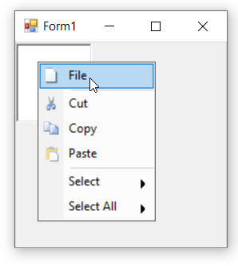

## Metro

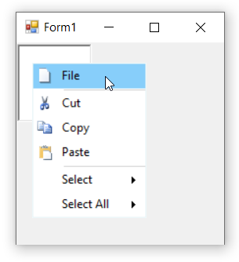

## Office2003

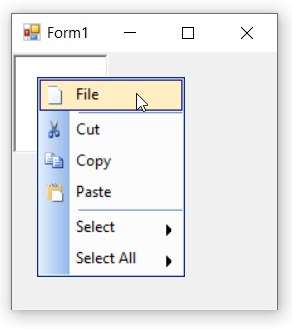

## Office2007

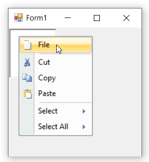

## Office2007Outlook

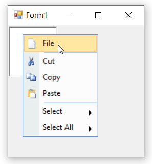

## Office2010

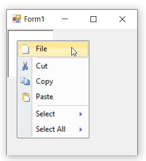

## Office2016Colorful

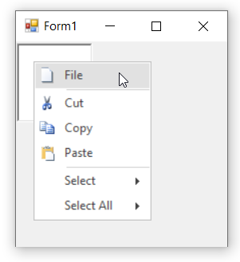

## Office2016DarkGray

## Office2016White

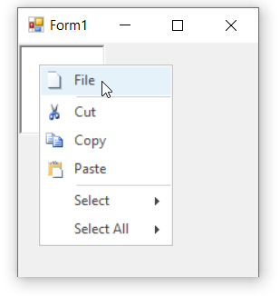

## OfficeXP

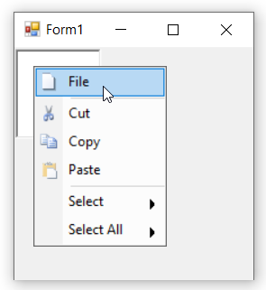

## VS2005

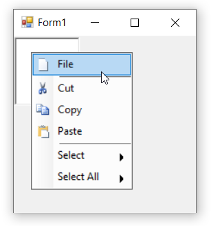

## VS2010

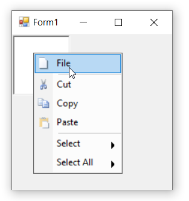

