# Theming

Popup menu supports various built-in themes, using which the default look of visual elements of the menu items can be customized. This can be achieved by using the [Style](https://help.syncfusion.com/cr/cref_files/windowsforms/Syncfusion.Tools.Windows~Syncfusion.Windows.Forms.Tools.XPMenus.ParentBarItem~Style.html) property of a [ParentBarItem](https://help.syncfusion.com/cr/cref_files/windowsforms/Syncfusion.Tools.Windows~Syncfusion.Windows.Forms.Tools.XPMenus.ParentBarItem.html) item associated with the popup menu.

The applicable themes can be applied to the popup menu via both the designer and code. The following are the applicable themes that are supported in popup menu.

* Default
* Metro
* Office2003
* Office2007
* Office2007Outlook
* Office2010
* Office2016Black
* Office2016Colorful
* Office2016DarkGray
* Office2016White
* OfficeXP
* VS2005
* VS2010

## Default theme

When the `Default` theme value is set to the popup menu, the default color values of the control is are applied to the visual components of the popup menu. The following code snippet shows the popup menu is being set with the default theme.





this.popupMenu1.ParentBarItem.Style = VisualStyle.Default;





Me.popupMenu1.ParentBarItem.Style = VisualStyle.Default





### Customizing theming colors

When the `Default` theme is set, visual component's color values of popup menu can be customized. The below code snippet shows the customized color values applied via the [`MenuColors`](https://help.syncfusion.com/cr/cref_files/windowsforms/Syncfusion.Shared.Base~Syncfusion.Windows.Forms.MenuColors.html) class. The below code snippet shows the customized popup menu in default theme.





this.popupMenu1.ParentBarItem.Style = VisualStyle.Default;
MenuColors.DropDownBorderColor = Color.Red;
MenuColors.SelBorderColor = Color.Red;
MenuColors.SelTextColor = Color.Green;





Me.popupMenu1.ParentBarItem.Style = VisualStyle.Default
MenuColors.DropDownBorderColor = Color.Red
MenuColors.SelBorderColor = Color.Red
MenuColors.SelTextColor = Color.Green





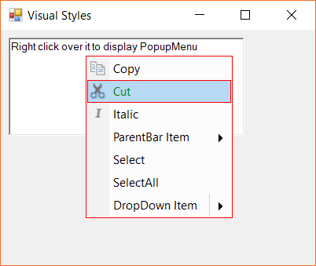

## Office 2003 theme

The popup menu is applied with Office 2003 style color values when the `Office2003` theme is applied.





this.popupMenu1.ParentBarItem.Style = VisualStyle.Office2003;





Me.popupMenu1.ParentBarItem.Style = VisualStyle.Office2003





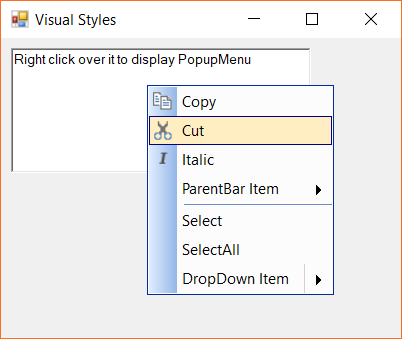

### Customizing theming colors

The color values of Office 2003 theme can be customized with the [`Office2003Colors`](https://help.syncfusion.com/cr/cref_files/windowsforms/Syncfusion.Shared.Base~Syncfusion.Windows.Forms.Office2003Colors.html) class. The following code snippet shows the custom color values applied to the theme.





this.popupMenu1.ParentBarItem.Style = VisualStyle.Office2003;
Office2003Colors.DropdownBorderColor = Color.Green;
Office2003Colors.SelBorderColor = Color.Red;





Me.popupMenu1.ParentBarItem.Style = Syncfusion.Windows.Forms.VisualStyle.Office2003
Office2003Colors.DropdownBorderColor = Color.Green
Office2003Colors.SelBorderColor = Color.Red





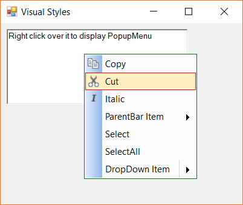

## Office 2007 theme

The color styles can be applied via the [`Office2007Theme`](https://help.syncfusion.com/cr/cref_files/windowsforms/Syncfusion.Tools.Windows~Syncfusion.Windows.Forms.Tools.XPMenus.ParentBarItem~Office2007Theme.html) property of the parent bar instance associated with the popup menu. The following color styles can be selected when the style is applied with `Office2007` theme.

* Black
* Silver
* Blue
* Managed

### Office 20007 Black

The popup menu is applied with pre-defined black themed colors. The following code snippet shows the popup menu is applied with the office 2007 `Black` theme.





this.popupMenu1.ParentBarItem.Style = VisualStyle.Office2007;
this.popupMenu1.ParentBarItem.Office2007Theme = Office2007Theme.Black;





Me.popupMenu1.ParentBarItem.Style = VisualStyle.Office2007
Me.popupMenu1.ParentBarItem.Office2007Theme = Office2007Theme.Black





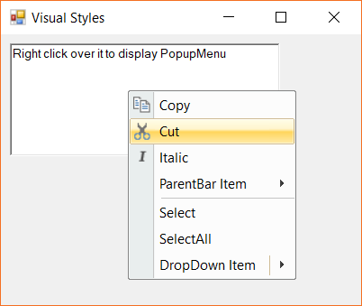

### Office 20007 Silver

The popup menu is applied with pre-defined silver themed colors. The following code snippet shows the popup menu is applied with the office 2007 `Silver` theme.





this.popupMenu1.ParentBarItem.Style = VisualStyle.Office2007;
this.popupMenu1.ParentBarItem.Office2007Theme = Office2007Theme.Silver;





Me.popupMenu1.ParentBarItem.Style = VisualStyle.Office2007
Me.popupMenu1.ParentBarItem.Office2007Theme = Office2007Theme.Silver





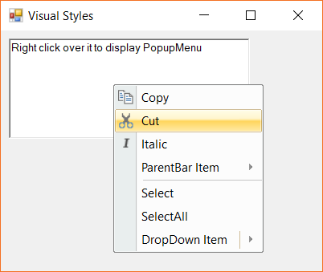

### Office 20007 Blue

The popup menu is applied with pre-defined blue themed colors The following code snippet shows the popup menu is applied with the office 2007 `Blue` theme.





this.popupMenu1.ParentBarItem.Style = VisualStyle.Office2007;
this.popupMenu1.ParentBarItem.Office2007Theme = Office2007Theme.Blue;





Me.popupMenu1.ParentBarItem.Style = VisualStyle.Office2007
Me.popupMenu1.ParentBarItem.Office2007Theme = Office2007Theme.Blue





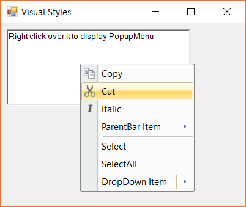

### Office 20007 Managed

The `Managed` color style allows to define the custom colors to the popup menu elements. This can be done through defining the color values via the [`Office2007Colors`](https://help.syncfusion.com/cr/cref_files/windowsforms/Syncfusion.Shared.Base~Syncfusion.Windows.Forms.Office2007Colors.html) class The following code snippet shows the popup menu is applied with the office 2007 managed theme.





this.popupMenu1.ParentBarItem.Style = VisualStyle.Office2007;
this.popupMenu1.ParentBarItem.Office2007Theme = Office2007Theme.Managed;
Office2007Colors.ApplyManagedColors(this, Color.Red);





Me.popupMenu1.ParentBarItem.Style = VisualStyle.Office2007
Me.popupMenu1.ParentBarItem.Office2007Theme = Office2007Theme.Managed
Office2007Colors.ApplyManagedColors(Me, Color.Red)





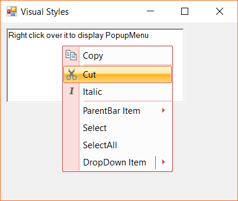

## Office 2010 theme

The color styles can be applied via the [`Office2010Theme`](https://help.syncfusion.com/cr/cref_files/windowsforms/Syncfusion.Tools.Windows~Syncfusion.Windows.Forms.Tools.XPMenus.ParentBarItem~Office2010Theme.html) property of the parent bar instance associated with the popup menu. The following color styles can be selected when the style is applied with `Office2010` theme.

* Black
* Silver
* Blue
* Managed

### Office 2010 Black

The popup menu is applied with pre-defined black themed colors. The following code snippet shows the popup menu is applied with the Office 2010 `Black` theme.





this.popupMenu1.ParentBarItem.Style = VisualStyle.Office2010;
this.popupMenu1.ParentBarItem.Office2010Theme = Office2010Theme.Black;





Me.popupMenu1.ParentBarItem.Style = VisualStyle.Office2010
Me.popupMenu1.ParentBarItem.Office2010Theme = Office2010Theme.Black





### Office 2010 Silver

The popup menu is applied with pre-defined silver themed colors. The following code snippet shows the popup menu is applied with the Office 2010 `Silver` theme.





this.popupMenu1.ParentBarItem.Style = VisualStyle.Office2010;
this.popupMenu1.ParentBarItem.Office2010Theme = Office2010Theme.Silver;





Me.popupMenu1.ParentBarItem.Style = VisualStyle.Office2010
Me.popupMenu1.ParentBarItem.Office2010Theme = Office2010Theme.Silver





### Office 2010 Blue

The popup menu is applied with pre-defined blue themed colors The following code snippet shows the popup menu is applied with the Office 2010 `Blue` theme.





this.popupMenu1.ParentBarItem.Style = VisualStyle.Office2010;
this.popupMenu1.ParentBarItem.Office2010Theme = Office2010Theme.Blue;





Me.popupMenu1.ParentBarItem.Style = VisualStyle.Office2010
Me.popupMenu1.ParentBarItem.Office2010Theme = Office2010Theme.Blue





### Office 2010 Managed

The `Managed` color style allows to define the custom colors to the popup menu elements. This can be done through defining the color values via the [`Office2010Colors`](https://help.syncfusion.com/cr/cref_files/windowsforms/Syncfusion.Shared.Base~Syncfusion.Windows.Forms.Office2010Colors.html) class The following code snippet shows the popup menu is applied with the office 2007 managed theme.





this.popupMenu1.ParentBarItem.Style = VisualStyle.Office2010;
this.popupMenu1.ParentBarItem.Office2010Theme = Office2010Theme.Managed;
Office2010Colors.ApplyManagedColors(this, Color.Red);





Me.popupMenu1.ParentBarItem.Style = VisualStyle.Office2010
Me.popupMenu1.ParentBarItem.Office2010Theme = Office2010Theme.Managed
Office2010Colors.ApplyManagedColors(Me, Color.Red)





## Office 2007 outlook theme

The popup menu supports the Outlook 2007 style theme. This below code snippet shows the popup menu is applied with the `Office2007Outlook` theme.





this.popupMenu1.ParentBarItem.Style = VisualStyle.Office2007Outlook;





Me.popupMenu1.ParentBarItem.Style = VisualStyle.Office2007Outlook





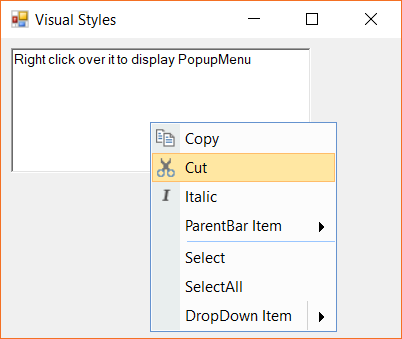

## Office 2016 theme

The popup menu supports Office 2016 colored-theme under the following pre-defined color styles.

* Office2016White
* Office2016Colorful
* Office2016DarkGray
* Office2016Black

### Office 2016 white theme

The below code snippet shows the popup menu is applied with Office 2016 white-themed color styles.





this.popupMenu1.ParentBarItem.Style = VisualStyle.Office2016White;





Me.popupMenu1.ParentBarItem.Style = VisualStyle.Office2016White





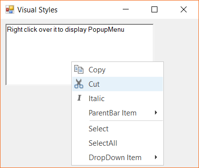

### Office 2016 colorful

The below code snippet shows the popup menu is applied with Office 2016 colorful-themed color styles.





this.popupMenu1.ParentBarItem.Style = VisualStyle.Office2010;
this.popupMenu1.ParentBarItem.Office2010Theme = Office2010Theme.Blue;





Me.popupMenu1.ParentBarItem.Style = VisualStyle.Office2010
Me.popupMenu1.ParentBarItem.Office2010Theme = Office2010Theme.Blue





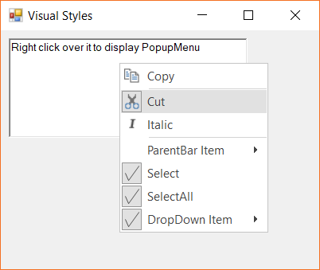

### Office 2016 dark gray

The below code snippet shows the popup menu is applied with Office 2016 dark gray-themed color styles.





this.popupMenu1.ParentBarItem.Style = VisualStyle.Office2016DarkGray;





Me.popupMenu1.ParentBarItem.Style = VisualStyle.Office2016DarkGray





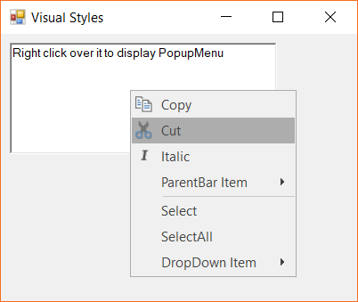

### Office 2016 black

The below code snippet shows the popup menu is applied with Office 2016 black-themed color styles.





this.popupMenu1.ParentBarItem.Style = VisualStyle.Office2016Black;





Me.popupMenu1.ParentBarItem.Style = VisualStyle.Office2016Black





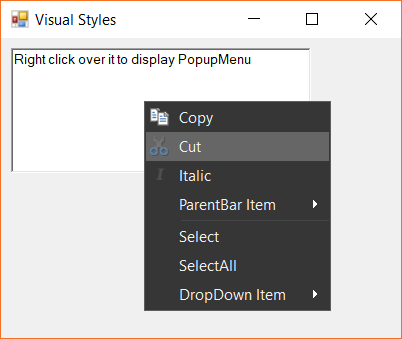

## Metro theme

The below code snippet shows the popup menu is applied with metro-themed color styles.





this.popupMenu1.ParentBarItem.Style = VisualStyle.Metro;





Me.popupMenu1.ParentBarItem.Style = VisualStyle.Metro





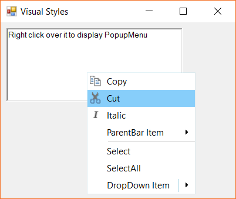

## Office XP theme

The below code snippet shows the popup menu is applied with Office XP-themed color styles.





this.popupMenu1.ParentBarItem.Style = VisualStyle.OfficeXP;





Me.popupMenu1.ParentBarItem.Style = VisualStyle.OfficeXP





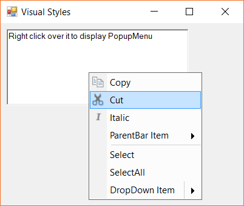

## Visual Studio 2005 theme

The below code snippet shows the popup menu is applied with Visual Studio 2005-themed color styles.





this.popupMenu1.ParentBarItem.Style = VisualStyle.VS2005;





Me.popupMenu1.ParentBarItem.Style = VisualStyle.VS2005





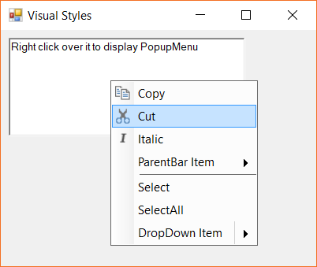

## Visual Studio 2010 theme

The below code snippet shows the popup menu is applied with Visual Studio 2010-themed color styles.





this.popupMenu1.ParentBarItem.Style = VisualStyle.VS2010;





Me.popupMenu1.ParentBarItem.Style = VisualStyle.VS2010





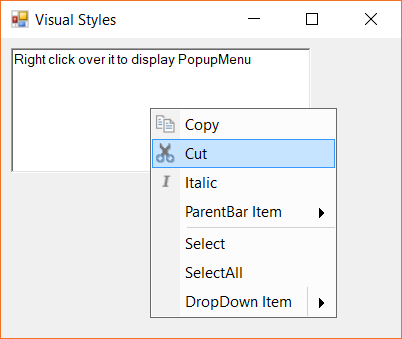