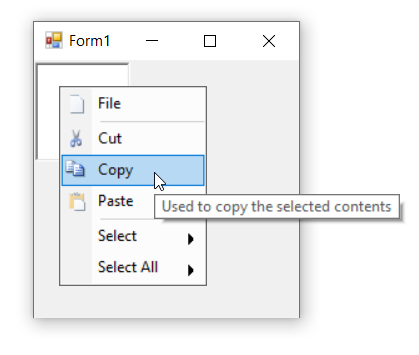

# Tooltip in Windows Forms PopupMenu

Tooltip is nothing but a hint, showing short format or customized text about the bar item, when mouse hover on it. By enabling [`ShowToolTipInPopUp`](https://help.syncfusion.com/cr/windowsforms/Syncfusion.Windows.Forms.Tools.XPMenus.BarItem.html#Syncfusion_Windows_Forms_Tools_XPMenus_BarItem_ShowToolTipInPopUp) property of bar items, we can display tooltips while mouse hovering. The [`Tooltip`](https://help.syncfusion.com/cr/windowsforms/Syncfusion.Windows.Forms.Tools.XPMenus.BarItem.html#Syncfusion_Windows_Forms_Tools_XPMenus_BarItem_Tooltip) property is used to set short format or customized text for each bar item.

>**NOTE**             
In this illustration, we have used **BarItem**. Similarly, we have set the tooltip for ParentBarItem, DropDownBarItem, ComboBoxBarItem, ListBarItem, StaticBarItem and TextBoxBarItem.

The below code snippet will explain how to set tooltip for bar items.




this.barItem3.ShowToolTipInPopUp = true;
this.barItem3.Tooltip = "Used to copy the selected contents";
        





Me.barItem3.ShowToolTipInPopUp = True
Me.barItem3.Tooltip = "Used to copy the selected contents"




