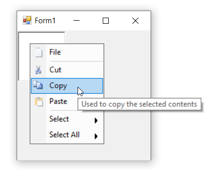

# Tooltip in Windows Forms PopupMenu

Tooltip is a hint that shows short or customized text about the bar item when the mouse hovers over it. By enabling the [`ShowToolTipInPopUp`](https://help.syncfusion.com/cr/windowsforms/Syncfusion.Windows.Forms.Tools.XPMenus.BarItem.html#Syncfusion_Windows_Forms_Tools_XPMenus_BarItem_ShowToolTipInPopUp) property of bar items, tooltips can be displayed while mouse hovering. The [`Tooltip`](https://help.syncfusion.com/cr/windowsforms/Syncfusion.Windows.Forms.Tools.XPMenus.BarItem.html#Syncfusion_Windows_Forms_Tools_XPMenus_BarItem_Tooltip) property is used to set the short format or customized text for each bar item.

>**NOTE**             
In this illustration, the **BarItem** has been used. Similarly, the tooltip can be set for ParentBarItem, DropDownBarItem, ComboBoxBarItem, ListBarItem, StaticBarItem and TextBoxBarItem.

The below code snippet will explain how to set tooltip for bar items.




this.barItem3.ShowToolTipInPopUp = true;
this.barItem3.Tooltip = "Used to copy the selected contents";
        





Me.barItem3.ShowToolTipInPopUp = True
Me.barItem3.Tooltip = "Used to copy the selected contents"




