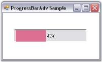

# Boundary Value Settings in Windows Forms Progress Bar

The Progress Bar during it's progressive operation indicates a minimum value and a maximum value for the process.

It provides the below properties to set the boundary values for the control and also the interval for the progression.

Property table

<table>
<tr>
<th>
Progress Bar property</th><th>
Description</th></tr>
<tr>
<td>
Minimum</td><td>
Determines the lower bound of the range of the Progress Bar.</td></tr>
<tr>
<td>
Maximum</td><td>
Determines the higher bound of the range of the Progress Bar.</td></tr>
<tr>
<td>
Value</td><td>
The current value between the minimum and maximum values.</td></tr>
<tr>
<td>
Step</td><td>
Determines the amount to increment or decrement the value of the Progress Bar when the Increment() or Decrement() method is called.</td></tr>
</table>

Create a Progress Bar and set the below properties to see the changes.





this.progressBarAdv1.Maximum = 200;

this.progressBarAdv1.Minimum = 25;

this.progressBarAdv1.Step = 50;

this.progressBarAdv1.Value = 100;





Me.progressBarAdv1.Maximum = 200

Me.progressBarAdv1.Minimum = 25

Me.progressBarAdv1.Step = 50

Me.progressBarAdv1.Value = 100





 

The methods associated with the above properties are given below.

Methods table

<table>
<tr>
<th>
Methods</th><th>
Description</th></tr>
<tr>
<td>
Increment</td><td>
Increments the Value property associated with the Step value.</td></tr>
<tr>
<td>
Decrement</td><td>
Decrements the Value property associated with the Step value.</td></tr>
</table>

