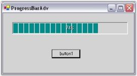

# How to activate a ProgressBarAdv?

This section will give you a brief description on how to use the ProgressBarAdv control.

1. Drag and drop a ProgressBarAdv onto your form.
2. Add a Timer and a Button to the form. By default, the Timer will be disabled.

    

3. Double-click the timer and add the below given code in the timer_Tick event.

   
   

   

        private void timer1_Tick(object sender, EventArgs e)
		
		{
		
		    if (this.progressBarAdv1.Value < 100)
			
			this.progressBarAdv1.Value++;
			
			else
			
			this.progressBarAdv1.Value = 0;
			
		}

	

	
        
		Private Sub timer1_Tick(ByVal sender As Object, ByVal e As EventArgs)
		
		If Me.progressBarAdv1.Value < 100 Then
		
		Me.progressBarAdv1.Value += 1
		
		Else
		
		Me.progressBarAdv1.Value = 0
		
		End If
		
		End Sub

   

   
   
   {{ codesnippet1 | OrderList_Indent_Level_1 }}

4. Enable the timer in the button_Click event.

   ​
   

   

        private void button1_Click(object sender, EventArgs e)
		
		{
		
		this.timer1.Enabled = true;
		
		}

    

	
   
        Private Sub button1_Click(ByVal sender As Object, ByVal e As EventArgs)
		
		Me.timer1.Enabled = True
		
		End Sub

   

   
   
   {{ codesnippet2 | OrderList_Indent_Level_1 }}

5. Run the application.

    

