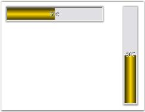

# Orientation Settings in Windows Forms Progress Bar

The direction of display of the [Windows Forms Progress Bar](https://www.syncfusion.com/winforms-ui-controls/progress-bar) (ProgressBarAdv) control can be changed using the property given below.

Property table

<table>
<tr>
<th>
Progress Bar property</th><th>
Description</th></tr>
<tr>
<td>
ProgressOrientation</td><td>
Determines the horizontal or vertical style of the progress bar.</td></tr>
</table>





this.progressBarAdv1.ProgressOrientation = System.Windows.Forms.Orientation.Horizontal;

this.progressBarAdv1.ProgressOrientation = System.Windows.Forms.Orientation.Vertical;





Me.progressBarAdv1.ProgressOrientation = System.Windows.Forms.Orientation.Horizontal

Me.progressBarAdv1.ProgressOrientation = System.Windows.Forms.Orientation.Vertical





 

